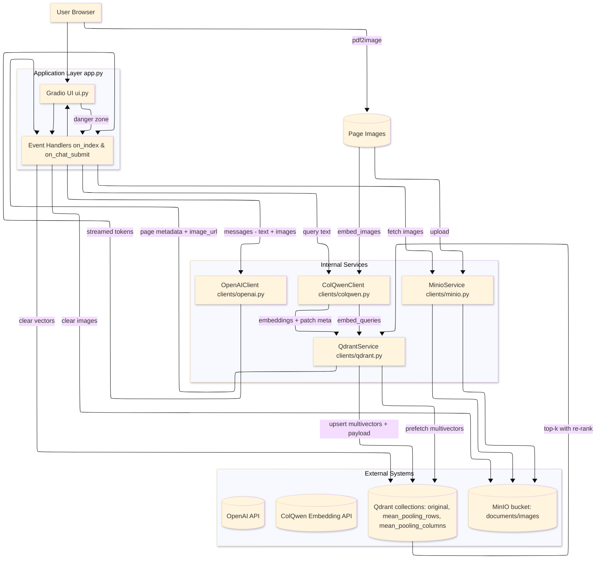

# Knowledgebase Retrieval Agent (Vision RAG Template)

A lightweight, end-to-end template for page-level retrieval over PDFs using a ColPali-like approach:

- __Storage__: page images in MinIO, multivector embeddings in Qdrant
- __Retrieval__: two-stage reranking with pooled image-token vectors
- __Generation__: OpenAI chat completions with multimodal context (retrieved page images)
- __UI__: Gradio app to upload/index PDFs and chat with the knowledgebase

This repo is intended as a developer-friendly starting point for vision RAG systems.

## Architecture

Below is the high-level component architecture of the Vision RAG template.



- __`ui.py`__: Gradio Blocks UI built by `build_ui(...)`.
- __`app.py`__: App wiring. Converts PDFs to page images, indexes to Qdrant/MinIO, retrieves, and streams LLM replies.
- __`clients/qdrant.py`__: `QdrantService` manages collection, indexing, multivector retrieval, and MinIO integration.
- __`clients/minio.py`__: `MinioService` for image storage/retrieval with batch operations and public-read policy.
- __`clients/openai.py`__: Thin wrapper for OpenAI SDK (streaming completions, message construction).
- __`clients/colqwen.py`__: HTTP client for a ColQwen-style embedding API (queries, images, patch metadata).
- __`config.py`__: Centralized configuration via environment variables.

__Indexing flow__:

1) PDF -> images via `pdf2image.convert_from_path`
2) Images -> embeddings via external ColQwen API
3) Images saved to MinIO (public URL)
4) Embeddings (original + mean-pooled rows/cols) upserted to Qdrant with payload metadata

__Retrieval flow__:

1) Query -> embedding (ColQwen API)
2) Qdrant multivector prefetch (rows/cols) + re-ranking using `using="original"`
3) Fetch images from MinIO for top-k pages
4) Stream OpenAI answer conditioned on user text + page images

## Features

- __Page-level, multimodal RAG__: stores per-page images, uses image-token pooling for robust retrieval
- __Modern Gradio UI__: upload/index, chat, adjustable top-k and AI params, and a danger zone to clear stores
- __Dockerized__: one `docker-compose up -d` brings up Qdrant, MinIO and the app
- __Configurable__: all knobs in `.env`/`config.py`

## Prerequisites

- Python 3.10+
- System dependency: Poppler (for `pdf2image`)
  - Linux: `apt-get install poppler-utils`
  - macOS: `brew install poppler`
  - Windows: install Poppler and add `bin/` to PATH (see "Troubleshooting" below)
- Optional but recommended: Docker + Docker Compose

## Quickstart (Docker Compose)

1) Copy env template and edit values:

```bash
cp .env.example .env
# Set OPENAI_API_KEY and OPENAI_MODEL, adjust COLQWEN_API_BASE_URL, etc.
```

2) Start services:

```bash
docker compose up -d
```

This launches:

- Qdrant on http://localhost:6333
- MinIO on http://localhost:9000 (console: http://localhost:9001, user/pass: `minioadmin`/`minioadmin`)
- App on http://localhost:7860

3) Open the app at http://localhost:7860

## Local development (without Compose)

1) Install system deps (Poppler). Ensure `pdftoppm`/`pdftocairo` are in PATH.
2) Create venv and install Python deps:

```bash
python -m venv .venv
. .venv/Scripts/activate  # Windows PowerShell: .venv\Scripts\Activate.ps1
pip install -U pip setuptools wheel
pip install -r requirements.txt
```

3) Run Qdrant and MinIO separately (examples via Docker):

```bash
# Qdrant
docker run -p 6333:6333 -p 6334:6334 -v qdrant_data:/qdrant/storage --name qdrant qdrant/qdrant:latest
# MinIO
docker run -p 9000:9000 -p 9001:9001 -e MINIO_ROOT_USER=minioadmin -e MINIO_ROOT_PASSWORD=minioadmin -v minio_data:/data --name minio minio/minio:latest server /data --console-address ":9001"
```

4) Configure `.env` (or export vars) and run the app:

```bash
cp .env.example .env
# set OPENAI_API_KEY, OPENAI_MODEL, and ensure QDRANT_URL/MINIO_URL point to your services
python app.py
```

## Environment variables

Most defaults are in `config.py`. Key variables:

- __Core__: `LOG_LEVEL` (INFO), `HOST` (0.0.0.0), `PORT` (7860)
- __OpenAI__: `OPENAI_API_KEY`, `OPENAI_MODEL`
  - Note: `clients/openai.py` defaults to `gpt-4.1-mini` if unset; `app.py` reads `OPENAI_MODEL` (default `gpt-5-mini`). Set this explicitly to a valid model in your environment.
- __ColQwen API__: `COLQWEN_API_BASE_URL` (default http://localhost:8000), `COLQWEN_API_TIMEOUT`
- __Qdrant__: `QDRANT_URL` (default http://localhost:6333), `QDRANT_COLLECTION_NAME` (documents), `QDRANT_SEARCH_LIMIT`, `QDRANT_PREFETCH_LIMIT`
- __MinIO__: `MINIO_URL` (default http://localhost:9000), `MINIO_ACCESS_KEY`, `MINIO_SECRET_KEY`, `MINIO_BUCKET_NAME` (documents), `MINIO_WORKERS`, `MINIO_RETRIES`, `MINIO_FAIL_FAST`, `MINIO_IMAGE_FMT`
- __Processing__: `DEFAULT_TOP_K`, `BATCH_SIZE`, `WORKER_THREADS`, `MAX_TOKENS`

See `.env.example` for a minimal starting point. When using Compose, some storage vars are injected in `docker-compose.yml`.

## Using the app

1) Open the UI.
2) __Upload & Index__: drop one or more PDFs, click “Index documents”. A status message shows total pages indexed.
3) __Ask__: type your question. The app retrieves top-k pages and, if AI is enabled, streams an answer from OpenAI using those page images as context.
4) __AI Settings__: toggle AI on/off, set `temperature`, provide a custom system prompt.
5) __Retrieval Settings__: adjust `Top-k`.
6) __Danger Zone__: clear Qdrant, clear MinIO images, or clear both (requires checkbox confirmation).

## ColQwen API contract (expected)

`clients/qdrant.py` expects the embedding server to expose endpoints:

- `GET /health` -> `200` when healthy
- `GET /info` -> JSON including `{"dim": <int>}` for embedding dimension
- `POST /patches` with body `{ "dimensions": [{"width": W, "height": H}, ...] }` ->
  `{ "results": [{"n_patches_x": int, "n_patches_y": int}, ...] }`
- `POST /embed/queries` with `{ "queries": ["...", ...] }` -> `{ "embeddings": [[[...], ...]] }`
- `POST /embed/images` (multipart form) -> for each image, an object:
  ```json
  {
    "embedding": [[...], ...],
    "image_patch_start": <int>,
    "image_patch_len": <int>
  }
  ```

Note: the example `clients/colqwen.py` is a thin starting client. Ensure it matches your server’s response shape (including `image_patch_start`/`image_patch_len`) to avoid runtime errors in `QdrantService._embed_and_mean_pool_batch(...)`.

## Data model in Qdrant

`clients/qdrant.py` creates a collection with three vectors per point:

- `original`: full token sequence
- `mean_pooling_rows`: pooled by rows
- `mean_pooling_columns`: pooled by columns

Each point has payload metadata like:

```json
{
  "index": 12,
  "page": "Page 3",
  "image_url": "http://localhost:9000/documents/images/<id>.png",
  "document_id": "<id>",
  "filename": "file.pdf",
  "file_size_bytes": 123456,
  "pdf_page_index": 3,
  "total_pages": 10,
  "page_width_px": 1654,
  "page_height_px": 2339,
  "indexed_at": "2025-01-01T00:00:00Z"
}
```

## Troubleshooting

- __OpenAI key/model__: If AI responses show an error, verify `OPENAI_API_KEY` and `OPENAI_MODEL`.
- __ColQwen API health__: On start, `QdrantService` checks `GET /health`. Ensure your server is reachable at `COLQWEN_API_BASE_URL`.
- __Patch metadata mismatch__: If you see an error like "embed_images() returned embeddings without image-token boundaries", update your embedding server/client to include `image_patch_start` and `image_patch_len` per image.
- __MinIO access__: The app sets a public-read bucket policy. For production, lock this down. If images fail to upload, check MinIO logs and credentials.
- __Poppler on Windows__: Install Poppler (e.g., download a release, extract, add `poppler-*/bin` to PATH). `pdf2image` must find `pdftoppm`.
- __Ports already in use__: Change `PORT` (app), `QDRANT_URL`, `MINIO_URL`, or Docker port mappings.

## Scripts and containers

- `Dockerfile`: Python 3.10-slim, installs system deps (`poppler-utils`, etc.), installs requirements, and runs `python app.py`.
- `docker-compose.yml`: brings up `qdrant`, `minio`, and the app (`vision-rag`).
- `packages.txt`: system package hint for environments like Codespaces.

## Development notes

- UI built via `build_ui(...)` in `ui.py`. Chat uses Gradio `Chatbot` with multimodal messages.
- Replace OpenAI with another LLM by adapting `clients/openai.py` and `app.py:on_chat_submit`.
- To filter search by metadata, see `QdrantService.search_with_metadata(...)`.

## License

MIT License. See `LICENSE`.

## Acknowledgements

Inspired by ColPali-style page-level retrieval and multivector search patterns. Uses Qdrant, MinIO, Gradio, pdf2image, and OpenAI.

## Citations

- ColPali — https://arxiv.org/abs/2407.01449
- Qdrant Optimizations
  - https://qdrant.tech/blog/colpali-qdrant-optimization/
  - https://qdrant.tech/articles/binary-quantization/
- PyTorch — https://pytorch.org/
