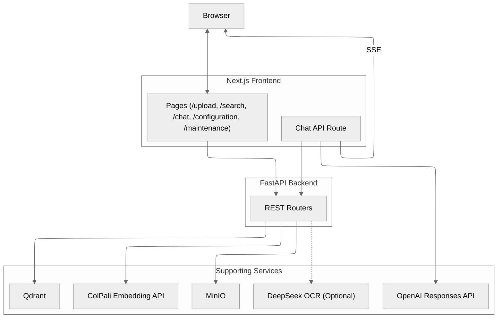

<p align="center">
  
</p>

---

# Snappy - Vision-Grounded Document Retrieval

<!-- Project Stats -->
[](https://github.com/athrael-soju/Snappy/releases)
[](https://github.com/athrael-soju/Snappy/stargazers)
[](https://github.com/athrael-soju/Snappy/network/members)
[](https://github.com/athrael-soju/Snappy/issues)
[](LICENSE)

<!-- Build & Quality -->
[](https://github.com/athrael-soju/Snappy/actions)
[](https://github.com/athrael-soju/Snappy/security/code-scanning)
[](https://github.com/athrael-soju/Snappy)
[](https://github.com/pre-commit/pre-commit)

<!-- Tech Stack -->
[](https://fastapi.tiangolo.com/)
[](https://nextjs.org/)
[](https://react.dev/)
[](https://www.python.org/)
[](https://www.typescriptlang.org/)
[](https://qdrant.tech/)
[](https://min.io/)
[](https://docs.docker.com/compose/)

Snappy pairs a FastAPI backend, a ColPali embedding service, and a Next.js frontend to deliver vision-first retrieval over PDFs. Each page is rasterized, embedded as multivectors, and stored alongside images so you can search by how documents look rather than only extracted text.

**TL;DR**

- Vision-focused retrieval and chat with ColPali multivector embeddings, MinIO image storage, and Qdrant search.
- Streaming responses, live indexing progress, and a schema-driven configuration UI to keep changes safe.
- One Docker Compose stack or individual services for local development and production-style deployments.

**Table of Contents**

- [Quick Start](#quick-start)
- [Highlights](#highlights)
- [Use Cases](#use-cases)
- [Architecture](#architecture)
- [Frontend Experience](#frontend-experience)
- [Demo](#demo)
- [Environment Variables](#environment-variables)
- [API Overview](#api-overview)
- [Troubleshooting](#troubleshooting)
- [Developer Notes](#developer-notes)
- [Documentation](#documentation)
- [Further Reading](#further-reading)
- [License](#license)
- [Acknowledgements](#acknowledgements)

---

## Showcase

https://github.com/user-attachments/assets/99438b0d-c62e-4e47-bdc8-623ee1d2236c

---

## Architecture



Head to `backend/docs/architecture.md` and `backend/docs/analysis.md` for a deeper walkthrough of the indexing and retrieval flows.

---

## Quick Start

> **Using pre-built images?** Skip to [Option A](#option-a--run-with-pre-built-docker-images) for the fastest deployment using the pre-built containers from GitHub Container Registry.

### 1. Prepare environment files

```bash
cp .env.example .env
cp frontend/.env.example frontend/.env.local
```

Add your OpenAI API key to `frontend/.env.local` and review the backend defaults in `.env`.

### 2. Start the ColPali embedding service

From `colpali/` pick one profile:

```bash
# GPU profile (CUDA + flash-attn tooling)
docker compose --profile gpu up -d --build

# CPU profile (no GPU dependencies)
docker compose --profile cpu up -d --build
```

Only start one profile at a time to avoid port clashes. The first GPU build compiles `flash-attn`; subsequent builds reuse the cached wheel.

### 3. (Optional) Start the DeepSeek OCR service

For advanced text extraction with configurable model sizes and modes:

```bash
cd deepseek-ocr
docker compose up -d --build
```

The service runs at http://localhost:8200. Enable it via `DEEPSEEK_OCR_ENABLED=True` in `.env`. See `deepseek-ocr/README.md` for configuration details.

---

### Option A - Run with Pre-built Docker Images

Use the pre-built images from GitHub Container Registry for instant deployment:

```bash
# Pull pre-built images
docker pull ghcr.io/athrael-soju/Snappy/backend:latest
docker pull ghcr.io/athrael-soju/Snappy/frontend:latest
docker pull ghcr.io/athrael-soju/Snappy/colpali-cpu:latest

# Create minimal docker-compose.yml (see docs/DOCKER_IMAGES.md)
# Then start services
docker compose up -d
```

**Available images:**
- `backend:latest` - FastAPI backend (amd64/arm64)
- `frontend:latest` - Next.js frontend (amd64/arm64)
- `colpali-cpu:latest` - CPU embedding service (amd64/arm64)
- `colpali-gpu:latest` - GPU embedding service (amd64 only)

**Full guide**: See [`docs/DOCKER_IMAGES.md`](docs/DOCKER_IMAGES.md) for complete documentation on using pre-built images, version tags, configuration, and production deployment examples.

---

### Option B - Run the full stack with Docker Compose (Build from Source)

At the project root:

```bash
docker compose up -d --build
```

Services will come online at:
- Backend: http://localhost:8000
- Frontend: http://localhost:3000
- Qdrant: http://localhost:6333
- MinIO: http://localhost:9000 (console at :9001)

Update `.env` and `frontend/.env.local` if you need to expose different hostnames or ports.

---

### Option C - Run services locally

1. In `backend/`, install dependencies and launch FastAPI:

   ```bash
   cd backend
   python -m venv .venv
   source .venv/bin/activate  # Windows: .venv\Scripts\Activate.ps1
   pip install -U pip setuptools wheel
   pip install -r requirements.txt
   uvicorn backend.main:app --host 0.0.0.0 --port 8000 --reload
   ```

2. Start the ColPali embedding service (Docker Compose or locally):

   ```bash
   # Docker (preferred)
   cd ../colpali
   docker compose --profile cpu up -d --build

   # Or run locally (inside a separate virtualenv)
   python -m venv .venv
   source .venv/bin/activate
   pip install -U pip setuptools wheel
   pip install -r requirements.txt
   uvicorn app:app --host 0.0.0.0 --port 7000 --reload
   ```

3. Start Qdrant and MinIO (via Docker or your preferred deployment).

4. In `frontend/`, install and run the Next.js app:

   ```bash
   yarn install --frozen-lockfile
   yarn dev
   ```

Keep the services from steps 2 and 3 running while you develop.

---

## Highlights

- Page-level vision retrieval powered by ColPali multivector embeddings; no OCR pipeline to maintain.
- Optional DeepSeek OCR integration for advanced text extraction with configurable model sizes, modes (plain/markdown/grounding/locate), and image embedding.
- Streaming chat responses from the OpenAI Responses API with inline visual citations so you can see each supporting page.
- Pipelined indexing with live Server-Sent Events progress updates and optional MUVERA-assisted first-stage search.
- Runtime configuration UI backed by a typed schema, with reset and draft flows that make experimentation safe.
- Docker Compose profiles for ColPali (GPU or CPU) plus an all-in-one stack for local development.

---

## Use Cases

Snappy excels at retrieval scenarios where visual layout, formatting, and appearance matter as much as textual content:

- **Legal Document Analysis** - Search case files, contracts, and legal briefs by visual layout, annotations, and document structure without relying on OCR accuracy.
- **Medical Records Retrieval** - Find patient charts, diagnostic reports, and medical forms by handwritten notes, stamps, diagrams, and visual markers that traditional text search misses.
- **Financial Auditing and Compliance** - Locate invoices, receipts, financial statements, and compliance documents by visual characteristics like logos, stamps, signatures, and table layouts.
- **Academic Research and Papers** - Search scientific papers, technical documents, and research archives by figures, tables, equations, charts, and visual presentation; ideal for literature reviews.
- **Archive and Document Management** - Retrieve historical documents, scanned archives, and legacy records by visual appearance, preserving context that text extraction destroys.
- **Engineering and Technical Documentation** - Find blueprints, schematics, technical drawings, and specification sheets by visual elements, diagrams, and layout patterns.
- **Media and Publishing** - Search newspaper archives, magazine layouts, and published materials by visual design, page composition, and formatting.
- **Educational Content** - Organize and retrieve textbooks, lecture notes, and educational materials by visual structure, highlighting, and annotations.

---

## Frontend Experience

The Next.js 16 frontend with React 19.2 keeps things fast and friendly: real-time streaming, responsive layouts, and design tokens (`text-body-*`, `size-icon-*`) that make extending the UI consistent. Configuration and maintenance pages expose everything the backend can do, while upload/search/chat give you the workflows you need day to day.

---

## Environment Variables

### Backend highlights

- `COLPALI_URL`, `COLPALI_API_TIMEOUT`
- `DEEPSEEK_OCR_ENABLED`, `DEEPSEEK_OCR_URL`, `DEEPSEEK_OCR_API_TIMEOUT`, `DEEPSEEK_OCR_MAX_WORKERS`, `DEEPSEEK_OCR_POOL_SIZE`
- `QDRANT_EMBEDDED`, `QDRANT_URL`, `QDRANT_COLLECTION_NAME`, `QDRANT_PREFETCH_LIMIT`, `QDRANT_MEAN_POOLING_ENABLED`, optional quantisation toggles
- `MINIO_URL`, `MINIO_PUBLIC_URL`, credentials, bucket naming, `IMAGE_FORMAT`, `IMAGE_QUALITY`
- `MUVERA_ENABLED` and related settings (requires `fastembed[postprocess]` in your environment)
- `LOG_LEVEL`, `ALLOWED_ORIGINS`, `UVICORN_RELOAD`

All schema-backed settings (and defaults) are documented in `backend/docs/configuration.md`. Runtime updates via `/config/update` are ephemeral; update `.env` for persistence.

### Frontend highlights (`frontend/.env.local`)

- `NEXT_PUBLIC_API_BASE_URL` (defaults to `http://localhost:8000`)
- `OPENAI_API_KEY`, `OPENAI_MODEL`, optional `OPENAI_TEMPERATURE`, `OPENAI_MAX_TOKENS`

---

## API Overview

| Area         | Endpoint(s)                              | Notes |
|--------------|------------------------------------------|-------|
| Meta         | `GET /health`                            | Service and dependency status |
| Retrieval    | `GET /search?q=...&k=5`                  | Page-level search (defaults to 10 when `k` omitted) |
| Indexing     | `POST /index`                            | Background indexing job (multipart PDF upload) |
|              | `GET /progress/stream/{job_id}`          | Real-time progress (SSE) |
|              | `POST /index/cancel/{job_id}`            | Cancel an active job |
| OCR          | `POST /ocr/process-page`, `/ocr/process-batch` | DeepSeek OCR per-page and batch processing (requires OCR service) |
|              | `POST /ocr/process-document`             | Background OCR for an entire indexed document |
|              | `GET /ocr/progress/{job_id}`, `/ocr/progress/stream/{job_id}` | Poll or stream OCR job progress |
|              | `POST /ocr/cancel/{job_id}`, `GET /ocr/health` | Cancel jobs and check OCR health |
| Maintenance  | `GET /status`                            | Collection/bucket statistics |
|              | `POST /initialize`, `DELETE /delete`     | Provision or tear down collection + bucket |
|              | `POST /clear/qdrant`, `/clear/minio`, `/clear/all` | Data reset helpers |
| Configuration| `GET /config/schema`, `/config/values`   | Expose runtime schema and values |
|              | `POST /config/update`, `/config/reset`   | Runtime configuration management |

Chat streaming lives in `frontend/app/api/chat/route.ts`. The route calls the backend search endpoint, invokes the OpenAI Responses API, and streams Server-Sent Events to the browser. The backend does not proxy OpenAI calls.

---

## Troubleshooting

- **ColPali timing out?** Increase `COLPALI_API_TIMEOUT` or run the GPU profile for heavy workloads.
- **Progress bar stuck?** Ensure Poppler is installed and check backend logs for PDF conversion errors.
- **Missing images?** Verify MinIO credentials/URLs and confirm `next.config.ts` allows the domains you expect.
- **CORS issues?** Replace wildcard `ALLOWED_ORIGINS` entries with explicit URLs before exposing the API publicly.
- **Config changes vanish?** `/config/update` modifies runtime state only-update `.env` for anything you need to keep after a restart.
- **Upload rejected?** The uploader currently accepts PDFs only. Adjust max size, chunk size, or file count limits in the "Uploads" section of the configuration UI.

`backend/docs/configuration.md` and `backend/CONFIGURATION_GUIDE.md` cover advanced troubleshooting and implementation details.

---

## Developer Notes

- Background indexing uses FastAPI `BackgroundTasks`. For larger deployments consider a dedicated task queue.
- MinIO worker pools auto-size based on hardware. Override only when you have specific throughput limits.
- TypeScript types and Zod schemas regenerate from the OpenAPI spec (`yarn gen:sdk`, `yarn gen:zod`) to keep the frontend in sync.
- Pre-commit hooks (autoflake, isort, black, pyright) keep the codebase tidy-run them before contributing.
- **Version management:** Uses Release Please + Conventional Commits for automated releases. See `VERSIONING.md` for details.

---

## Documentation

- `backend/README.md` - FastAPI backend guide
- `frontend/README.md` - Next.js frontend guide
- `colpali/README.md` - ColPali embedding service guide
- `deepseek-ocr/README.md` - DeepSeek OCR service guide
- `backend/docs/configuration.md` - Configuration reference
- `VERSIONING.md` - Release and version workflow

---

## Further Reading

- `backend/docs/analysis.md` - vision vs. text RAG comparison
- `backend/docs/architecture.md` - collection, indexing, and search deep dive
- `colpali/README.md` - details on the standalone embedding service
- `deepseek-ocr/README.md` - details on the DeepSeek OCR service

---

## License

MIT License - see [LICENSE](LICENSE).

---

## Acknowledgements

Snappy builds on the work of:

- **ColPali / ColModernVBert** - multimodal models for visual retrieval  
   https://arxiv.org/abs/2407.01449
   https://arxiv.org/abs/2510.01149

- **DeepSeek-OCR** - vision-language model for document understanding  
   https://huggingface.co/deepseek-ai/DeepSeek-OCR

- **Qdrant** - the vector database powering multivector search  
   https://qdrant.tech/blog/colpali-qdrant-optimization/  
   https://qdrant.tech/articles/binary-quantization/  
   https://qdrant.tech/articles/muvera-embeddings/

- **PyTorch** - core deep learning framework  
   https://pytorch.org/  

