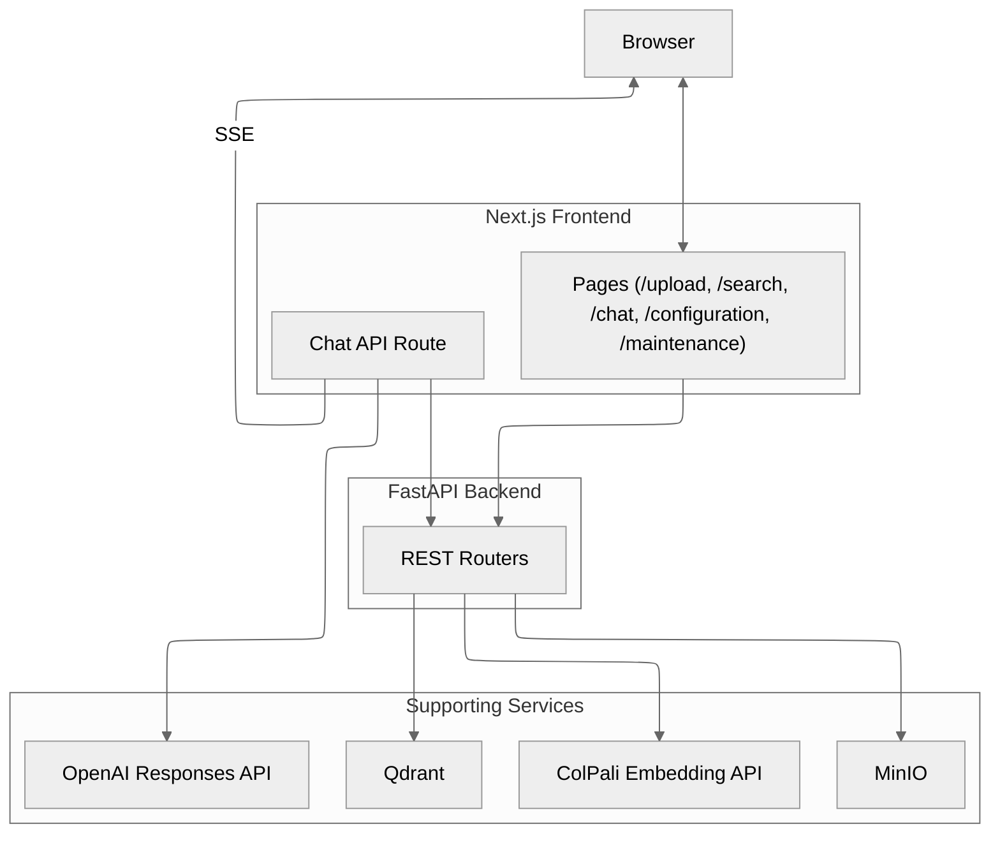

<p align="center">
  
</p>

<h1 align="center">Snappy – Vision-Grounded Document Retrieval 📸</h1>

<p align="center">
  <strong>Search documents the way you see them, not just the words inside</strong>
  <br>
  <em>Production-ready template for building visual retrieval systems with ColPali, FastAPI, and Next.js</em>
</p>

<p align="center">
  <a href="#-quick-start">Quick Start</a> •
  <a href="#-key-features">Features</a> •
  <a href="#-demo">Demo</a> •
  <a href="#-use-cases">Use Cases</a> •
  <a href="#-documentation">Docs</a> •
  <a href="#-contributing">Contributing</a>
</p>

---

<!-- Project Stats -->
<p align="center">
  <a href="https://github.com/athrael-soju/Snappy/releases"></a>
  <a href="https://github.com/athrael-soju/Snappy/stargazers"></a>
  <a href="https://github.com/athrael-soju/Snappy/network/members"></a>
  <a href="https://github.com/athrael-soju/Snappy/issues"></a>
  <a href="LICENSE"></a>
</p>

<!-- Build & Quality -->
<p align="center">
  <a href="https://github.com/athrael-soju/Snappy/actions"></a>
  <a href="https://github.com/athrael-soju/Snappy/security/code-scanning"></a>
  
  
</p>

<!-- Tech Stack -->
<p align="center">
  <a href="https://fastapi.tiangolo.com/"></a>
  <a href="https://nextjs.org/"></a>
  <a href="https://react.dev/"></a>
  <a href="https://www.python.org/"></a>
  <a href="https://www.typescriptlang.org/"></a>
  <a href="https://qdrant.tech/"></a>
  <a href="https://min.io/"></a>
  <a href="https://docs.docker.com/compose/"></a>
</p>

---

## 🎯 What is Snappy?

**Snappy** is a production-ready template for building **vision-first document retrieval systems**. Instead of relying solely on text extraction (OCR), Snappy searches PDFs by **visual appearance**—layout, formatting, diagrams, handwriting, and more.

Each document page is:
1. **Rasterized** into an image
2. **Embedded** using ColPali's multivector model
3. **Stored** in Qdrant vector database with visual metadata
4. **Searchable** by how it looks, not just what text it contains

Perfect for documents where **visual context matters**: legal contracts, medical records, financial forms, technical diagrams, and research papers.

---

## 📺 Demo

https://github.com/user-attachments/assets/99438b0d-c62e-4e47-bdc8-623ee1d2236c

---

## ✨ Key Features

<table>
<tr>
<td width="50%">

### 🎯 Vision-First Retrieval
- **No OCR required** – search by visual appearance
- **ColPali multivector embeddings** for page-level precision
- **Layout-aware** – finds diagrams, tables, handwriting
- **MUVERA-assisted** first-stage search (optional)

</td>
<td width="50%">

### 💬 AI-Powered Chat
- **Streaming responses** from OpenAI Responses API
- **Visual citations** – see supporting pages inline
- **Context-aware** – grounded in your documents
- **Real-time** – Server-Sent Events for live updates

</td>
</tr>
<tr>
<td width="50%">

### ⚡ Production Ready
- **Type-safe** – end-to-end TypeScript + Python typing
- **Schema-driven config** – runtime updates with UI
- **Background processing** – parallel indexing pipeline
- **Pre-built images** – deploy in minutes

</td>
<td width="50%">

### 🐳 Developer Friendly
- **Docker Compose** – one command to start
- **GPU/CPU profiles** – flexible deployment
- **Live reload** – fast development cycle
- **Comprehensive docs** – architecture, config, APIs

</td>
</tr>
</table>

---

## 🚀 Quick Start

> **⚡ Fastest Path:** Use [pre-built Docker images](#option-a--pre-built-images-recommended) from GitHub Container Registry

### Prerequisites

- Docker & Docker Compose
- OpenAI API key
- (Optional) NVIDIA GPU with CUDA for faster embeddings

### 5-Minute Setup

1️⃣ **Clone and configure**
```bash
git clone https://github.com/athrael-soju/Snappy.git
cd Snappy
cp .env.example .env
cp frontend/.env.example frontend/.env.local
```

2️⃣ **Add your OpenAI API key** to `frontend/.env.local`:
```bash
OPENAI_API_KEY=sk-...
```

3️⃣ **Choose your deployment method:**

#### Option A – Pre-built Images (Recommended)

```bash
# Pull images
docker pull ghcr.io/athrael-soju/Snappy/backend:latest
docker pull ghcr.io/athrael-soju/Snappy/frontend:latest
docker pull ghcr.io/athrael-soju/Snappy/colpali-cpu:latest

# Start services
docker compose up -d
```

📖 **Complete guide:** [`docs/DOCKER_IMAGES.md`](docs/DOCKER_IMAGES.md)

#### Option B – Build from Source

```bash
# Start ColPali service (choose GPU or CPU)
cd colpali
docker compose --profile gpu up -d --build  # or --profile cpu

# Start full stack
cd ..
docker compose up -d --build
```

4️⃣ **Access the application**

- 🌐 Frontend: http://localhost:3000
- 🔌 Backend API: http://localhost:8000
- 📊 API Docs: http://localhost:8000/docs
- 🗄️ Qdrant Dashboard: http://localhost:6333/dashboard
- 📦 MinIO Console: http://localhost:9001

---

<details>
<summary><b>🛠️ Option C – Local Development (Advanced)</b></summary>

For development without Docker:

**Backend:**
```bash
cd backend
python -m venv .venv
source .venv/bin/activate  # Windows: .venv\Scripts\Activate.ps1
pip install -U pip setuptools wheel
pip install -r requirements.txt
uvicorn backend:app --host 0.0.0.0 --port 8000 --reload
```

**Frontend:**
```bash
cd frontend
yarn install --frozen-lockfile
yarn dev
```

**Services:** Start Qdrant, MinIO, and ColPali separately (Docker recommended).

</details>

---

## 💼 Use Cases

Snappy excels where **visual layout and formatting matter as much as textual content**:

<table>
<tr>
<td width="33%">

### 📋 Legal & Compliance
- Contracts with annotations
- Case files with stamps
- Legal briefs by structure
- Compliance documents

</td>
<td width="33%">

### 🏥 Healthcare
- Patient charts
- Diagnostic reports
- Medical forms
- Handwritten notes

</td>
<td width="33%">

### 💰 Finance
- Invoices with logos
- Receipt verification
- Financial statements
- Audit documents

</td>
</tr>
<tr>
<td width="33%">

### 🔬 Research
- Scientific papers
- Technical documents
- Figures & charts
- Equations & formulas

</td>
<td width="33%">

### 📚 Archives
- Historical documents
- Scanned records
- Legacy files
- Visual preservation

</td>
<td width="33%">

### 🏗️ Engineering
- Blueprints
- Schematics
- Technical drawings
- Specification sheets

</td>
</tr>
</table>

---

## 🏗️ Architecture



---

## 🏗️ Architecture


### Components

| Component | Technology | Purpose |
|-----------|-----------|---------|
| **Frontend** | Next.js 16 + React 19.2 | Modern UI with Server Components, streaming, and type-safe API client |
| **Backend** | FastAPI + Python 3.11+ | RESTful API, background jobs, SSE progress tracking |
| **Vector DB** | Qdrant | Multivector search with optional quantization and MUVERA |
| **Storage** | MinIO | S3-compatible object storage for page images |
| **Embeddings** | ColPali Service | Standalone FastAPI app for vision embeddings (GPU/CPU) |
| **AI Chat** | OpenAI Responses API | Streaming responses with visual citations |

📖 **Deep dive:** [`backend/docs/architecture.md`](backend/docs/architecture.md) • [`backend/docs/analysis.md`](backend/docs/analysis.md)

---

## 📚 Documentation

<table>
<tr>
<td width="50%">

### Component Guides
- 📘 [Backend README](backend/README.md)
- 📗 [Frontend README](frontend/README.md)
- 📙 [ColPali Service README](colpali/README.md)

### Technical Docs
- 🏛️ [Architecture Deep Dive](backend/docs/architecture.md)
- ⚙️ [Configuration Reference](backend/docs/configuration.md)
- 📊 [Vision vs Text RAG Analysis](backend/docs/analysis.md)

</td>
<td width="50%">

### Deployment
- 🐳 [Docker Images Guide](docs/DOCKER_IMAGES.md)
- 🔧 [Configuration Guide](backend/CONFIGURATION_GUIDE.md)
- 📦 [Version Management](VERSIONING.md)

### API Reference
- 🔌 [OpenAPI Spec](http://localhost:8000/docs) (when running)
- 📝 [API Overview](#api-overview)
- 🔍 [Troubleshooting](#troubleshooting)

</td>
</tr>
</table>

---

## 🔌 API Overview

<details>
<summary><b>Click to expand API endpoints</b></summary>

| Area | Endpoint | Method | Description |
|------|----------|--------|-------------|
| **Meta** | `/health` | GET | Service and dependency health status |
| **Retrieval** | `/search` | GET | Page-level visual search (`?q=...&k=5`) |
| **Indexing** | `/index` | POST | Upload PDFs and start background indexing |
| | `/progress/stream/{job_id}` | GET | Real-time SSE progress updates |
| | `/index/cancel/{job_id}` | POST | Cancel active indexing job |
| **Maintenance** | `/status` | GET | Collection and bucket statistics |
| | `/initialize` | POST | Create collection and bucket |
| | `/delete` | DELETE | Remove collection and bucket |
| | `/clear/all` | POST | Clear all data (Qdrant + MinIO) |
| **Configuration** | `/config/schema` | GET | Configuration schema with defaults |
| | `/config/values` | GET | Current runtime configuration |
| | `/config/update` | POST | Update runtime configuration |
| | `/config/reset` | POST | Reset to defaults |

💡 **Chat streaming** is implemented in `frontend/app/api/chat/route.ts` using the OpenAI Responses API

📖 **Full API documentation:** http://localhost:8000/docs (when backend is running)

</details>

---

## ⚙️ Configuration

### Environment Variables

<details>
<summary><b>Backend Configuration (`.env`)</b></summary>

**ColPali Service:**
- `COLPALI_URL` – Embedding service endpoint (default: `http://localhost:8080`)
- `COLPALI_API_TIMEOUT` – Request timeout in seconds (default: `300`)

**Qdrant:**
- `QDRANT_EMBEDDED` – Use embedded Qdrant (default: `false`)
- `QDRANT_URL` – Vector database endpoint
- `QDRANT_COLLECTION_NAME` – Collection name (default: `snappy_collection`)
- `QDRANT_PREFETCH_LIMIT` – Prefetch limit for search (default: `500`)
- `QDRANT_MEAN_POOLING_ENABLED` – Enable mean pooling (default: `true`)

**MinIO:**
- `MINIO_URL` – Object storage endpoint
- `MINIO_PUBLIC_URL` – Public-facing URL for images
- `MINIO_ACCESS_KEY`, `MINIO_SECRET_KEY` – Credentials
- `MINIO_BUCKET_NAME` – Bucket for images (default: `snappy-images`)
- `IMAGE_FORMAT` – Output format (default: `webp`)
- `IMAGE_QUALITY` – Compression quality 1-100 (default: `85`)

**MUVERA (Optional):**
- `MUVERA_ENABLED` – Enable MUVERA first-stage search (default: `false`)
- Requires: `pip install fastembed[postprocess]`

**API:**
- `LOG_LEVEL` – Logging level (default: `INFO`)
- `ALLOWED_ORIGINS` – CORS origins (comma-separated)
- `UVICORN_RELOAD` – Enable auto-reload (default: `false`)

📖 **Complete reference:** [`backend/docs/configuration.md`](backend/docs/configuration.md)

</details>

<details>
<summary><b>Frontend Configuration (`frontend/.env.local`)</b></summary>

**Required:**
- `OPENAI_API_KEY` – Your OpenAI API key

**Optional:**
- `NEXT_PUBLIC_API_BASE_URL` – Backend URL (default: `http://localhost:8000`)
- `OPENAI_MODEL` – Model to use (default: `gpt-4o-mini`)
- `OPENAI_TEMPERATURE` – Response randomness 0-2 (default: `0.7`)
- `OPENAI_MAX_TOKENS` – Max response length (default: `4096`)

</details>

---

## 🐛 Troubleshooting

<details>
<summary><b>Common Issues & Solutions</b></summary>

### ColPali Timing Out
**Cause:** Heavy workload on CPU-only service  
**Solution:** 
- Increase `COLPALI_API_TIMEOUT` in `.env`
- Use GPU profile: `docker compose --profile gpu up -d --build`

### Progress Bar Stuck During Indexing
**Cause:** PDF conversion failure (missing Poppler)  
**Solution:** 
- Install `poppler-utils` in backend environment
- Check backend logs for conversion errors

### Missing Images
**Cause:** MinIO URL misconfiguration  
**Solution:**
- Verify `MINIO_PUBLIC_URL` in `.env`
- Add MinIO domain to `next.config.ts` `images.remotePatterns`

### CORS Errors
**Cause:** `ALLOWED_ORIGINS` not configured  
**Solution:** 
- Set explicit origins in `.env` (avoid `*` in production)
- Example: `ALLOWED_ORIGINS=http://localhost:3000,https://your-domain.com`

### Config Changes Not Persisting
**Cause:** `/config/update` only affects runtime  
**Solution:** 
- Update `.env` file for persistent changes
- Restart services after editing `.env`

### Type Errors After API Changes
**Cause:** OpenAPI spec out of sync  
**Solution:**
```bash
# Regenerate OpenAPI spec
python scripts/generate_openapi.py

# Update frontend types
cd frontend
yarn gen:sdk
yarn gen:zod
```

</details>

📖 **More troubleshooting:** [`backend/CONFIGURATION_GUIDE.md`](backend/CONFIGURATION_GUIDE.md)

---

## 🧪 Development

### Prerequisites

- **Backend:** Python 3.11+, `uv` (recommended) or `pip`
- **Frontend:** Node.js 18+, `yarn`
- **Services:** Docker for Qdrant, MinIO, ColPali

### Development Workflow

**Generate OpenAPI spec:**
```bash
python scripts/generate_openapi.py
```

**Update frontend types:**
```bash
cd frontend
yarn gen:sdk    # TypeScript types
yarn gen:zod    # Zod schemas
```

**Run pre-commit hooks:**
```bash
cd backend
pre-commit run --all-files
```

**Type checking:**
```bash
# Backend
cd backend
pyright

# Frontend
cd frontend
yarn type-check
```

### Version Management

Snappy uses **Release Please** with **Conventional Commits** for automated versioning:

```bash
# Feature (minor bump)
git commit -m "feat: add new search filter"

# Bug fix (patch bump)
git commit -m "fix: resolve timeout issue"

# Breaking change (major bump)
git commit -m "feat!: redesign API

BREAKING CHANGE: /search now requires collection parameter"
```

📖 **Full guide:** [`VERSIONING.md`](VERSIONING.md)

---

## 🤝 Contributing

We welcome contributions! Please see:

- 📋 [Contributing Guide](CONTRIBUTING.md)
- 📜 [Code of Conduct](CODE_OF_CONDUCT.md)
- 🔒 [Security Policy](SECURITY.md)

### Quick Contribution Steps

1. Fork the repository
2. Create a feature branch (`git checkout -b feat/amazing-feature`)
3. Make your changes following our [code patterns](AGENTS.md#best-practices)
4. Run tests and pre-commit hooks
5. Commit using [Conventional Commits](https://www.conventionalcommits.org/)
6. Push and create a Pull Request

---

## 📄 License

MIT License – see [LICENSE](LICENSE) for details.

---

## 🙏 Acknowledgements

Snappy builds on outstanding work from:

### Research & Models
- **[ColPali](https://arxiv.org/abs/2407.01449)** – Efficient Document Retrieval with Vision Language Models
- **[ColModernVBert](https://arxiv.org/abs/2510.01149)** – Improved Vision Language Model for Document Retrieval

### Infrastructure
- **[Qdrant](https://qdrant.tech/)** – Vector database with multivector search
  - [ColPali Optimization Guide](https://qdrant.tech/blog/colpali-qdrant-optimization/)
  - [Binary Quantization](https://qdrant.tech/articles/binary-quantization/)
  - [MUVERA Embeddings](https://qdrant.tech/articles/muvera-embeddings/)
- **[PyTorch](https://pytorch.org/)** – Deep learning framework

### Frameworks & Tools
- **[FastAPI](https://fastapi.tiangolo.com/)** – Modern Python web framework
- **[Next.js](https://nextjs.org/)** – React framework for production
- **[MinIO](https://min.io/)** – High-performance object storage
- **[OpenAI](https://openai.com/)** – AI-powered chat capabilities

---

<p align="center">
  <strong>Built with ❤️ for the developer community</strong>
  <br>
  <sub>Star ⭐ this repo if you find it useful!</sub>
</p>

<p align="center">
  <a href="#-quick-start">Get Started</a> •
  <a href="https://github.com/athrael-soju/Snappy/issues">Report Bug</a> •
  <a href="https://github.com/athrael-soju/Snappy/issues">Request Feature</a>
</p>

---

## Highlights

- 🎯 Page-level vision retrieval powered by ColPali multivector embeddings—no OCR pipeline to maintain.
- 💬 Streaming chat responses from the OpenAI Responses API with inline visual citations so you can see each supporting page.
- ⚡ Pipelined indexing with live Server-Sent Events progress updates and optional MUVERA-assisted first-stage search.
- 🎛️ Runtime configuration UI backed by a typed schema, with reset/draft flows that make experimentation safe.
- 🐳 Docker Compose profiles for ColPali (GPU or CPU) plus an all-in-one stack for local development.

---

## Use Cases

Snappy excels at retrieval scenarios where visual layout, formatting, and appearance matter as much as textual content:

- **📋 Legal Document Analysis** – Search case files, contracts, and legal briefs by visual layout, annotations, and document structure without relying on OCR accuracy.

- **🏥 Medical Records Retrieval** – Find patient charts, diagnostic reports, and medical forms by handwritten notes, stamps, diagrams, and visual markers that traditional text search misses.

- **💰 Financial Auditing & Compliance** – Locate invoices, receipts, financial statements, and compliance documents by visual characteristics like logos, stamps, signatures, and table layouts.

- **🔬 Academic Research & Papers** – Search scientific papers, technical documents, and research archives by figures, tables, equations, charts, and visual presentation—ideal for literature reviews.

- **📚 Archive & Document Management** – Retrieve historical documents, scanned archives, and legacy records by visual appearance, preserving context that text extraction destroys.

- **🏗️ Engineering & Technical Documentation** – Find blueprints, schematics, technical drawings, and specification sheets by visual elements, diagrams, and layout patterns.

- **📰 Media & Publishing** – Search newspaper archives, magazine layouts, and published materials by visual design, page composition, and formatting.

- **🎓 Educational Content** – Organize and retrieve textbooks, lecture notes, and educational materials by visual structure, highlighting, and annotations.

---

## Frontend Experience

The Next.js 16 frontend with React 19.2 keeps things fast and friendly: real-time streaming, responsive layouts, and design tokens (`text-body-*`, `size-icon-*`) that make extending the UI consistent. Configuration and maintenance pages expose everything the backend can do, while upload/search/chat give you the workflows you need day to day.

---

## Demo

https://github.com/user-attachments/assets/99438b0d-c62e-4e47-bdc8-623ee1d2236c

---

## Quick Start

> 🚀 **Using Pre-built Images?** Skip to [Option A](#option-a--run-with-pre-built-docker-images) for the fastest deployment using our pre-built containers from GitHub Container Registry.

### 1. Prepare environment files

```bash
cp .env.example .env
cp frontend/.env.example frontend/.env.local
```

Add your OpenAI API key to `frontend/.env.local` and review the backend defaults in `.env`.

### 2. Start the ColPali embedding service

From `colpali/` pick one profile:

```bash
# GPU profile (CUDA + flash-attn tooling)
docker compose --profile gpu up -d --build

# CPU profile (no GPU dependencies)
docker compose --profile cpu up -d --build
```

Only start one profile at a time to avoid port clashes. The first GPU build compiles `flash-attn`; subsequent builds reuse the cached wheel.

---

### Option A – Run with Pre-built Docker Images

Use our pre-built images from GitHub Container Registry for instant deployment:

```bash
# Pull pre-built images
docker pull ghcr.io/athrael-soju/Snappy/backend:latest
docker pull ghcr.io/athrael-soju/Snappy/frontend:latest
docker pull ghcr.io/athrael-soju/Snappy/colpali-cpu:latest

# Create minimal docker-compose.yml (see docs/DOCKER_IMAGES.md)
# Then start services
docker compose up -d
```

**Available images:**
- `backend:latest` - FastAPI backend (amd64/arm64)
- `frontend:latest` - Next.js frontend (amd64/arm64)
- `colpali-cpu:latest` - CPU embedding service (amd64/arm64)
- `colpali-gpu:latest` - GPU embedding service (amd64 only)

📖 **Full guide**: See [`docs/DOCKER_IMAGES.md`](docs/DOCKER_IMAGES.md) for complete documentation on using pre-built images, version tags, configuration, and production deployment examples.

---

### Option B – Run the full stack with Docker Compose (Build from Source)

At the project root:

```bash
docker compose up -d --build
```

Services will come online at:
- Backend: http://localhost:8000
- Frontend: http://localhost:3000
- Qdrant: http://localhost:6333
- MinIO: http://localhost:9000 (console at :9001)

Update `.env` and `frontend/.env.local` if you need to expose different hostnames or ports.

---

### Option C – Run services locally

1. In `backend/`, install dependencies and launch FastAPI:

   ```bash
   python -m venv .venv
   source .venv/bin/activate  # Windows: .venv\Scripts\Activate.ps1
   pip install -U pip setuptools wheel
   pip install -r backend/requirements.txt
   uvicorn backend:app --host 0.0.0.0 --port 8000 --reload
   ```

2. Start Qdrant and MinIO (via Docker or your preferred deployment).

3. In `frontend/`, install and run the Next.js app:

   ```bash
   yarn install --frozen-lockfile
   yarn dev
   ```

4. Keep the ColPali service from step 2 running (Docker or `uvicorn colpali/app.py`).

---

## Environment Variables

### Backend highlights

- `COLPALI_URL`, `COLPALI_API_TIMEOUT`
- `QDRANT_EMBEDDED`, `QDRANT_URL`, `QDRANT_COLLECTION_NAME`, `QDRANT_PREFETCH_LIMIT`, `QDRANT_MEAN_POOLING_ENABLED`, optional quantisation toggles
- `MINIO_URL`, `MINIO_PUBLIC_URL`, credentials, bucket naming, `IMAGE_FORMAT`, `IMAGE_QUALITY`
- `MUVERA_ENABLED` and related settings (requires `fastembed[postprocess]` in your environment)
- `LOG_LEVEL`, `ALLOWED_ORIGINS`, `UVICORN_RELOAD`

All schema-backed settings (and defaults) are documented in `backend/docs/configuration.md`. Runtime updates via `/config/update` are ephemeral; update `.env` for persistence.

### Frontend highlights (`frontend/.env.local`)

- `NEXT_PUBLIC_API_BASE_URL` (defaults to `http://localhost:8000`)
- `OPENAI_API_KEY`, `OPENAI_MODEL`, optional `OPENAI_TEMPERATURE`, `OPENAI_MAX_TOKENS`

---

## API Overview

| Area         | Endpoint(s)                              | Notes |
|--------------|------------------------------------------|-------|
| Meta         | `GET /health`                            | Service and dependency status |
| Retrieval    | `GET /search?q=...&k=5`                  | Page-level search (defaults to 10 when `k` omitted) |
| Indexing     | `POST /index`                            | Background indexing job (multipart PDF upload) |
|              | `GET /progress/stream/{job_id}`          | Real-time progress (SSE) |
|              | `POST /index/cancel/{job_id}`            | Cancel an active job |
| Maintenance  | `GET /status`                            | Collection/bucket statistics |
|              | `POST /initialize`, `DELETE /delete`     | Provision or tear down collection + bucket |
|              | `POST /clear/qdrant`, `/clear/minio`, `/clear/all` | Data reset helpers |
| Configuration| `GET /config/schema`, `/config/values`   | Expose runtime schema and values |
|              | `POST /config/update`, `/config/reset`   | Runtime configuration management |

Chat streaming lives in `frontend/app/api/chat/route.ts`. The route calls the backend search endpoint, invokes the OpenAI Responses API, and streams Server-Sent Events to the browser. The backend does not proxy OpenAI calls.

---

## Troubleshooting

- **ColPali timing out?** Increase `COLPALI_API_TIMEOUT` or run the GPU profile for heavy workloads.
- **Progress bar stuck?** Ensure Poppler is installed and check backend logs for PDF conversion errors.
- **Missing images?** Verify MinIO credentials/URLs and confirm `next.config.ts` allows the domains you expect.
- **CORS issues?** Replace wildcard `ALLOWED_ORIGINS` entries with explicit URLs before exposing the API publicly.
- **Config changes vanish?** `/config/update` modifies runtime state only—update `.env` for anything you need to keep after a restart.
- **Upload rejected?** The uploader currently accepts PDFs only. Adjust max size, chunk size, or file count limits in the “Uploads” section of the configuration UI.

`backend/docs/configuration.md` and `backend/CONFIGURATION_GUIDE.md` cover advanced troubleshooting and implementation details.

---

## Developer Notes

- Background indexing uses FastAPI `BackgroundTasks`. For larger deployments consider a dedicated task queue.
- MinIO worker pools auto-size based on hardware. Override only when you have specific throughput limits.
- TypeScript types and Zod schemas regenerate from the OpenAPI spec (`yarn gen:sdk`, `yarn gen:zod`) to keep the frontend in sync.
- Pre-commit hooks (autoflake, isort, black, pyright) keep the codebase tidy—run them before contributing.
- **Version management:** Uses Release Please + Conventional Commits for automated releases. See `VERSIONING.md` for details.

---

## Further Reading

- `backend/docs/analysis.md` – vision vs. text RAG comparison
- `backend/docs/architecture.md` – collection, indexing, and search deep dive
- `colpali/README.md` – details on the standalone embedding service

---

## License

MIT License – see [LICENSE](LICENSE).

---

## Acknowledgements

Snappy builds on the work of:

- **ColPali / ColModernVBert** – multimodal models for visual retrieval  
  📄 https://arxiv.org/abs/2407.01449
  📄 https://arxiv.org/abs/2510.01149

- **Qdrant** – the vector database powering multivector search  
  📚 https://qdrant.tech/blog/colpali-qdrant-optimization/  
  📚 https://qdrant.tech/articles/binary-quantization/  
  📚 https://qdrant.tech/articles/muvera-embeddings/

- **PyTorch** – core deep learning framework  
  🔥 https://pytorch.org/  

