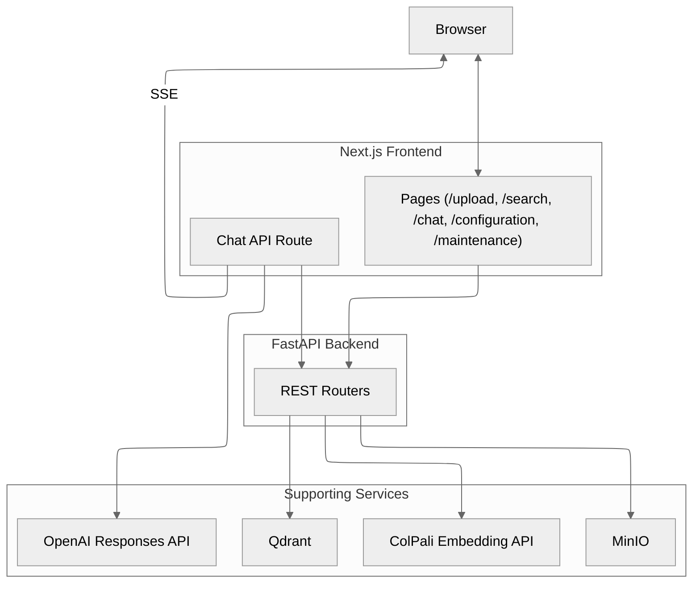

<p align="center">
  
</p>

---

> **Rebrand Notice (2025-10-20):** This project has been rebranded from **Snappy** to **Morty™** as part of a **pro-bono** promotional collaboration with Vultr. Morty is **based on** the original Snappy project and remains compatible with existing Snappy documentation where applicable. Learn more about Snappy here: https://github.com/athrael-soju/Snappy.  
> _Morty™ is a trademark of Vultr.com. All other trademarks are the property of their respective owners._

# Morty™ – Your Vision Retrieval Buddy!

[](https://fastapi.tiangolo.com/)
[](https://qdrant.tech/)
[](https://min.io/)
[](https://nextjs.org/)
[](https://docs.docker.com/compose/)
[](LICENSE)

Morty is an energetic, approachable, infrastructure-savvy companion for vision-first document retrieval. Drop in PDFs and Morty turns them into searchable, citation-ready experiences powered by ColPali embeddings, Qdrant multivectors, MinIO object storage, and a polished Next.js interface.

> Looking for component-level documentation?  
> - Backend implementation: `backend/README.md`  
> - Frontend guide: `frontend/README.md`  
> - ColPali service: `colpali/README.md`  
> - Configuration reference: `backend/docs/configuration.md`

---

## Background

- Morty inherits its core from the Snappy project and continues to honor the upstream MIT-licensed codebase.  
- This Vultr collaboration is strictly **pro-bono**; no payment or consideration is involved.  
- Morty retains existing CLI names, configuration schemas, and API routes so existing Snappy deployments remain compatible.  
- Brand voice: energetic, approachable, infrastructure-savvy. Palette: Vultr blues accented with neutral grays; ensure AA contrast in both light and dark themes.

---

## Why Morty Stands Out

- **Vision-first retrieval:** Page-level multivectors let Morty understand document layout without OCR. Optional MUVERA acceleration balances recall and throughput.  
- **Grounded responses:** Morty pairs streamed OpenAI responses with thumbnail citations so readers can validate answers instantly.  
- **Live tuning:** Runtime configuration, typed validation, and draft detection keep deployments aligned without restarts.  
- **Deployment flexibility:** One `docker compose` call gets you Qdrant, MinIO, FastAPI, Next.js, and ColPali. Prefer bespoke infrastructure? Morty plays nicely with external services too.

---

## Architecture



See `backend/docs/architecture.md` and `backend/docs/analysis.md` for deeper dives into ingestion, retrieval, and scaling strategies.

---

## Quick Start

**Step 1 — Environment files**

```bash
cp .env.example .env
cp frontend/.env.example frontend/.env.local
```

Set `COLPALI_MODE=cpu` or `gpu`, then add your OpenAI API key to `frontend/.env.local`.

**Step 2 — ColPali embeddings**

```bash
# From colpali/
docker compose up -d api-cpu   # http://localhost:7001
# or GPU acceleration
docker compose up -d api-gpu   # http://localhost:7002
```

**Step 3 — Morty stack**

```bash
docker compose up -d --build
```

**Step 4 — Explore**

- Backend API docs: http://localhost:8000/docs  
- Morty UI: http://localhost:3000  
- MinIO console (optional): http://localhost:9001

All services communicate over the `morty-network` bridge defined in `docker-compose.yml`.

Need a manual deployment? Follow the local workflow below and keep existing Snappy environment variables; only the branding changes.

---

## Local Workflow Without Docker

1. Start Qdrant and MinIO (self-hosted or managed) and update `.env`.  
2. Launch the ColPali API:
   ```bash
   uvicorn colpali.api:app --host 0.0.0.0 --port 7001
   ```
3. Configure a virtual environment and start FastAPI:
   ```bash
   python -m venv .venv
   .\.venv\Scripts\activate
   pip install -r backend/requirements.txt
   uvicorn backend:app --host 0.0.0.0 --port 8000 --reload
   ```
4. Install and run the Next.js frontend:
   ```bash
   yarn install --frozen-lockfile
   yarn dev
   ```
5. Prefer GPU embeddings? Run `uvicorn colpali.app:app --port 7002` or use the Docker services above.

---

## Configuration Essentials

### Backend highlights

- `COLPALI_MODE`, `COLPALI_CPU_URL`, `COLPALI_GPU_URL`, `COLPALI_API_TIMEOUT`  
- `QDRANT_URL`, `QDRANT_COLLECTION_NAME`, `QDRANT_USE_BINARY`, `QDRANT_PREFETCH_LIMIT`  
- `MINIO_URL`, `MINIO_PUBLIC_URL`, `MINIO_BUCKET_NAME`, `MINIO_ACCESS_KEY`, `MINIO_SECRET_KEY`  
- `MUVERA_ENABLED`, `MUVERA_CONFIG`, and related post-processing flags  
- `LOG_LEVEL`, `ALLOWED_ORIGINS`, `UVICORN_RELOAD`

Schema-backed defaults live in `backend/docs/configuration.md`. Runtime updates through `/config/update` are ephemeral; commit long-term changes to `.env`.

### Frontend highlights (`frontend/.env.local`)

- `NEXT_PUBLIC_API_BASE_URL` (default `http://localhost:8000`)  
- `OPENAI_API_KEY`, `OPENAI_MODEL`, optional `OPENAI_TEMPERATURE`, `OPENAI_MAX_TOKENS`

---

## API Overview

| Area         | Endpoint(s)                              | Description |
|--------------|------------------------------------------|-------------|
| Meta         | `GET /health`                            | Service and dependency status |
| Retrieval    | `GET /search?q=...&k=5`                  | Page-level search (defaults to 10 results when `k` is omitted) |
| Indexing     | `POST /index`                            | Start background ingestion (multipart PDF upload) |
|              | `GET /progress/stream/{job_id}`          | Real-time Server-Sent Events |
|              | `POST /index/cancel/{job_id}`            | Cancel an active job |
| Maintenance  | `GET /status`                            | Collection and storage metrics |
|              | `POST /initialize` / `DELETE /delete`    | Provision or tear down collection and bucket |
|              | `POST /clear/qdrant` / `/clear/minio` / `/clear/all` | Targeted cleanup helpers |
| Configuration| `GET /config/schema` / `GET /config/values` | Inspect schema and runtime values |
|              | `POST /config/update` / `/config/reset` / `/config/optimize` | Manage live configuration |

Chat streaming lives in `frontend/app/api/chat/route.ts`. It calls the backend search endpoint, invokes the OpenAI Responses API, and streams Server-Sent Events to the browser. The backend intentionally avoids proxying OpenAI directly.

---

## Troubleshooting

- **ColPali timeouts:** Increase `COLPALI_API_TIMEOUT` or use the GPU service.  
- **Stalled progress:** Confirm Poppler is installed and inspect backend logs for PDF conversion errors.  
- **Missing thumbnails:** Validate MinIO credentials and permitted image domains in `next.config.ts`.  
- **CORS issues:** Restrict `ALLOWED_ORIGINS` to explicit URLs before production rollout.  
- **Config drift:** `/config/update` is temporary; commit permanent values to `.env`.  
- Need more? `backend/docs/configuration.md` contains deep-dive remediation notes.

---

## Developer Notes

- Background ingestion relies on FastAPI `BackgroundTasks`. For large workloads consider an external task queue.  
- MinIO upload pools auto-size based on hardware; only adjust `MINIO_WORKERS` or `MINIO_RETRIES` for advanced tuning.  
- Type safety comes from generated SDKs: `yarn gen:sdk` and `yarn gen:zod`.  
- Pre-commit hooks enforce formatting (`autoflake`, `isort`, `black`) and static analysis (`pyright`).

---

## Roadmap

Upcoming improvements include authentication, distributed workers, observability dashboards, CI/CD hardening, and scale-oriented infrastructure playbooks. Track progress and contribute ideas via GitHub issues and discussions.

---

## Rebrand & Migration

- Review `MIGRATION.md` for a concise summary of what changed, what stayed the same, and frequently asked questions.  
- Legal and brand usage guidelines are consolidated in `TRADEMARKS.md`.  
- Redirect map and updated doc slugs are tracked in `docs/redirects.md` (or your site generator of choice).

---

## Attribution & Licensing

- Morty remains licensed under the **MIT License**; see [LICENSE](LICENSE) for current terms.  
- Upstream Snappy license text is preserved in `LICENSES/SNAPPY_MIT_LICENSE.txt`.  
- Trademark usage guidance and the pro-bono disclosure live in `TRADEMARKS.md`.

---

Morty is a rebrand based on the open-source project Snappy (https://github.com/athrael-soju/Snappy). Portions are licensed under the **MIT License**; license and attribution preserved.
