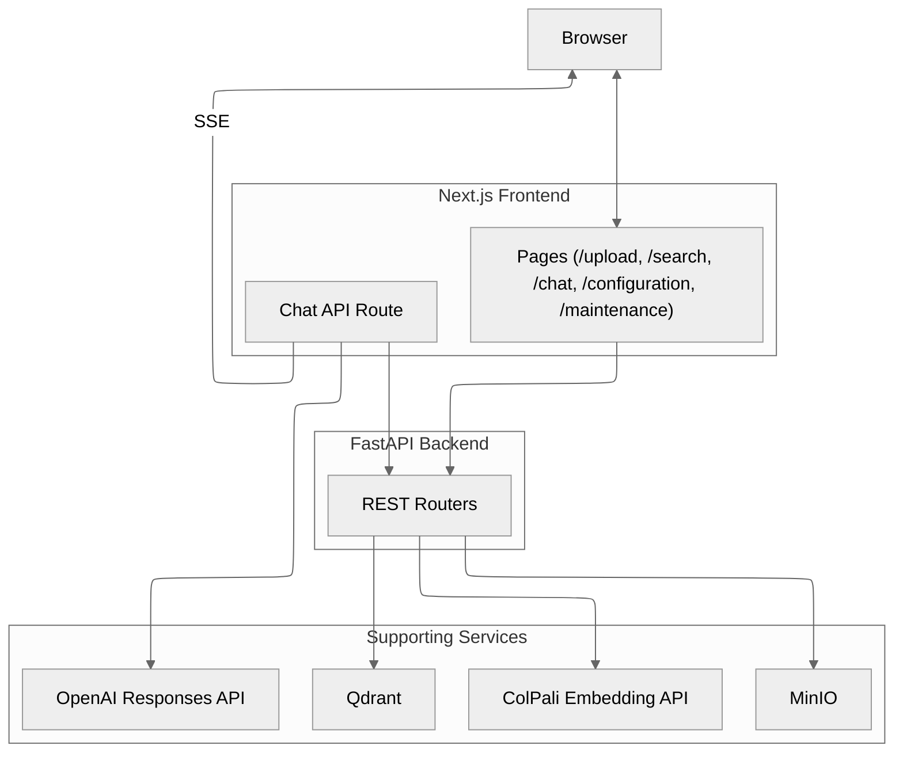

<p align="center">
  
</p>

---

# Snappy - Your Vision Retrieval Buddy! 📸

[](https://fastapi.tiangolo.com/)
[](https://qdrant.tech/)
[](https://min.io/)
[](https://nextjs.org/)
[](https://docs.docker.com/compose/)
[](LICENSE)

Hey there! 👋 Snappy is your friendly companion for **vision-first document retrieval**. Drop in your PDFs, and watch as Snappy transforms them into searchable page images with state-of-the-art ColPali embeddings. No OCR headaches, no text extraction gymnastics; just pure visual understanding!

We're talking multivector embeddings in Qdrant, object storage in MinIO, streaming AI chat with visual citations, and a sleek Next.js interface that makes document search feel like magic. ✨

> Looking for component-level docs?  
> - Backend: `backend/README.md`  
> - Frontend: `frontend/README.md`  
> - ColPali service: `colpali/README.md`  
> - Configuration reference: `backend/docs/configuration.md`

---

## Architecture



See `backend/docs/architecture.md` and `backend/docs/analysis.md` for a deeper
walkthrough of the indexing and retrieval flows.

---

## What Makes Snappy Special? 🌟

- **🎯 Page-level Vision Retrieval** - Multivector embeddings for every PDF page with optional MUVERA acceleration. No text extraction needed; Snappy sees your documents the way you do!

- **💬 Smart Chat with Visual Proof** - Stream responses from OpenAI with actual page images as citations. When Snappy answers, it shows its work with a glowing "Visual citations included" chip and image gallery.

- **⚡ Blazing Fast Indexing** - Pipelined processing with real-time progress updates via Server-Sent Events. Cancel anytime, batch smartly, and watch the magic happen.

- **🎛️ Live Configuration** - Tweak runtime settings on the fly through a beautiful web UI. Review drafts, manage by section, reset to defaults; all without restarting a thing.

- **🐳 Docker-Ready** - One command gets you Qdrant, MinIO, FastAPI backend, Next.js frontend, and ColPali embedding services (CPU or GPU, you choose!).

---

## Snappy's Look & Feel 🎨

We've crafted a gorgeous Next.js 15 interface that's as functional as it is beautiful. Think real-time streaming, smooth animations, and visual citations that pop!

- **Design Tokens**: Everything stays pixel-perfect with our tokenized utilities in `frontend/app/globals.css` (`text-body-*`, `size-icon-*`). Extend Snappy's UI with these helpers to maintain that consistent, professional vibe.

- **Smart Configuration**: Organized tabs, live stats, and a helpful draft banner that lets you know when your browser settings drift from the server. No surprises, just smooth sailing! 🚢

---

## See Snappy in Action 🎬

https://github.com/user-attachments/assets/99438b0d-c62e-4e47-bdc8-623ee1d2236c

---

## Get Snappy Running in 5 Minutes! ⚡

**Step 1:** Set up your environment files

```bash
cp .env.example .env
cp frontend/.env.example frontend/.env.local
```

- Pop in your OpenAI API key in `frontend/.env.local`

**Step 2:** Fire up the ColPali embedding service

```bash
# From the colpali/ directory

# GPU profile (includes CUDA + flash-attn build tooling)
docker compose --profile gpu up -d --build

# CPU profile (lean image, no GPU requirements)
docker compose --profile cpu up -d --build

# Need a different port or to pin GPU usage? Override env vars as you go.
PUBLIC_PORT=7010 COLPALI_GPUS=1 docker compose --profile gpu up -d --build

> Heads up: the first GPU build compiles `flash-attn`; thanks to the multi-stage build the wheel is cached, so subsequent rebuilds are much faster.

> Pick exactly one profile per run—`--profile gpu` or `--profile cpu`—to avoid port clashes.

Behind the scenes the GPU profile uses NVIDIA's nightly `pytorch/pytorch:nightly-cu130` image, then reinstalls the matching PyTorch CU130 nightly wheel so Blackwell (`sm_120`) cards work; the flash-attn wheel is prebuilt in a builder stage and layered on top.

# Update your .env (COLPALI_URL) to match the port you expose.
```

**Step 3:** Launch the whole Snappy stack

```bash
docker compose up -d --build
```

**Step 4:** Start exploring! 🎉
- 📚 Backend API docs: http://localhost:8000/docs
- 🎨 Snappy UI: http://localhost:3000
- 🗄️ MinIO console: http://localhost:9001 (optional)

---

## Prefer Local Development? We Got You! 💻

1. Install Poppler (required by `pdf2image`).
2. Create a virtual environment and install backend dependencies:

   ```bash
   cd backend
   python -m venv .venv
   . .venv/Scripts/activate  # PowerShell: .venv\Scripts\Activate.ps1
   pip install -U pip setuptools wheel
   pip install -r requirements.txt
   ```

3. Run the backend:

   ```bash
   uvicorn backend:app --host 0.0.0.0 --port 8000 --reload
   ```

4. In `frontend/`, install and run the Next.js app:

   ```bash
   yarn install --frozen-lockfile
   yarn dev
   ```

5. Start a ColPali embedding service (via Docker or locally with `uvicorn
   colpali/app.py`).

---

## Environment variables

### Backend highlights

  `COLPALI_API_TIMEOUT`
- `QDRANT_EMBEDDED` (defaults to `False`), `QDRANT_URL`, `QDRANT_COLLECTION_NAME`,
  `QDRANT_PREFETCH_LIMIT`, quantisation toggles (`QDRANT_USE_BINARY`, etc.)
- `MINIO_URL`, `MINIO_PUBLIC_URL`, credentials, `MINIO_BUCKET_NAME`,
  `IMAGE_FORMAT` and `IMAGE_QUALITY`
- `MUVERA_ENABLED` and related parameters (requires `fastembed[postprocess]`)
- `LOG_LEVEL`, `ALLOWED_ORIGINS`, `UVICORN_RELOAD`

All schema-backed settings (and their defaults) are documented in
`backend/docs/configuration.md`. To change values permanently update your
`.env`. Runtime updates via `/config/update` are ephemeral. MinIO credentials
must be supplied; the backend no longer falls back to inline image storage.

### Frontend highlights (`frontend/.env.local`)

- `NEXT_PUBLIC_API_BASE_URL` - defaults to `http://localhost:8000`
- `OPENAI_API_KEY`, `OPENAI_MODEL`, optional `OPENAI_TEMPERATURE`,
  `OPENAI_MAX_TOKENS`

---

## API overview

| Area         | Endpoint(s)                              | Description |
|--------------|------------------------------------------|-------------|
| Meta         | `GET /health`                            | Service and dependency status |
| Retrieval    | `GET /search?q=...&k=5`                  | Page-level search (defaults to 10 results when `k` is omitted) |
| Indexing     | `POST /index`                            | Start a background indexing job (multipart PDF upload) |
|              | `GET /progress/stream/{job_id}`          | Real-time job progress (SSE) |
|              | `POST /index/cancel/{job_id}`            | Cancel an in-flight job |
| Maintenance  | `GET /status`                            | Collection/bucket statistics |
|              | `POST /initialize` / `DELETE /delete`    | Provision or tear down collection + bucket |
|              | `POST /clear/qdrant` / `/clear/minio` / `/clear/all` | Data reset helpers |
| Configuration| `GET /config/schema` / `GET /config/values` | Expose runtime schema and values |
|              | `POST /config/update` / `/config/reset` / `/config/optimize` | Runtime configuration management |

Chat streaming is implemented in the Next.js API route
`frontend/app/api/chat/route.ts`. It calls the backend search endpoint, invokes
the OpenAI Responses API, and streams Server-Sent Events to the browser. The
backend does not proxy OpenAI calls.

---

## Troubleshooting - Snappy's Here to Help! 🔧

**ColPali timing out?** Bump up `COLPALI_API_TIMEOUT` or switch to GPU mode. CPU works but it's like running through molasses!

**Progress bar stuck?** Make sure Poppler is installed and playing nice. Check those backend logs for PDF conversion drama.

**Missing images?** Double-check your MinIO credentials and URLs. Also peek at `next.config.ts` to ensure image domains are whitelisted.

**CORS giving you grief?** Lock down `ALLOWED_ORIGINS` with explicit URLs before going public. Wildcards are great for dev, not so much for production!

**Config changes vanishing?** Remember: `/config/update` is temporary magic. For permanent changes, update that `.env` file!

💡 **Pro tip**: Check out `backend/docs/configuration.md` for deep-dive troubleshooting guidance.

---

## Developer Notes 🛠️

- **Background Jobs**: PDF ingestion uses FastAPI `BackgroundTasks`. Simple and effective! For production scale, consider a proper job queue.

- **Smart Upload Pools**: MinIO automatically sizes worker pools based on your hardware. Only tweak `MINIO_WORKERS`/`MINIO_RETRIES` if you really know what you're doing!

- **Type Safety FTW**: The frontend auto-generates TypeScript types from OpenAPI specs (`yarn gen:sdk`, `yarn gen:zod`). Always in sync, always type-safe!

- **Code Quality**: Pre-commit hooks keep things tidy with autoflake, isort, black, and pyright. Clean code is happy code! ✨

---

## What's Next for Snappy? 🚀

Curious about future features? Check out `feature-list.md` for our production roadmap; think authentication, distributed workers, observability dashboards, CI/CD pipelines, and infrastructure scaling. Snappy's just getting started!

---

## License

MIT License - see [LICENSE](LICENSE).

---

## Standing on the Shoulders of Giants 🙏

Snappy wouldn't exist without these amazing projects:

- **ColPali / ColModernVBert** - The brilliant vision-language models that power our understanding  
  📄 https://arxiv.org/abs/2407.01449

- **Qdrant** - Lightning-fast vector search with killer optimization guides  
  📚 https://qdrant.tech/blog/colpali-qdrant-optimization/  
  📚 https://qdrant.tech/articles/binary-quantization/

- **PyTorch** - The deep learning framework that makes it all possible  
  🔥 https://pytorch.org/
