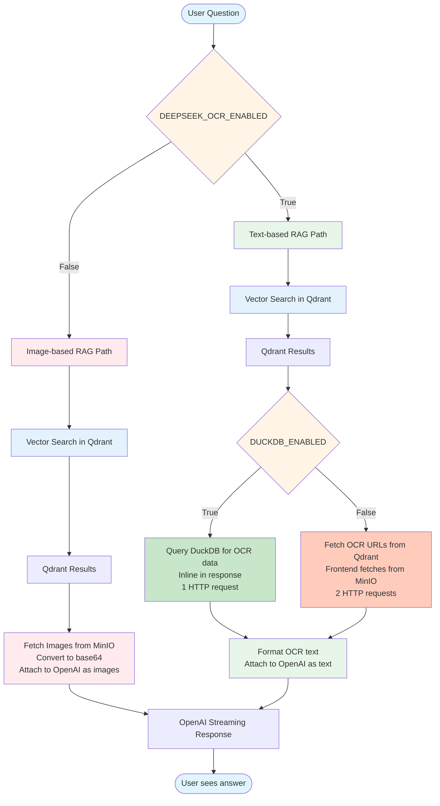

<p align="center">
  
</p>

---

<h1 align="center">Snappy - Vision-Grounded Document Retrieval</h1>

<p align="center">
  <!-- Project Stats -->
  <a href="https://github.com/athrael-soju/Snappy/releases"></a>
  <a href="https://github.com/athrael-soju/Snappy/stargazers"></a>
  <a href="https://github.com/athrael-soju/Snappy/network/members"></a>
  <a href="https://github.com/athrael-soju/Snappy/issues"></a>
  <a href="LICENSE"></a>
</p>

<p align="center">
  <!-- Build & Quality -->
  <a href="https://github.com/athrael-soju/Snappy/actions"></a>
  <a href="https://github.com/athrael-soju/Snappy/security/code-scanning"></a>
  <a href="https://github.com/athrael-soju/Snappy"></a>
  <a href="https://github.com/pre-commit/pre-commit"></a>
</p>

<p align="center">
  <!-- Tech Stack -->
  <a href="https://fastapi.tiangolo.com/"></a>
  <a href="https://nextjs.org/"></a>
  <a href="https://react.dev/"></a>
  <a href="https://www.python.org/"></a>
  <a href="https://www.typescriptlang.org/"></a>
  <a href="https://qdrant.tech/"></a>
  <a href="https://min.io/"></a>
  <a href="https://docs.docker.com/compose/"></a>
</p>

---

<p align="center">
  Snappy pairs a FastAPI backend, ColPali embedding service, DeepSeek OCR, DuckDB analytics, and a Next.js frontend to deliver hybrid vision+text retrieval over PDFs. Each page is rasterized, embedded as multivectors, and stored alongside images and optional OCR text so you can search by visual layout, extracted text, or both. 🔍✨
</p>

**TL;DR** 🚀

- 👁️ Vision-focused retrieval and chat with ColPali multivector embeddings, MinIO image storage, and Qdrant search.
- 🔍 DeepSeek OCR integration for advanced text extraction with configurable models and visual grounding.
- 🦆 DuckDB analytics for document deduplication, OCR metadata storage, and SQL-based queries.
- ⚡ Streaming responses, live indexing progress, and a schema-driven configuration UI to keep changes safe.
- 🐳 One Docker Compose stack or individual services for local development and production-style deployments.

---

## Table of Contents 📑

- [🎬 Showcase](#showcase)
- [🏗️ Architecture](#architecture)
- [🚀 Quick Start](#quick-start)
  - [Option A - Pre-built Docker Images](#option-a---run-with-pre-built-docker-images)
  - [Option B - Full Stack (Build from Source)](#option-b---run-the-full-stack-with-docker-compose-build-from-source)
  - [Option C - Local Development](#option-c---run-services-locally)
- [✨ Highlights](#highlights)
- [💼 Use Cases](#use-cases)
- [🎨 Frontend Experience](#frontend-experience)
- [⚙️ Environment Variables](#environment-variables)
- [🔌 API Overview](#api-overview)
- [🔧 Troubleshooting](#troubleshooting)
- [👨‍💻 Developer Notes](#developer-notes)
- [📚 Documentation](#documentation)
- [📄 License](#license)
- [🙏 Acknowledgements](#acknowledgements)

---

## Showcase 🎬

https://github.com/user-attachments/assets/99438b0d-c62e-4e47-bdc8-623ee1d2236c

---

## Architecture 🏗️



Head to `backend/docs/architecture.md` and `backend/docs/analysis.md` for a deeper walkthrough of the indexing and retrieval flows. 📖

---

## Quick Start 🚀

**Choose your deployment method:** 🎯

- **[Option A](#option-a---run-with-pre-built-docker-images-)** 🐳 - Fastest: Use pre-built images from GitHub Container Registry
- **[Option B](#option-b---run-the-full-stack-with-docker-compose-build-from-source-)** 🔨 - Build from source: Full Docker Compose stack
- **[Option C](#option-c---run-services-locally-)** 💻 - Local development: Run services individually

### Simplified Configuration ✅

Snappy uses an opinionated configuration approach with automatic optimizations. You only need to configure essential settings:

1. **Copy the environment file** 📝

   ```bash
   cp .env.example .env
   ```

2. **Edit essential settings in `.env`** 🔑

   ```bash
   # Required
   QDRANT_COLLECTION_NAME=your-collection-name  # Name for your document collection
   OPENAI_API_KEY=your-api-key                  # For chat feature

   # Optional - Hardware Configuration
   DEEPSEEK_OCR_ENABLED=true                    # Enable OCR (requires NVIDIA GPU)
   DUCKDB_ENABLED=false                         # Enable DuckDB analytics
   BATCH_SIZE=4                                 # 2-4 for CPU/Apple Silicon, 4-8 for NVIDIA GPU
   ```

3. **Start with the appropriate profile** 🚀

   ```bash
   # Minimal (ColPali only - works on any hardware)
   make up-minimal

   # ML (ColPali + DeepSeek OCR - requires NVIDIA GPU)
   make up-ml

   # Full (All services including DuckDB)
   make up-full
   ```

   Prefer plain Docker Compose? Use the root `docker-compose.yml` with profiles:
   ```bash
   docker compose --profile minimal up -d  # ColPali only (no DeepSeek OCR, no DuckDB)
   docker compose --profile ml up -d       # ColPali + DeepSeek OCR
   docker compose --profile full up -d     # All services including DuckDB
   ```

**That's it!** The system automatically configures:
- ✅ Hardware detection (NVIDIA GPU → Apple Silicon MPS → CPU)
- ✅ Binary quantization (32x memory reduction)
- ✅ Mean pooling (better recall)
- ✅ Re-ranking (improved accuracy)
- ✅ Parallelism (workers, connection pools)
- ✅ Storage optimization (disk vs RAM)
- ✅ GPU acceleration (when available)

---

### Option A - Run with Pre-built Docker Images 🐳

Use the pre-built images from GitHub Container Registry for instant deployment: ⚡

```bash
# Pull pre-built images
docker pull ghcr.io/athrael-soju/snappy/backend:latest
docker pull ghcr.io/athrael-soju/snappy/frontend:latest
docker pull ghcr.io/athrael-soju/snappy/colpali:latest
docker pull ghcr.io/athrael-soju/snappy/deepseek-ocr:latest
docker pull ghcr.io/athrael-soju/snappy/duckdb:latest

# Start services using Makefile profiles
make up-minimal  # ColPali only
make up-ml       # ColPali + DeepSeek OCR
make up-full     # All services
```

**Available images:** 📦
- `backend:latest` - FastAPI backend (amd64)
- `frontend:latest` - Next.js frontend (amd64)
- `colpali:latest` - Unified embedding service with GPU auto-detection (amd64)
- `deepseek-ocr:latest` - DeepSeek OCR service (amd64 only, requires NVIDIA GPU)
- `duckdb:latest` - DuckDB analytics service (amd64)

**Hardware Support:** 🖥️
- ColPali: Auto-detects NVIDIA GPU → Apple Silicon MPS → CPU at runtime
- DeepSeek OCR: Requires NVIDIA GPU with CUDA
- All other services: CPU-compatible

**Note:** 📌 For complete pre-built image documentation including version tags and production deployment guides, see the [Docker Registry Guide](.github/DOCKER_REGISTRY.md).

---

### Option B - Run the Full Stack with Docker Compose (Build from Source) 🔨

At the project root, choose your deployment profile based on your hardware:

```bash
# Minimal - ColPali only (works on any hardware)
make up-minimal

# ML - ColPali + DeepSeek OCR (requires NVIDIA GPU)
make up-ml

# Full - All services including DuckDB
make up-full
```

Or run Docker Compose directly with the same profiles as the Makefile:
```bash
docker compose --profile minimal up -d --build  # ColPali only (CPU ok)
docker compose --profile ml up -d --build       # Adds DeepSeek OCR (GPU)
docker compose --profile full up -d --build     # Adds DuckDB analytics
# Or set COMPOSE_PROFILES=minimal|ml|full then run: docker compose up -d --build
```

To disable services inside a profile without changing the stack, edit `.env`:
```bash
DEEPSEEK_OCR_ENABLED=false  # Disable OCR (if no GPU)
DUCKDB_ENABLED=false        # Disable DuckDB
```

**Makefile Commands:** 📋
```bash
make help          # Show all available commands
make up            # Start full profile (alias for up-full)
make down          # Stop all services
make logs          # View logs from all services
make logs-backend  # View specific service logs
make restart       # Restart services
make clean         # Stop and remove volumes
make ps            # Show running services
make health        # Check service health
```
Docker Compose automatically detects when images need rebuilding. To explicitly rebuild after Dockerfile or dependency changes, run `make build` or `make build-no-cache` before starting services.

Services will come online at: 🌐
- Backend: http://localhost:8000
- Frontend: http://localhost:3000
- Qdrant: http://localhost:6333
- MinIO: http://localhost:9000 (console at :9001)
- ColPali: http://localhost:7000
- DeepSeek OCR: http://localhost:8200 (ML/Full profiles only)
- DuckDB Analytics: http://localhost:8300 (Full profile only)

**Service Communication:** 🔗
- Inside Docker: Services use container names (`http://colpali:7000`, `http://deepseek-ocr:8200`)
- From host: Services use `localhost` (`http://localhost:7000`, `http://localhost:8200`)
- `.env` files use `localhost` URLs by default; docker-compose.yml overrides with service names

**Hardware Auto-Detection:** 🖥️
- ColPali automatically detects: NVIDIA GPU → Apple Silicon MPS → CPU
- No manual configuration needed for GPU/CPU switching
- DeepSeek OCR requires NVIDIA GPU (disable if unavailable)

---

### Option C - Run Services Locally 💻

Each service has a standalone `docker-compose.yml` for isolated development:

```bash
# ColPali only
cd colpali && docker compose up

# DeepSeek OCR only (requires NVIDIA GPU)
cd deepseek-ocr && docker compose up

# Backend with minimal dependencies (Qdrant + MinIO)
cd backend && docker compose up

# DuckDB only
cd duckdb && docker compose up

# Frontend with full backend stack
cd frontend && docker compose up
```

**For Python services without Docker:**

1. **Backend:**
   ```bash
   cd backend
   python -m venv .venv
   source .venv/bin/activate  # Windows: .venv\Scripts\Activate.ps1
   pip install -U pip setuptools wheel
   pip install -r requirements.txt
   uvicorn backend.main:app --host 0.0.0.0 --port 8000 --reload
   ```

2. **ColPali:**
   ```bash
   cd colpali
   python -m venv .venv
   source .venv/bin/activate
   pip install -U pip setuptools wheel
   pip install -r requirements.txt
   uvicorn app.main:app --host 0.0.0.0 --port 7000 --reload
   ```

3. **Frontend:**
   ```bash
   cd frontend
   yarn install --frozen-lockfile
   yarn dev
   ```

**Development Tips:** 💡
- Service-specific compose files disable ML dependencies by default for faster startup
- Enable ML services in individual `.env` files as needed
- All services automatically detect available hardware (GPU/CPU)

---

## Highlights ✨

- 🎯 **Page-level vision retrieval** powered by ColPali multivector embeddings; no OCR pipeline to maintain.
- 🔍 **DeepSeek OCR integration** for advanced text extraction with:
  - Configurable model sizes (Tiny, Small, Base, Large, Gundam)
  - Multiple processing modes (plain OCR, markdown conversion, text location, image description, custom prompts)
  - Visual grounding with bounding boxes
  - Parallel batch processing with adjustable worker settings
  - UUID-based result naming for reliable storage and retrieval
  - Image embedding support
- 🦆 **DuckDB Analytics** for OCR data storage and SQL-based analytics with:
  - **Document deduplication** - Automatically detects and prevents duplicate uploads using content-based fingerprinting (filename, size, page count)
  - Automatic storage of OCR results alongside MinIO
  - Columnar tables (documents/pages/regions) for structured analytics instead of JSON blobs
  - SQL query interface for custom analytics with query sanitization
  - Full-text search across all OCR data
  - DuckDB-Wasm UI for interactive exploration
  - Document and page-level statistics with metadata tracking
- 🛑 **Comprehensive job cancellation** with multi-stage cleanup:
  1. **Service Restart** (0-75%, optional): Stops in-flight processing in ColPali/DeepSeek OCR via `/restart` endpoints
  2. **Qdrant Cleanup** (75-81%): Deletes all vector points by document filename
  3. **MinIO Cleanup** (81-87%): Removes all objects under document prefix (images, OCR JSON, regions)
  4. **DuckDB Cleanup** (87-93%): Cascade deletes from documents/pages/regions tables
  5. **Temp Files** (93-100%): Cleans up PDF conversion artifacts
  - Real-time progress tracking via Server-Sent Events
  - Configurable restart timeout (`JOB_CANCELLATION_SERVICE_RESTART_TIMEOUT`)
  - Enable with `JOB_CANCELLATION_RESTART_SERVICES_ENABLED=true`
- 💬 **Streaming chat responses** from the OpenAI Responses API with inline visual citations so you can see each supporting page.
- ⚡ **Streaming pipeline indexing** with parallel stages (rasterizer, embedding, storage, OCR, upsert) - first results in ~8 seconds, 3-6x faster for large documents with live Server-Sent Events progress updates.
- ⚙️ **Runtime configuration UI** backed by a typed schema, with reset and draft flows that make experimentation safe.
- 🐳 **Docker Compose profiles** for ColPali (GPU or CPU) plus an all-in-one stack for local development.

---

## Use Cases 💼

Snappy excels at retrieval scenarios where visual layout, formatting, and appearance matter as much as textual content: 🎯

- ⚖️ **Legal Document Analysis** - Search case files, contracts, and legal briefs by visual layout, annotations, and document structure without relying on OCR accuracy.
- 🏥 **Medical Records Retrieval** - Find patient charts, diagnostic reports, and medical forms by handwritten notes, stamps, diagrams, and visual markers that traditional text search misses.
- 💰 **Financial Auditing and Compliance** - Locate invoices, receipts, financial statements, and compliance documents by visual characteristics like logos, stamps, signatures, and table layouts.
- 🔬 **Academic Research and Papers** - Search scientific papers, technical documents, and research archives by figures, tables, equations, charts, and visual presentation; ideal for literature reviews.
- 📚 **Archive and Document Management** - Retrieve historical documents, scanned archives, and legacy records by visual appearance, preserving context that text extraction destroys.
- 🔧 **Engineering and Technical Documentation** - Find blueprints, schematics, technical drawings, and specification sheets by visual elements, diagrams, and layout patterns.
- 📰 **Media and Publishing** - Search newspaper archives, magazine layouts, and published materials by visual design, page composition, and formatting.
- 🎓 **Educational Content** - Organize and retrieve textbooks, lecture notes, and educational materials by visual structure, highlighting, and annotations.

**💡 When to use DeepSeek OCR:** Enable DeepSeek OCR when you need structured text extraction, markdown conversion, or precise text location with bounding boxes alongside visual retrieval. Perfect for hybrid workflows that combine vision-based search with traditional text processing.

---

## Frontend Experience 🎨

The Next.js 16 frontend with React 19.2 keeps things fast and friendly: real-time streaming, responsive layouts, and design tokens (`text-body-*`, `size-icon-*`) that make extending the UI consistent. Configuration and maintenance pages expose everything the backend can do, while upload/search/chat give you the workflows you need day to day.

### Hybrid RAG Modes 🔄

The chat interface adapts to three retrieval configurations based on backend settings:

1. **Image-Only Mode** (`DEEPSEEK_OCR_ENABLED=false`)
   - ColPali embeddings match query to page images
   - Full page images sent to OpenAI as vision context
   - Best for: Visual layout, diagrams, handwritten notes
   - System prompt focuses on visual analysis

2. **OCR-Only Mode** (`DEEPSEEK_OCR_ENABLED=true`, `DEEPSEEK_OCR_INCLUDE_IMAGES=false`)
   - ColPali embeddings + DeepSeek OCR extracted text
   - Text-only context sent to OpenAI (no images)
   - Best for: Text-heavy documents, faster inference, lower token costs
   - System prompt emphasizes text analysis with citations

3. **OCR + Region Images Mode** (`DEEPSEEK_OCR_ENABLED=true`, `DEEPSEEK_OCR_INCLUDE_IMAGES=true`)
   - ColPali embeddings + OCR text + extracted region images (figures, tables, diagrams)
   - Hybrid context: text + cropped visual elements sent to OpenAI
   - Best for: Technical documents, research papers, mixed content
   - System prompt combines text analysis with visual grounding

The frontend automatically detects the active mode and adjusts the chat system prompt accordingly. Citations render as interactive hover cards showing page previews with relevance scores.

---

## Environment Variables ⚙️

### Backend highlights 🔧

- 🧠 `COLPALI_URL`, `COLPALI_API_TIMEOUT`
- 🔍 **DeepSeek OCR**: `DEEPSEEK_OCR_ENABLED`, `DEEPSEEK_OCR_URL`, `DEEPSEEK_OCR_API_TIMEOUT`, `DEEPSEEK_OCR_MAX_WORKERS`, `DEEPSEEK_OCR_POOL_SIZE`, `DEEPSEEK_OCR_MODE`, `DEEPSEEK_OCR_TASK`, `DEEPSEEK_OCR_INCLUDE_GROUNDING`, `DEEPSEEK_OCR_INCLUDE_IMAGES`
- 🛑 **Job Cancellation**: `JOB_CANCELLATION_RESTART_SERVICES_ENABLED`, `JOB_CANCELLATION_WAIT_FOR_RESTART`, `JOB_CANCELLATION_SERVICE_RESTART_TIMEOUT`
- 📊 `QDRANT_EMBEDDED`, `QDRANT_URL`, `QDRANT_COLLECTION_NAME`, `QDRANT_PREFETCH_LIMIT`, `QDRANT_MEAN_POOLING_ENABLED`, quantisation toggles
- 🗄️ `MINIO_URL`, `MINIO_PUBLIC_URL`, credentials, bucket naming, `IMAGE_FORMAT`, `IMAGE_QUALITY`
- 📝 `LOG_LEVEL`, `ALLOWED_ORIGINS`, `UVICORN_RELOAD`

**Configuration Organization:** Settings are organized into 8 modular categories (`backend/config/schema/`):
- `application.py` - App-level settings (CORS, logging, environment)
- `colpali.py` - ColPali embedding service options
- `deepseek_ocr.py` - DeepSeek OCR mode, task, workers
- `duckdb.py` - DuckDB analytics and storage options
- `minio.py` - MinIO storage, bucket, image quality
- `processing.py` - Pipeline concurrency and batch sizes
- `qdrant.py` - Qdrant collection, quantization, pooling
- `upload.py` - Upload restrictions (file size, count, types)

All schema-backed settings (and defaults) are documented in `backend/docs/configuration.md`. Runtime updates via `/config/update` are ephemeral; update `.env` for persistence. 💾

### Frontend highlights (`frontend/.env.local`) 🎨

- 🌐 `NEXT_PUBLIC_API_BASE_URL` (defaults to `http://localhost:8000`)
- 🤖 `OPENAI_API_KEY`, `OPENAI_MODEL`, `OPENAI_TEMPERATURE`, `OPENAI_MAX_TOKENS`

---

## API Overview 🔌

| Area         | Endpoint(s)                              | Notes |
|--------------|------------------------------------------|-------|
| Meta         | `GET /health`                            | Service and dependency status |
| Retrieval    | `GET /search?q=...&k=5`                  | Page-level search (defaults to 10 when `k` omitted) |
| Indexing     | `POST /index`                            | Background indexing job (multipart PDF upload) |
|              | `GET /progress/stream/{job_id}`          | Real-time progress (SSE) |
|              | `POST /index/cancel/{job_id}`            | Cancel job with comprehensive cleanup (Qdrant, MinIO, DuckDB, temp files) |
| OCR          | `POST /ocr/process-page`, `/ocr/process-batch` | DeepSeek OCR per-page and batch processing (requires OCR service) |
|              | `POST /ocr/process-document`             | Background OCR for an entire indexed document |
|              | `GET /ocr/progress/{job_id}`, `/ocr/progress/stream/{job_id}` | Poll or stream OCR job progress |
|              | `POST /ocr/cancel/{job_id}`              | Cancel OCR job with comprehensive cleanup |
|              | `GET /ocr/health`                        | Check OCR service health |
| Maintenance  | `GET /status`                            | Collection, bucket, and DuckDB statistics |
|              | `POST /initialize`, `DELETE /delete`     | Provision or tear down collection, bucket, and DuckDB storage |
|              | `POST /clear/qdrant`, `/clear/minio`, `/clear/all` | Data reset helpers (DuckDB participates in reset/all) |
| Configuration| `GET /config/schema`, `/config/values`   | Expose runtime schema and values |
|              | `POST /config/update`, `/config/reset`   | Runtime configuration management |

Chat streaming lives in `frontend/app/api/chat/route.ts`. The route calls the backend search endpoint, invokes the OpenAI Responses API, and streams Server-Sent Events to the browser. The backend does not proxy OpenAI calls.

---

## Troubleshooting 🔧

- ⏱️ **ColPali timing out?** Increase `COLPALI_API_TIMEOUT` or run the GPU profile for heavy workloads.
- ⏸️ **Progress bar stuck?** Ensure Poppler is installed and check backend logs for PDF conversion errors.
- 🖼️ **Missing images?** Verify MinIO credentials/URLs and confirm `next.config.ts` allows the domains you expect.
- 🚫 **CORS issues?** Replace wildcard `ALLOWED_ORIGINS` entries with explicit URLs before exposing the API publicly.
- 💨 **Config changes vanish?** `/config/update` modifies runtime state only-update `.env` for anything you need to keep after a restart.
- 📤 **Upload rejected?** The uploader currently accepts PDFs only. Adjust max size, chunk size, or file count limits in the "Uploads" section of the configuration UI.
- 🔍 **OCR not working?** Ensure `DEEPSEEK_OCR_ENABLED=True` in `.env`, the GPU profile is running (DeepSeek OCR is GPU-only), and the service is reachable at `http://deepseek-ocr:8200`. Check service health with `GET /ocr/health`.
- 🛑 **Job cleanup after cancellation?** Job cancellation automatically cleans up all resources (Qdrant vectors, MinIO objects, DuckDB records, temp files). Enable service restart via `JOB_CANCELLATION_RESTART_SERVICES_ENABLED=true` to stop in-flight processing. See [backend/README.md](backend/README.md#job-cancellation) for details.

`backend/docs/configuration.md` and `backend/CONFIGURATION_GUIDE.md` cover advanced troubleshooting and implementation details.

---

## Developer Notes 👨‍💻

- 🔄 Background indexing uses FastAPI `BackgroundTasks`. For larger deployments consider a dedicated task queue.
- ⚙️ MinIO worker pools auto-size based on hardware. Override only when you have specific throughput limits.
- 🔄 TypeScript types and Zod schemas regenerate from the OpenAPI spec (`yarn gen:sdk`, `yarn gen:zod`) to keep the frontend in sync.
- ✅ Pre-commit hooks (autoflake, isort, black, pyright) keep the codebase tidy-run them before contributing.
- 🏗️ **Architecture:** Service classes follow "Client" naming convention (e.g., `ColPaliClient`, `OcrClient`) for consistent external service interaction patterns.
- 🏷️ **Version management:** Uses Release Please + Conventional Commits for automated releases. See `VERSIONING.md` for details.
- 🐳 **Docker organization:**
  - `Makefile` - Profile-based orchestration (minimal/ml/full)
  - `docker/*.yml` - Split compose files (base/ml/app)
  - `*/docker-compose.yml` - Per-service standalone development
  - `docker-compose.yml` - Root stack for `docker compose --profile ... up`

---

## Documentation 📚

**Core Documentation:** 📖
- 📄 `README.md` - This file: project overview and quick start
- 🏷️ `VERSIONING.md` - Version management and release workflow
- 🤖 `AGENTS.md` - Comprehensive guide for AI agents and developers

**Component Guides:** 🔧
- 🔌 `backend/README.md` - FastAPI backend setup and API reference
- 🎨 `frontend/README.md` - Next.js frontend development guide
- 🧠 `colpali/README.md` - ColPali embedding service guide
- 🔍 `deepseek-ocr/README.md` - DeepSeek OCR service guide

**Technical Deep Dives:** 🏗️
- 📐 `backend/docs/architecture.md` - System architecture and data flows
- ⚙️ `backend/docs/configuration.md` - Complete configuration reference
- 📊 `backend/docs/analysis.md` - Vision vs. text RAG comparison
- 🔄 `backend/docs/pipeline.md` - Pipeline processing architecture

**Deployment:** 🚀
- 🐳 `.github/DOCKER_REGISTRY.md` - Docker image registry and pre-built images guide

---

## License 📄

MIT License - see [LICENSE](LICENSE). ⚖️

---

## Acknowledgements 🙏

Snappy builds on the work of: 🌟

- 🧠 **ColPali / ColModernVBert** - multimodal models for visual retrieval  
   https://arxiv.org/abs/2407.01449
   https://arxiv.org/abs/2510.01149

- 🔍 **DeepSeek-OCR** - vision-language model for document understanding  
   https://huggingface.co/deepseek-ai/DeepSeek-OCR

- 🗄️ **Qdrant** - the vector database powering multivector search
   https://qdrant.tech/blog/colpali-qdrant-optimization/
   https://qdrant.tech/articles/binary-quantization/

- 🔥 **PyTorch** - core deep learning framework  
   https://pytorch.org/  
