# The Most Beautiful Rag - FastAPI / Next.js / ColPali Template

<center>

</center>

[](https://fastapi.tiangolo.com/)
[](https://qdrant.tech/)
[](https://min.io/)
[](https://nextjs.org/)
[](https://docs.docker.com/compose/)
[](LICENSE)

An end-to-end reference stack for **vision-first RAG** over PDFs. Documents are
rendered to page images, embedded with a ColPali-style model, stored as
multivectors in Qdrant, and surfaced through a Next.js UI with streaming chat
responses and visual citations.

> Looking for component-level docs?  
> • Backend: `backend/README.md`  
> • Frontend: `frontend/README.md`  
> • ColPali service: `colpali/README.md`  
> • Configuration reference: `backend/docs/configuration.md`

---

## Architecture

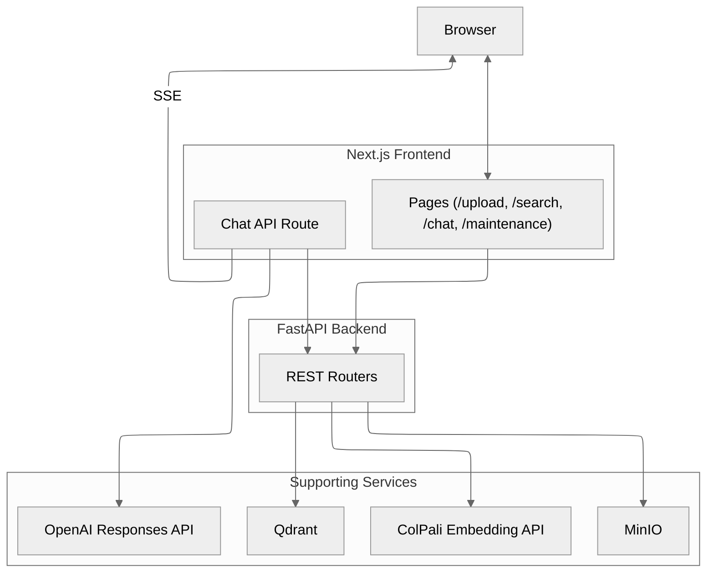

See `backend/docs/architecture.md` and `backend/docs/analysis.md` for a deeper
walkthrough of the indexing and retrieval flows.

---

## Features

- **Page-level, multimodal retrieval** – multivector embeddings per PDF page,
  optional MUVERA first-stage search, MinIO-backed image URLs or inline payloads.
- **Streaming chat with visual citations** – Next.js edge route emits a custom
  `kb.images` event alongside OpenAI Responses SSE, and the UI displays a
  "Visual citations included" chip with an image gallery.
- **Pipelined indexing** – configurable batch size, automatic concurrency
  sizing, progress tracking via Server-Sent Events, and optional cancellation.
- **Runtime configuration UI** – `/maintenance` page consumes the
  `/config/*` API to edit settings, reset to defaults, or apply hardware-driven
  optimisations without restarting the backend.
- **Docker-first** – root `docker-compose.yml` spins up Qdrant, MinIO, backend,
  frontend, and the ColPali embedding API services (CPU and GPU variants
  available under `colpali/docker-compose.yml`).

---

## UI / UX

A modern Next.js 15 UI with server-side streaming, real-time progress updates, and visual citations.

<div align="center">
  <table>
    <tr>
      <td align="center">
        <strong>Home</strong><br/>
        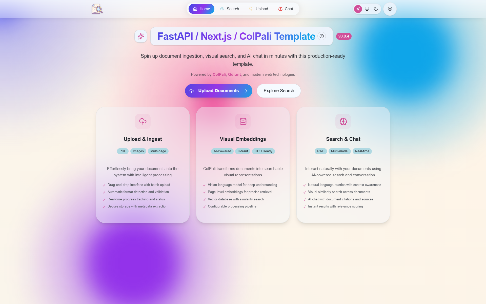
        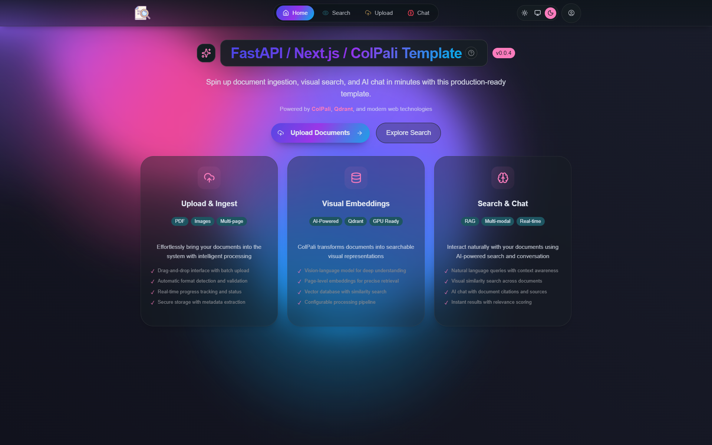
      </td>
      <td align="center">
        <strong>Upload</strong><br/>
        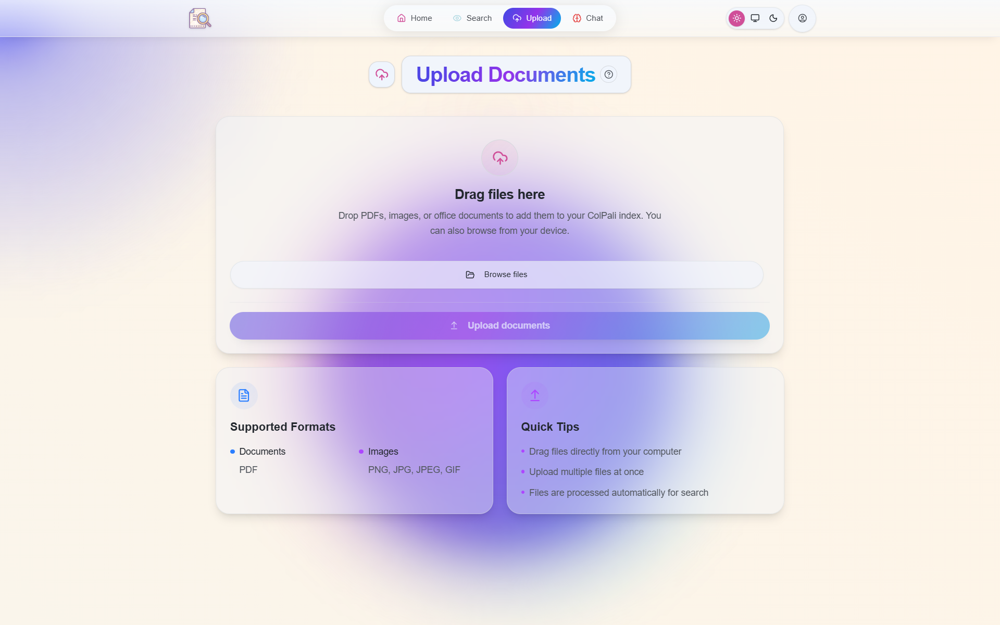
        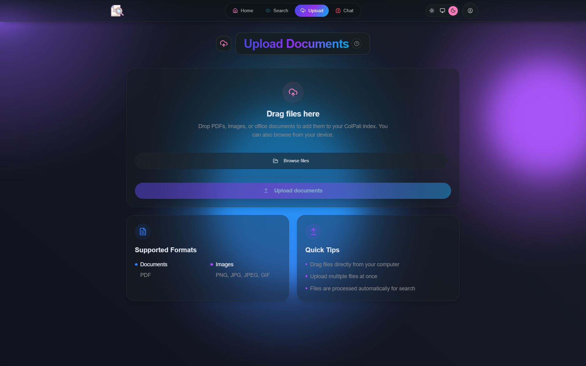
      </td>
    </tr>
    <tr>
      <td align="center">
        <strong>Search</strong><br/>
        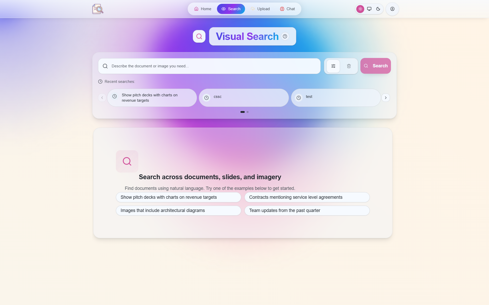
        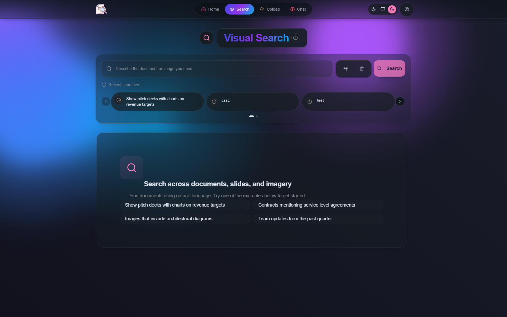
      </td>
      <td align="center">
        <strong>Chat</strong><br/>
        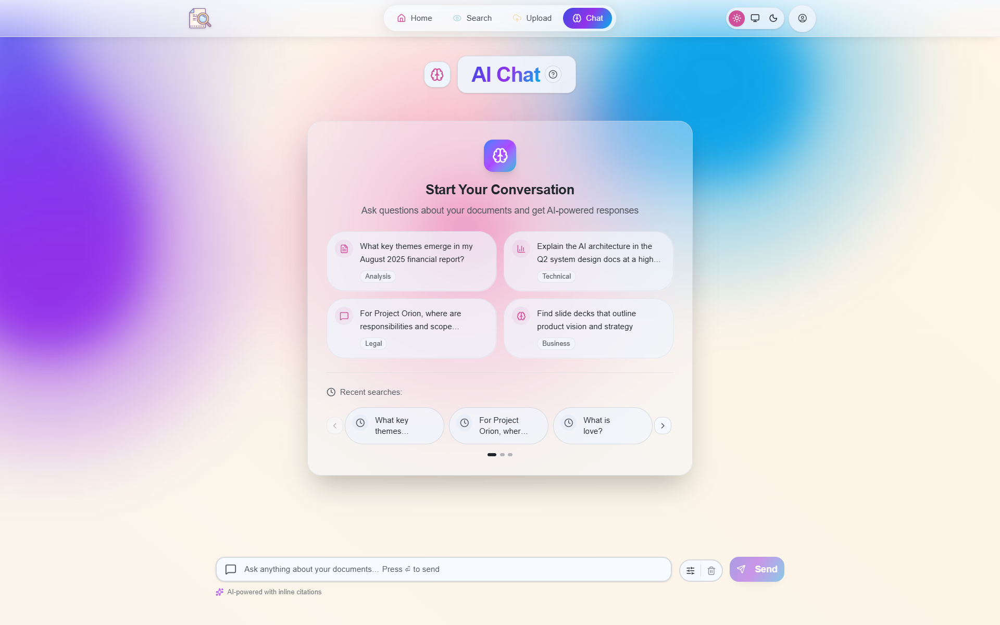
        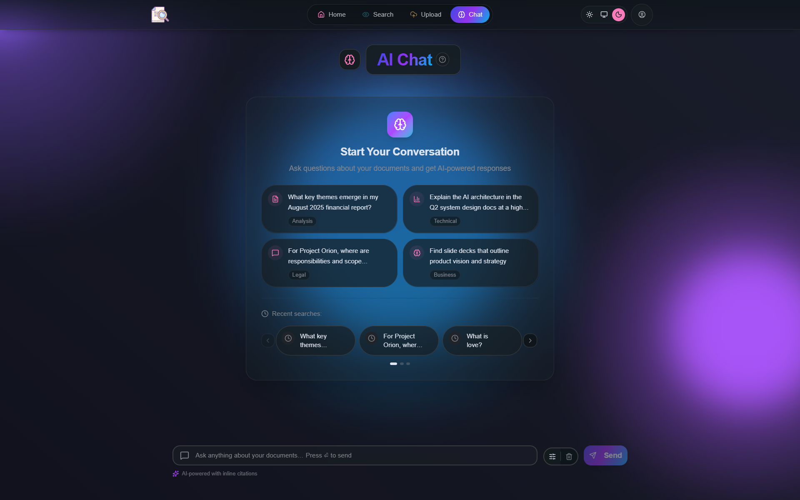
      </td>
    </tr>
    <tr>
      <td align="center">
        <strong>System (Configuration)</strong><br/>
        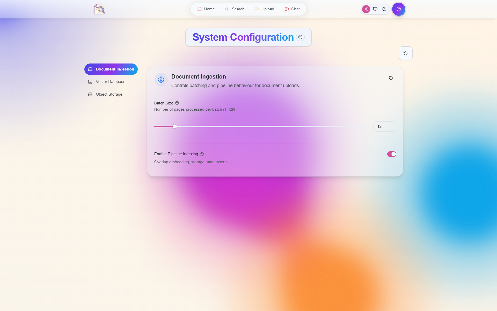
        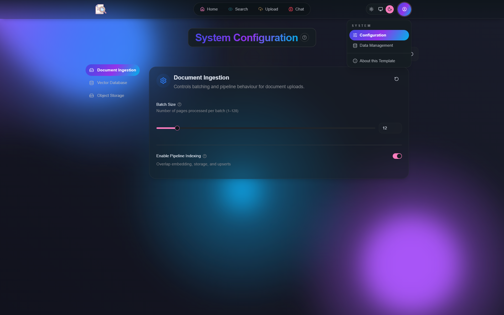
      </td>
      <td align="center">
        <strong>System (Maintenance)</strong><br/>
        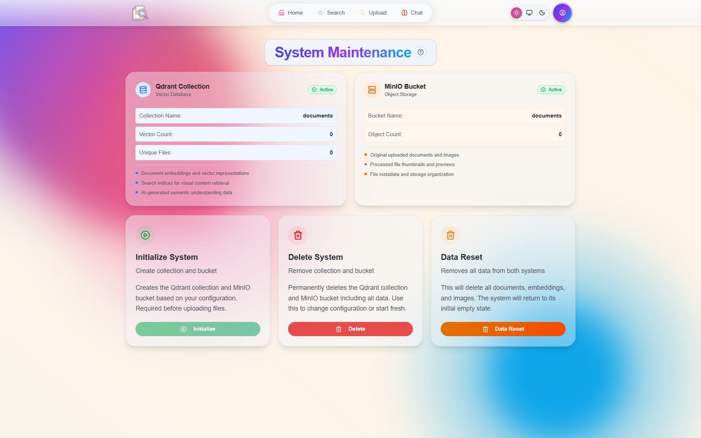
        
      </td>      
    </tr>
    <tr>    
      <td align="center">
         <strong>About</strong><br/>
         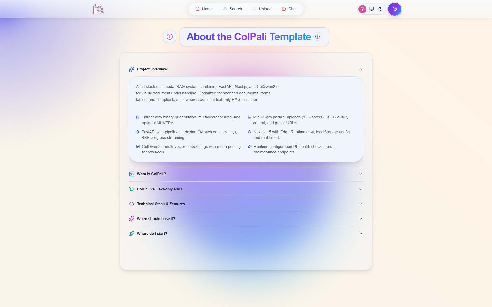
         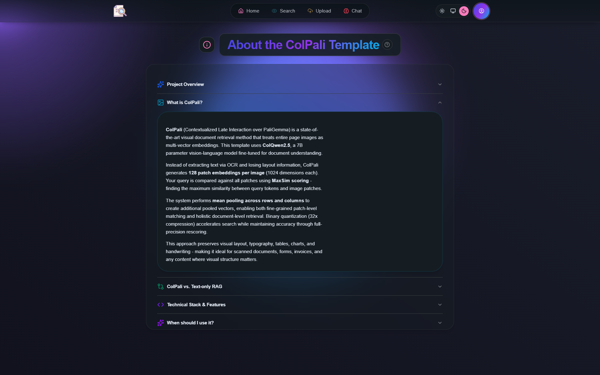
      </td>
    </tr>      
  </table>
</div>

---

## Quickstart (Docker Compose)

1. Copy environment defaults and configure values:

   ```bash
   cp .env.example .env
   cp frontend/.env.example frontend/.env.local
   ```

   - Set `COLPALI_MODE=cpu` or `gpu` depending on the embedding service you
     intend to run.
   - Provide an OpenAI API key in `frontend/.env.local`.

2. Start a ColPali embedding service in another terminal:

   ```bash
   # From colpali/
   docker compose up -d api-cpu      # http://localhost:7001
   # or
   docker compose up -d api-gpu      # http://localhost:7002
   ```

3. Launch the full stack from the repository root:

   ```bash
   docker compose up -d --build
   ```

4. Visit:
   - Backend API docs: http://localhost:8000/docs
   - Frontend UI: http://localhost:3000
   - MinIO console (optional): http://localhost:9001

---

## Local development (without Compose)

1. Install Poppler (required by `pdf2image`).
2. Create a virtual environment and install backend dependencies:

   ```bash
   cd backend
   python -m venv .venv
   . .venv/Scripts/activate  # PowerShell: .venv\Scripts\Activate.ps1
   pip install -U pip setuptools wheel
   pip install -r requirements.txt
   ```

3. Run the backend:

   ```bash
   uvicorn backend:app --host 0.0.0.0 --port 8000 --reload
   ```

4. In `frontend/`, install and run the Next.js app:

   ```bash
   yarn install --frozen-lockfile
   yarn dev
   ```

5. Start a ColPali embedding service (via Docker or locally with `uvicorn
   colpali/app.py`).

---

## Environment variables

### Backend highlights

- `COLPALI_MODE`, `COLPALI_CPU_URL`, `COLPALI_GPU_URL`,
  `COLPALI_API_TIMEOUT`
- `QDRANT_EMBEDDED`, `QDRANT_URL`, `QDRANT_COLLECTION_NAME`,
  `QDRANT_PREFETCH_LIMIT`, quantisation toggles (`QDRANT_USE_BINARY`, etc.)
- `MINIO_ENABLED`, `MINIO_URL`, `MINIO_PUBLIC_URL`, credentials, `IMAGE_FORMAT`
  and `IMAGE_QUALITY`
- `MUVERA_ENABLED` and related parameters (requires `fastembed[postprocess]`)
- `LOG_LEVEL`, `ALLOWED_ORIGINS`, `UVICORN_RELOAD`

All schema-backed settings (and their defaults) are documented in
`backend/docs/configuration.md`. To change values permanently update your
`.env`. Runtime updates via `/config/update` are ephemeral.

### Frontend highlights (`frontend/.env.local`)

- `NEXT_PUBLIC_API_BASE_URL` – defaults to `http://localhost:8000`
- `OPENAI_API_KEY`, `OPENAI_MODEL`, optional `OPENAI_TEMPERATURE`,
  `OPENAI_MAX_TOKENS`

---

## API overview

| Area         | Endpoint(s)                              | Description |
|--------------|------------------------------------------|-------------|
| Meta         | `GET /health`                            | Service and dependency status |
| Retrieval    | `GET /search?q=...&k=5`                  | Page-level search (defaults to 10 results when `k` is omitted) |
| Indexing     | `POST /index`                            | Start a background indexing job (multipart PDF upload) |
|              | `GET /progress/stream/{job_id}`          | Real-time job progress (SSE) |
|              | `POST /index/cancel/{job_id}`            | Cancel an in-flight job |
| Maintenance  | `GET /status`                            | Collection/bucket statistics |
|              | `POST /initialize` / `DELETE /delete`    | Provision or tear down collection + bucket |
|              | `POST /clear/qdrant` / `/clear/minio` / `/clear/all` | Data reset helpers |
| Configuration| `GET /config/schema` / `GET /config/values` | Expose runtime schema and values |
|              | `POST /config/update` / `/config/reset` / `/config/optimize` | Runtime configuration management |

Chat streaming is implemented in the Next.js API route
`frontend/app/api/chat/route.ts`. It calls the backend search endpoint, invokes
the OpenAI Responses API, and streams Server-Sent Events to the browser. The
backend does not proxy OpenAI calls.

---

## Troubleshooting

- **ColPali timeouts** – increase `COLPALI_API_TIMEOUT` or switch to the GPU
  service. CPU mode is significantly slower.
- **Progress stream never completes** – ensure Poppler is installed and
  accessible; check backend logs for PDF conversion errors.
- **Images missing in search results** – if `MINIO_ENABLED=False`, images are
  stored inline. Make sure the frontend `next.config.ts` allows the relevant
  domains when MinIO is enabled.
- **CORS errors** – set `ALLOWED_ORIGINS` to explicit URLs before exposing the
  API outside of local development.
- **Runtime config changes do not persist** – use `/config/update` for temporary
  tweaks and update `.env` for permanent values.

See the Troubleshooting section in `backend/docs/configuration.md` for more
configuration-specific guidance.

---

## Development notes

- PDF ingestion runs as an in-process background job (FastAPI
  `BackgroundTasks`). For production you may want to offload to a queue.
- MinIO uploads use automatically sized worker pools; override
  `MINIO_WORKERS`/`MINIO_RETRIES` only when you need explicit control.
- `frontend` uses OpenAPI code generation (`yarn gen:sdk`, `yarn gen:zod`)
  backed by `frontend/docs/openapi.json`.
- Pre-commit hooks (`.pre-commit-config.yaml`) include autoflake, isort, black,
  and pyright.

---

## Roadmap and hardening ideas

Refer to `feature-list.md` for a checklist of production hardening tasks:
authentication, background workers, observability, CI/CD, infrastructure, and
more.

---

## License

MIT License – see [LICENSE](LICENSE).

---

## Acknowledgements

- **ColPali / ColQwen** – https://arxiv.org/abs/2407.01449
- **Qdrant optimisations** – https://qdrant.tech/blog/colpali-qdrant-optimization/  
  and https://qdrant.tech/articles/binary-quantization/
- **PyTorch** – https://pytorch.org/
