<center>

</center>

# The Most Beautiful Rag - FastAPI / Next.js / ColPali Template

[](https://fastapi.tiangolo.com/) [](https://qdrant.tech/) [](https://min.io/) [](https://nextjs.org/) [](https://docs.docker.com/compose/) [](LICENSE)

A lightweight, end-to-end template for page-level retrieval over PDFs using a ColPali-like approach:

- __Storage__: page images in MinIO (or inline inside Qdrant when MinIO is disabled), multivector embeddings in Qdrant
- __Retrieval__: two-stage reranking with pooled image-token vectors; optional MUVERA-first stage when enabled
- __Generation__: Next.js chat API streams OpenAI Responses with multimodal context (retrieved page images)
- __API__: FastAPI service exposing endpoints for indexing, search, and maintenance

This repo is intended as a developer-friendly starting point for vision RAG systems.

## Component READMEs

- [backend/README.md](backend/README.md) — FastAPI backend
- [frontend/README.md](frontend/README.md) — Next.js frontend
- [colpali/README.md](colpali/README.md) — ColPali embedding API
- [backend/docs/configuration.md](backend/docs/configuration.md) — **Configuration reference and performance tuning** ⚙️
- [feature-list.md](feature-list.md) — Production hardening and roadmap checklist

> **⚠️ Performance Note**: CPU-based indexing is **significantly slower** than GPU. For production deployments with frequent indexing, GPU acceleration is strongly recommended. See [backend/docs/configuration.md](backend/docs/configuration.md) for detailed configuration options and performance tuning strategies.

## Table of Contents

- [The Most Beautiful Rag - FastAPI / Next.js / MinIO Template](#the-most-beautiful-rag---fastapi--nextjs--minio-template)
  - [Component READMEs](#component-readmes)
  - [Table of Contents](#table-of-contents)
  - [Architecture](#architecture)
  - [Features](#features)
  - [New Frontend](#new-frontend)
  - [What this project is not](#what-this-project-is-not)
  - [Prerequisites](#prerequisites)
  - [Quickstart (Docker Compose)](#quickstart-docker-compose)
  - [Local development (without Compose)](#local-development-without-compose)
  - [Environment variables](#environment-variables)
  - [Using the API](#using-the-api)
  - [API Examples](#api-examples)
  - [ColPali API contract (expected)](#colpali-api-contract-expected)
  - [Data model in Qdrant](#data-model-in-qdrant)
  - [Binary quantization (optional)](#binary-quantization-optional)
  - [Troubleshooting](#troubleshooting)
  - [Scripts and containers](#scripts-and-containers)
  - [Development notes](#development-notes)
  - [For collaborators](#for-collaborators)
  - [License](#license)
  - [Acknowledgements](#acknowledgements)
  - [Citations](#citations)

## Architecture

```mermaid
---
config:
  theme: neutral
  layout: elk
  look: neo
---
flowchart TB
 subgraph Services["🛠 Services"]
        BACKEND[["⚙️ Backend API"]]
        NXCHAT[["💬 Chat Service API"]]
  end
 subgraph External["🌐 External Integrations"]
        QD[("💾 Qdrant Vector DB")]
        MN[("🗄 MinIO Storage")]
        CQ(["☁️ ColPali Embedding API"])
        OA(["☁️ OpenAI API"])
  end
    U["🖥 User Browser"] <--> NEXT["🎨 Next.js Frontend"]
    NEXT -- 📤 Upload PDF(s) --> BACKEND
    NEXT -- 🔎 Search Query --> BACKEND
    BACKEND --> MN & CQ & QD
    NEXT -- 💬 Ask Question --> NXCHAT
    NXCHAT <--> OA
    NXCHAT -- 📡 Streamed Reply --> U

```



Below is the high-level component architecture of the Vision RAG template.
See the architecture diagram in [backend/docs/architecture.md](backend/docs/architecture.md). It focuses on the core indexing and retrieval flows for clarity.

- __`api/app.py`__ and `api/routers/*`__: Modular FastAPI application (routers: `meta`, `retrieval`, `indexing`, `maintenance`, `config`).
- __`backend.py`__: Thin entrypoint that boots `api.app.create_app()`.
- __`services/qdrant/`__: Refactored package with separation of concerns (service.py, collection.py, embedding.py, indexing.py, search.py). `QdrantService` orchestrates collection management, indexing, multivector retrieval, and MinIO integration.
- __`services/minio.py`__: `MinioService` for image storage/retrieval with batch operations and public-read policy.
- __`services/colpali.py`__: HTTP client for a ColPali-style embedding API (queries, images, patch metadata).
- __`config.py`__: Centralized configuration via environment variables.

Additionally:

- __`api/utils.py`__: Shared helpers for the API (e.g., PDF→image conversion used by the indexing route).

__Indexing flow__:

1) PDF -> images via `pdf2image.convert_from_path`
2) Images -> embeddings via external ColPali API
3) Images stored via MinIO (public URL) or embedded inline in the Qdrant payload when MinIO is disabled
4) Embeddings (original + mean-pooled rows/cols) upserted to Qdrant with payload metadata

__Retrieval flow__:

1) Query -> embedding (ColPali API)
2) Qdrant multivector prefetch (rows/cols) + re-ranking using `using="original"`; if MUVERA is enabled, the service performs a first-stage search on `muvera_fde` and prefetches multivectors for rerank
3) Fetch images via MinIO or read inline payload data for top-k pages
4) Frontend chat API streams OpenAI Responses conditioned on user text + page images

## Features

- __Page-level, multimodal RAG__: stores per-page images, uses image-token pooling for robust retrieval
- __FastAPI endpoints__: OpenAPI docs at `/docs`; endpoints for indexing, search, maintenance, and SSE progress streaming
- __Dockerized__: one `docker-compose up -d` brings up Qdrant, MinIO and the API
- __Configurable__: all knobs in `.env`/`config.py`
- __Optional binary quantization__: enable Qdrant binary quantization with env flags; supports rescore/oversampling.

## New Frontend

A modern Next.js 15 UI with server-side streaming, real-time progress updates, and visual citations. Features include:

- **Home** (`/`) — Landing page with feature cards showcasing the workflow: Upload & Ingest, Visual Embeddings, and Search & Chat
- **Upload** (`/upload`) — PDF upload with drag-and-drop interface, real-time progress tracking via SSE, and cancellation support
- **Search** (`/search`) — Visual search interface with image lightbox, relevance scoring, and recent searches
- **Chat** (`/chat`) — AI assistant with tool calling, visual citations, conversation management, and streaming responses
- **Maintenance** (`/maintenance`) — System administration with two tabs:
  - **Configuration**: Web-based UI for managing backend environment variables at runtime
  - **Maintenance**: System operations (Initialize System, Delete System, Data Reset) with real-time status display
- **About** (`/about`) — Project information and ColPali explanation

Screenshots of the current UI:

<div align="center">
  <table>
    <tr>
      <td align="center">
        <strong>Home</strong><br/>
        
        
      </td>
      <td align="center">
        <strong>Upload</strong><br/>
        
        
      </td>
    </tr>
    <tr>
      <td align="center">
        <strong>Search</strong><br/>
        
        
      </td>
      <td align="center">
        <strong>Chat</strong><br/>
        
        
      </td>
    </tr>
    <tr>
      <td align="center">
        <strong>System (Configuration)</strong><br/>
        
        
      </td>
      <td align="center">
        <strong>System (Maintenance)</strong><br/>
        
        
      </td>      
    </tr>
    <tr>    
      <td align="center">
         <strong>About</strong><br/>
         
         
      </td>
    </tr>      
  </table>
</div>

> Frontend is basic by design (no auth, i18n, SSR caching, or advanced routing) and off-course subject to change. It's a scaffold for you to extend.

### Configuration Management UI

The Maintenance page includes a **Configuration** tab that provides a web-based interface for managing all backend environment variables at runtime:

- **Live editing**: Modify configuration values through an intuitive UI with sliders, toggles, and input fields
- **Categorized settings**: Organized by Application, Processing, ColPali API, Qdrant, MinIO, and MUVERA
- **Real-time validation**: Input constraints and tooltips guide valid configurations
- **Persistence**: Changes are saved to browser localStorage and synced with the backend runtime configuration
- **Reset options**: Reset individual sections or all settings to defaults

**Note**: Configuration changes update the runtime environment immediately but are **not persisted** to your `.env` file. For permanent changes across container restarts, update your `.env` file manually. See [backend/docs/configuration.md](backend/docs/configuration.md) for detailed documentation of all available settings.

## Tool calling and visual citations

This template includes vision-first RAG with streamed visual citations in chat. The Next.js chat API (`frontend/app/api/chat/route.ts`) emits a custom SSE event `kb.images` when retrieved images are attached to the model input.

When are images emitted?

- Tools OFF (tool calling disabled)

  - Behavior: backend always runs document search before generating an answer.
  - UI: Visual citations chip glows and the gallery shows the images.
- Tools ON (tool calling enabled)

  - Behavior: backend calls the model with the `document_search` tool available.
  - UI: If the model does not call the tool, no images are shown.

Notes

- Multiple `kb.images` events per assistant turn are supported; the UI appends and de‑duplicates by URL.
- Images are associated to the current assistant message to avoid mixing across turns during re‑renders or pagination.

How to test

1) Open Chat at `/chat`.
2) Toggle Tool Calling in the chat settings chip.
   - OFF: ask a query like “What does the invoice say about due date?”; you should see the chip and image gallery.
   - ON: ask a grounded query to induce a tool call (e.g., “Find diagrams about AI architecture”). Try a generic, non‑retrieval question to observe that no images are emitted when the tool is not used.
3) Click the “Visual citations included” chip to scroll to the gallery. Click thumbnails to open the lightbox.

Deterministic runs

- You can disable tool calling from the UI, or via persisted preference (`localStorage['tool-calling-enabled']='false'`).
- Top‑K for retrieval is controlled by the K setting; it persists in `localStorage['k']`.

## What this project is not

- __NOT an opinionated framework__: this is a minimal template/starter to hack and extend.
- __No authentication/authorization__: no login, sessions, RBAC, or multitenancy by default.
- __No production-hardened out-of-the-box__: permissive CORS, public-read MinIO option, no secrets manager, no TLS.
- __Frontend is basic by design__: the Next.js app is intentionally simple (no auth, i18n, SSR caching, or advanced routing). It’s a scaffold for you to extend.
- __Image-first RAG only__: no OCR or text chunking; retrieval operates on page images. No hybrid BM25 + vector by default.
- __PDFs only__: indexing assumes PDFs via `pdf2image`; other formats (images, Office docs) are not supported yet.
- __Limited maintenance APIs__: provided endpoints clear stores (`/clear/*`), initialize/delete infrastructure (`/initialize`, `/delete`), and get status (`/status`), but there are no per-document delete/update endpoints.
- __Single-tenant shape__: one Qdrant collection and one MinIO bucket; no namespace isolation per tenant.
- __No external job queue__: indexing runs as an in-process background task (FastAPI `BackgroundTasks`), with SSE progress via `/progress/stream/{job_id}`; there is no distributed queue/worker.
- __No rate limiting or abuse protection__.
- __No observability stack__: no Prometheus/Grafana, OpenTelemetry, or tracing; logs only.
- __No automated tests/benchmarks__: no unit/integration tests in this template.
- __No CI/CD or deploy recipes beyond Compose__: no GitHub Actions, no CD pipelines, no Helm/Kubernetes manifests.
- __No backup/migration tooling__: no Qdrant snapshot management or schema versioning scripts.
- __No application-level caching__: search/chat responses are not cached.
- __No content moderation/safety filters__: LLM responses are not filtered; configure in your provider as needed.
- __Security hardening left to you__: add reverse proxy, TLS termination, JWT/OIDC, WAF as required.
- __Static device selection__: CPU/GPU selection via env; no scheduler or auto-placement across nodes.

Designed for extension:

- __Model-agnostic ColPali service__: you can swap to any ColPali-like model on Hugging Face by adapting `colpali/app.py` to the same API contract and pointing the backend via `COLPALI_API_BASE_URL` (or `COLPALI_MODE` URLs).
- __Storage/DB pluggable__: `MinioService` speaks S3 API; `QdrantService` can be adapted to other vector DBs with multivector support.

## Prerequisites

- Python 3.10+
- System dependency: Poppler (for `pdf2image`)
  - Linux: `apt-get install poppler-utils`
  - macOS: `brew install poppler`
  - Windows: install Poppler and add `bin/` to PATH (see "Troubleshooting" below)
- Optional but recommended: Docker + Docker Compose

## Quickstart (Docker Compose)

1) Copy env template and edit values:

```bash
cp .env.example .env
# Backend: choose COLPALI_MODE (cpu|gpu) and optionally adjust COLPALI_CPU_URL/COLPALI_GPU_URL.
# To force a single endpoint, set COLPALI_API_BASE_URL (takes precedence over mode URLs).

# Frontend (chat streaming): create frontend/.env.local with your OpenAI settings
# (these are read by Next.js API route at frontend/app/api/chat/route.ts)
cat > frontend/.env.local << 'EOF'
OPENAI_API_KEY=sk-your-key
OPENAI_MODEL=gpt-5-nano
# Optional
OPENAI_TEMPERATURE=1
OPENAI_MAX_TOKENS=1500
EOF
```

Note: Start the ColPali Embedding API (separate compose) in another terminal before the backend tries to call it:

```bash
# From colpali/
docker compose up -d api-cpu   # CPU at http://localhost:7001
# or
docker compose up -d api-gpu   # GPU at http://localhost:7002
```

2) Start services:

```bash
docker compose up -d
```

This launches:

- Qdrant on http://localhost:6333
- MinIO on http://localhost:9000 (console: http://localhost:9001, user/pass: `minioadmin`/`minioadmin`)
- API on http://localhost:8000 (OpenAPI docs at http://localhost:8000/docs)
- Frontend on http://localhost:3000 (if `frontend` service is enabled)

Health checks:

- Backend: `GET /health`.
- Qdrant/MinIO: no healthchecks are defined in `docker-compose.yml` by default. You can add simple HTTP/TCP healthchecks if desired.

3) Open the API docs at http://localhost:8000/docs

## Local development (without Compose)

1) Install system deps (Poppler). Ensure `pdftoppm`/`pdftocairo` are in PATH.
2) Create venv and install Python deps (from `backend/`):

```bash
# From backend/
python -m venv .venv
. .venv/Scripts/activate  # Windows PowerShell: .venv\Scripts\Activate.ps1
pip install -U pip setuptools wheel
pip install -r requirements.txt
```

3) Run Qdrant and MinIO separately (examples via Docker):

```bash
# Qdrant
docker run -p 6333:6333 -p 6334:6334 -v qdrant_data:/qdrant/storage --name qdrant qdrant/qdrant:latest
# MinIO
docker run -p 9000:9000 -p 9001:9001 -e MINIO_ROOT_USER=minioadmin -e MINIO_ROOT_PASSWORD=minioadmin -v minio_data:/data --name minio minio/minio:latest server /data --console-address ":9001"
```

4) Configure `.env` (or export vars) and run the API (from `backend/`):

```bash
# From backend/
cp ../.env.example ../.env
# ensure QDRANT_URL/MINIO_URL point to your services
uvicorn backend:app --host 0.0.0.0 --port 8000 --reload
```

For chat streaming, configure `frontend/.env.local` with `OPENAI_API_KEY`, `OPENAI_MODEL` (and optionally `OPENAI_TEMPERATURE`, `OPENAI_MAX_TOKENS`).

## Environment variables

Most defaults are in `config.py`. Key variables:

- __Core__: `LOG_LEVEL` (INFO), `HOST` (0.0.0.0), `PORT` (8000)
- __CORS__: `ALLOWED_ORIGINS` (comma-separated or `*` for all; use explicit origins in production)
- __Frontend chat (Next.js)__ — set in `frontend/.env.local`:
  - `OPENAI_API_KEY` (required)
  - `OPENAI_MODEL` (default `gpt-5-nano`)
  - `OPENAI_TEMPERATURE` (optional)
  - `OPENAI_MAX_TOKENS` (optional)
- __ColPali API__: Mode-based selection with optional explicit override:
  - `COLPALI_MODE` (cpu|gpu; default `gpu`)
  - `COLPALI_CPU_URL` (default `http://localhost:7001`)
  - `COLPALI_GPU_URL` (default `http://localhost:7002`)
  - `COLPALI_API_BASE_URL` (if set, overrides the above and is used as-is)
  - `COLPALI_API_TIMEOUT`
- __Qdrant__: `QDRANT_EMBEDDED` (default True for in-memory), `QDRANT_URL` (default http://localhost:6333 when using external service), `QDRANT_COLLECTION_NAME` (documents), `QDRANT_SEARCH_LIMIT`, `QDRANT_PREFETCH_LIMIT`
  - Storage: `QDRANT_ON_DISK` (store vectors on disk), `QDRANT_ON_DISK_PAYLOAD` (store payloads on disk)
  - Binary quantization (optional): `QDRANT_USE_BINARY` (enable), `QDRANT_BINARY_ALWAYS_RAM` (keep quantized codes in RAM)
  - Search tuning (when binary is enabled): `QDRANT_SEARCH_RESCORE`, `QDRANT_SEARCH_OVERSAMPLING`, `QDRANT_SEARCH_IGNORE_QUANT`
- __Object storage__: `MINIO_ENABLED` (set False to store images directly in Qdrant payloads), `MINIO_URL` (default http://localhost:9000), `MINIO_PUBLIC_URL` (public base for links), `MINIO_ACCESS_KEY`, `MINIO_SECRET_KEY`, `MINIO_BUCKET_NAME` (auto-derived from collection name unless overridden), `MINIO_WORKERS` (auto-sized), `MINIO_RETRIES` (auto-sized), `MINIO_FAIL_FAST` (advanced toggle), `MINIO_PUBLIC_READ` (apply public-read policy automatically), `IMAGE_FORMAT`
- __Processing__: `DEFAULT_TOP_K`, `BATCH_SIZE`, `WORKER_THREADS`, `MAX_TOKENS`

See `.env.example` for a minimal starting point. When using Compose, note:

- `backend` service sets defaults `COLPALI_CPU_URL=http://host.docker.internal:7001` and `COLPALI_GPU_URL=http://host.docker.internal:7002`.
- `QDRANT_URL` and `MINIO_URL` are set to internal service addresses (`http://qdrant:6333`, `http://minio:9000`). `MINIO_PUBLIC_URL` is set to `http://localhost:9000` for browser access.

## Using the API

You can interact via the OpenAPI UI at `/docs` or with HTTP clients:

- `GET /health` — check dependencies status.
- `GET /search?q=...&k=5` — retrieve top-k results with payload metadata.
- `POST /index` (multipart files[]) — start background indexing job; returns `{ status:"started", job_id, total }`.
- `GET /progress/stream/{job_id}` — Server‑Sent Events stream for real‑time progress updates.
- `POST /clear/qdrant` | `/clear/minio` | `/clear/all` — clear data from individual or all systems (data reset).
- `GET /status` — get collection and bucket status with statistics.
- `POST /initialize` — create/initialize collection and bucket based on current configuration.
- `DELETE /delete` — delete collection and bucket completely.
- `POST /index/cancel/{job_id}` — cancel an in-progress indexing job.
- `GET /config/schema` — retrieve configuration schema with categories and settings.
- `GET /config/values` — get current runtime configuration values.
- `POST /config/update` — update a configuration value at runtime.
- `POST /config/reset` — reset all configuration to defaults.

## API Examples

Example search:

```bash
curl "http://localhost:8000/search?q=What%20is%20the%20booking%20reference%3F&k=5"
```

## ColPali API contract (expected)

`services/colpali.py` and `services/qdrant/` expect the embedding server to expose endpoints:

- `GET /health` -> `200` when healthy
- `GET /info` -> JSON including `{"dim": <int>}` for embedding dimension
- `POST /patches` with body `{ "dimensions": [{"width": W, "height": H}, ...] }` ->
  `{ "results": [{"n_patches_x": int, "n_patches_y": int}, ...] }`
- `POST /embed/queries` with `{ "queries": ["...", ...] }` -> `{ "embeddings": [[[...], ...]] }`
- `POST /embed/images` (multipart form) -> for each image, an object:
  ```json
  {
    "embedding": [[...], ...],
    "image_patch_start": <int>,
    "image_patch_len": <int>
  }
  ```

Note: the example `services/colpali.py` is a thin starting client. Ensure it matches your server’s response shape (including `image_patch_start`/`image_patch_len`) to avoid runtime errors in `QdrantService._embed_and_mean_pool_batch(...)`.

## Data model in Qdrant

`services/qdrant/collection.py` creates a collection with three vectors per point (plus an optional MUVERA vector when enabled):

- `original`: full token sequence
- `mean_pooling_rows`: pooled by rows
- `mean_pooling_columns`: pooled by columns
 - `muvera_fde` (optional): single-vector first-stage field used when MUVERA postprocessing is enabled

Each point has payload metadata like:

```json
{
  "index": 12,
  "page": "Page 3",
  "image_url": "http://localhost:9000/documents/images/<id>.png",
  "document_id": "<id>",
  "filename": "file.pdf",
  "file_size_bytes": 123456,
  "pdf_page_index": 3,
  "total_pages": 10,
  "page_width_px": 1654,
  "page_height_px": 2339,
  "indexed_at": "2025-01-01T00:00:00Z"
}
```

## Binary quantization (optional)

This template supports binary quantization for Qdrant to reduce memory usage and speed up search while keeping retrieval quality via rescore/oversampling.

- Enable via `.env`:
  - `QDRANT_USE_BINARY=True`
  - `QDRANT_BINARY_ALWAYS_RAM=True` (quantized codes in RAM; originals on disk)
  - Optionally set `QDRANT_ON_DISK=True` and `QDRANT_ON_DISK_PAYLOAD=True`
  - Tune search with `QDRANT_SEARCH_RESCORE=True`, `QDRANT_SEARCH_OVERSAMPLING=2.0`, `QDRANT_SEARCH_IGNORE_QUANT=False`
- Apply changes: clear and recreate the collection (e.g., call `POST /clear/qdrant`) and re-index.
- Notes:
  - Multivector layout is preserved (`original`, `mean_pooling_rows`, `mean_pooling_columns`) with `MAX_SIM` comparator.
  - Embedding dimension is auto-detected from the ColPali service (`GET /info`).
  - See citations for Qdrant’s binary quantization details.

## Troubleshooting

- __OpenAI key/model (frontend)__: If AI responses show an error, verify `frontend/.env.local` has `OPENAI_API_KEY` and `OPENAI_MODEL` (and that the Next.js API route has access to them in its environment).
- __ColPali API health__: On start, `QdrantService` checks `GET /health`. Ensure your server is reachable at `COLPALI_API_BASE_URL`.
- __Patch metadata mismatch__: If you see an error like "embed_images() returned embeddings without image-token boundaries", update your embedding server/client to include `image_patch_start` and `image_patch_len` per image.
- __MinIO access__: The app sets a public-read bucket policy. For production, lock this down. If images fail to upload, check MinIO logs and credentials. (When `MINIO_ENABLED=False`, images are served directly from Qdrant payloads and this does not apply.)
- __Poppler on Windows__: Install Poppler (e.g., download a release, extract, add `poppler-*/bin` to PATH). `pdf2image` must find `pdftoppm`.
- __Ports already in use__: Change `PORT` (app), `QDRANT_URL`, `MINIO_URL`, or Docker port mappings.

## Scripts and containers

- `backend/Dockerfile`: Python 3.10-slim, installs system deps (`poppler-utils`, etc.), installs requirements, and runs `uvicorn backend:app` on port 8000.
- `docker-compose.yml` (repo root): brings up `qdrant`, `minio`, `backend` (API on 8000), and `frontend` (Next.js on 3000).
- `colpali/docker-compose.yml`: brings up the ColPali embedding API (`api-cpu` on 7001, `api-gpu` on 7002) used by the backend.
- `backend/packages.txt`: system package hint for environments like Codespaces.

## Development notes

- FastAPI app is assembled by `api/app.py` (routers: meta, retrieval, indexing, maintenance) and booted by `backend.py` in containers (alternatively, run `python main.py` locally from `backend/`).
- Replace OpenAI with another LLM by adapting the Next.js Chat API at `frontend/app/api/chat/route.ts`.
- To filter search by metadata, see `QdrantService.search_with_metadata(...)`.

## For collaborators

- __Start here__: Read `backend/README.md`, `frontend/README.md`, and the production checklist in `feature-list.md`.
- __Local dev__: Use the Quickstart (Compose) or Local development sections above. Ensure Poppler is installed and services (Qdrant/MinIO/ColPali) are running.
- __Branching__: Create small, focused branches like `feat/<short-desc>`, `fix/<short-desc>`, or `chore/<short-desc>`. Open PRs against `main`.
- __PR guidelines__: Describe the problem, approach, and tradeoffs. Update docs when behavior or config changes. Link related items in `feature-list.md`.
- __Code style__: Keep Python and TypeScript/React code consistent with existing patterns. Prefer clear naming, type hints where applicable, and small functions.
- __Security & data__: Do not commit secrets. Use `.env.example` for new vars. Avoid exposing private MinIO objects; use presigned URLs in code.
- __Issues__: When filing an issue, include context, steps to reproduce, expected vs. actual results, and logs if relevant.
- __Roadmap__: Use `feature-list.md` to propose or pick up items. Convert unchecked items into issues if you plan to work on them.

## License

MIT License. See `LICENSE`.

## Acknowledgements

Inspired by ColPali-style page-level retrieval and multivector search patterns. Uses Qdrant, MinIO, pdf2image, and OpenAI.

## Citations

- ColPali — https://arxiv.org/abs/2407.01449
- Qdrant Optimizations
  - https://qdrant.tech/blog/colpali-qdrant-optimization/
  - https://qdrant.tech/articles/binary-quantization/
- PyTorch — https://pytorch.org/
