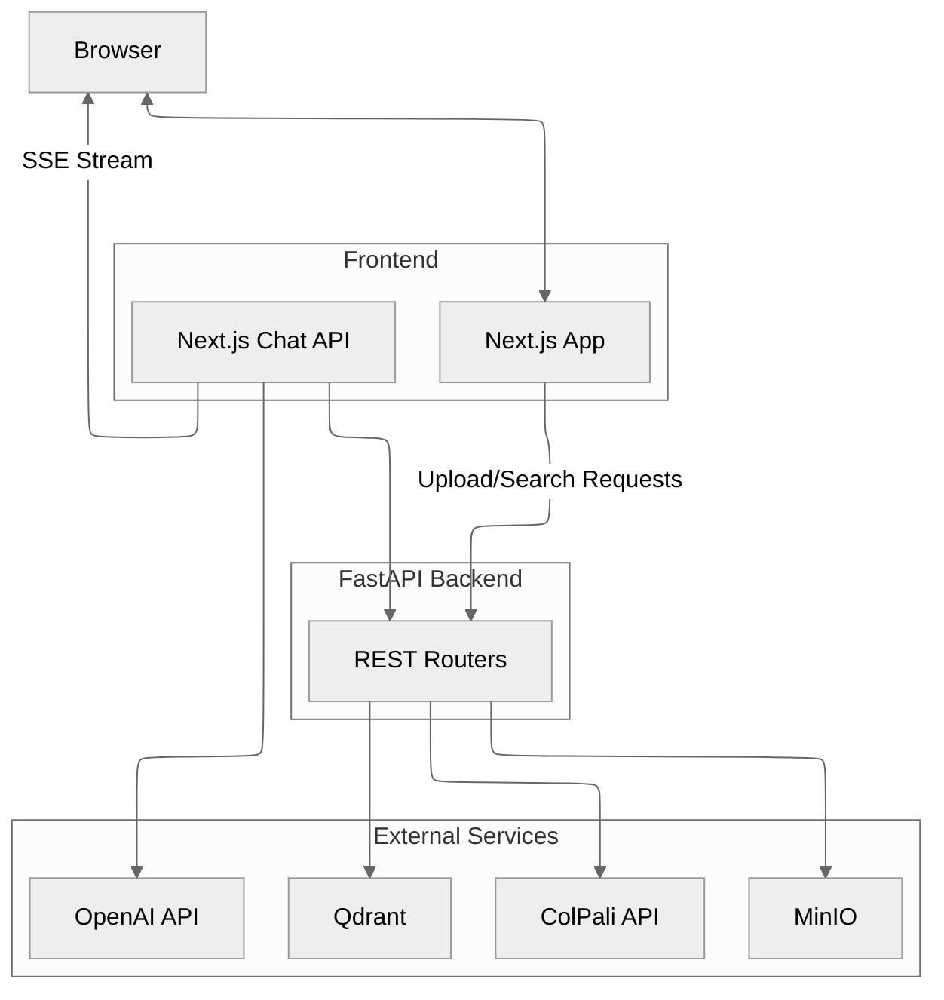

# Architecture

A high-level view of the Vision RAG template and its main data flows.

## Component overview

- **FastAPI app** – `backend/api/app.py` wires routers for `meta`, `retrieval`,
  `indexing`, `maintenance`, and `config`.
- **Qdrant service** – `backend/services/qdrant/` encapsulates collection
  management, document indexing, search, and optional MUVERA post-processing.
- **MinIO service** – `backend/services/minio.py` uploads page images in batches
  with automatic worker sizing and retry logic.
- **ColPali client** – `backend/services/colpali.py` handles query/image
  embedding calls, patch metadata requests, and timeout/retry settings.
- **Configuration** – `backend/config.py` reads values from
  `config_schema.py` and exposes typed accessors. The configuration API routes
  invalidate cached services when critical keys change.

Support modules:

- `backend/api/utils.py` – PDF to image conversion helpers.
- `backend/api/progress.py` – In-memory job progress registry used by SSE.
- `backend/api/dependencies.py` – Cached service access with error tracking.

## Indexing flow (PDF upload)

1. The `POST /index` route stores uploaded PDFs in temporary files and schedules
   a background task.
2. `convert_pdf_paths_to_images` renders pages via `pdf2image`.
3. `DocumentIndexer` (services/qdrant/indexing.py):
   - chunks pages into batches (`BATCH_SIZE`),
   - embeds each batch via the ColPali API (original + mean-pooled variants),
   - stores images either in MinIO or inline (base64) depending on
     `MINIO_ENABLED`,
   - upserts multivector payloads into Qdrant.
4. Two thread pools keep embedding, storage, and upserts overlapped when
   `ENABLE_PIPELINE_INDEXING=True`. Pipeline concurrency and PDF worker counts
   are derived automatically from available CPU cores.
5. Progress is published through `/progress/stream/{job_id}` as Server-Sent
   Events until the job completes, fails, or is cancelled.

## Retrieval flow

1. The `GET /search` route embeds the query using ColPali.
2. `SearchManager` (services/qdrant/search.py) performs a multivector search:
   - optional MUVERA first-stage search when enabled,
   - prefetch against mean-pooled vectors when `QDRANT_MEAN_POOLING_ENABLED=True`,
   - final reranking using the original vectors.
3. The API returns payload metadata including `image_url`. Images are not fetched
   during search; the frontend loads them lazily.

## Next.js integration

- Pages live under `frontend/app/*` (`/upload`, `/search`, `/chat`, `/configuration`,
    `/maintenance`, etc.).
- `frontend/lib/api/client.ts` configures the generated OpenAPI client using
  `NEXT_PUBLIC_API_BASE_URL` (defaults to `http://localhost:8000`).
- The chat experience is implemented in `frontend/app/api/chat/route.ts`. It:
  - optionally calls `/search` or exposes a `document_search` tool,
  - converts retrieved images to data URLs when necessary,
  - streams OpenAI Responses API events back to the browser and emits a custom
    `kb.images` event for visual citations.

## ColPali service (`colpali/`)

- Standalone FastAPI application exposing:
  - `GET /health`, `GET /info`
  - `POST /patches`
  - `POST /embed/queries`
  - `POST /embed/images`
- CPU and GPU variants are provided via `colpali/docker-compose.yml`.
- The backend selects the correct base URL based on `COLPALI_MODE` (CPU or GPU)
  and honours the `COLPALI_API_TIMEOUT` when making requests.

## Configuration lifecycle

1. Defaults and metadata originate from `config_schema.py`.
2. Values are loaded from `.env`/environment variables into `runtime_config`.
3. The configuration API (`/config/schema`, `/config/values`, `/config/update`,
   `/config/reset`, `/config/optimize`) exposes and mutates runtime values.
4. Critical updates clear service caches so new requests pick up the new
   configuration.

Refer to `backend/docs/configuration.md` for an exhaustive description of every
setting and its defaults. For implementation details, see
`backend/CONFIGURATION_GUIDE.md`.
