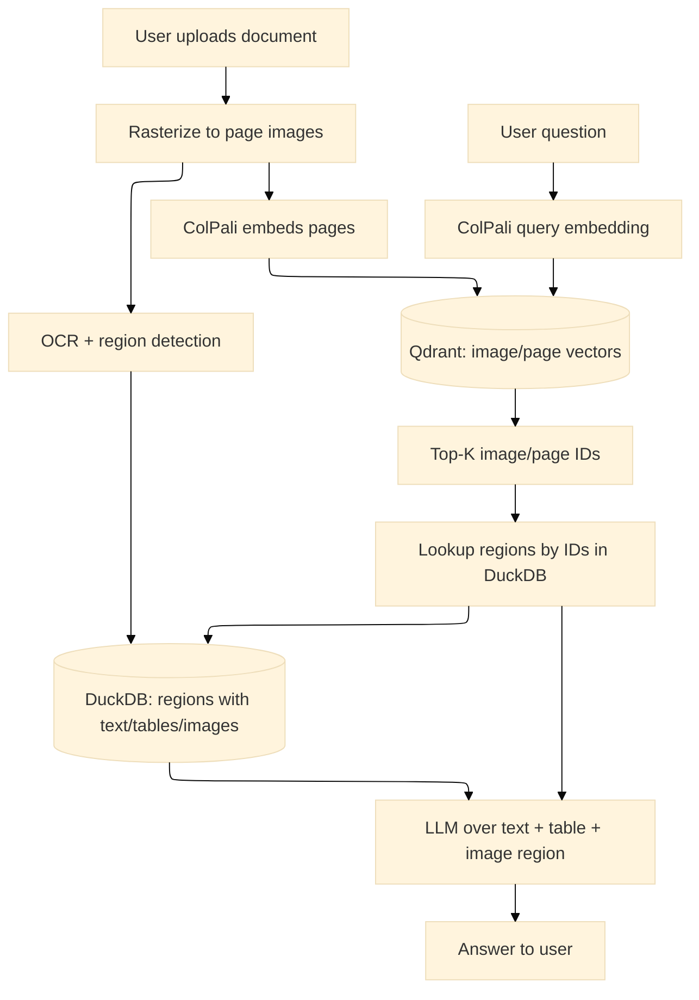

# Snappy Architecture

Snappy is a vision-grounded retrieval system: PDFs are rasterized to images, embedded with ColPali multivectors, and searched by layout and text. Optional DeepSeek OCR and DuckDB add text grounding, analytics, and deduplication.

## Components at a glance
- **FastAPI backend**: routers for indexing, search, OCR, configuration, maintenance, and health.
- **Streaming pipeline**: parallel stages for rasterize, embed, store images, optional OCR, and Qdrant upserts.
- **ColPali service**: query and image embeddings (multivectors with pooled variants).
- **DeepSeek OCR service (optional)**: text, markdown, and region extraction with bounding boxes.
- **Qdrant**: vector store for image/page embeddings; payload carries metadata and optional OCR URLs.
- **MinIO**: page images and OCR JSON storage with hierarchical paths.
- **DuckDB (optional)**: document metadata, OCR regions, and analytics; powers deduplication and inline OCR responses.
- **Next.js frontend**: upload, search, and chat flows; streams responses via SSE.
- **OpenAI**: generates chat answers using retrieved images, text, and tables.

## Indexing path (streaming)
1. Upload PDFs to `POST /index`; optional dedup check when DuckDB is enabled.
2. Rasterizer produces page batches and fans out to embedding, storage, and optional OCR stages in parallel.
3. Upsert stage waits for embeddings, generates URLs dynamically, writes vectors to Qdrant, and tracks progress.
4. Images live in MinIO; OCR output goes to MinIO or DuckDB depending on configuration.
5. `/progress/stream/{job_id}` streams live status for the UI; failures stop the pipeline to keep data consistent.

## Search and chat path
1. `GET /search` embeds the query with ColPali and retrieves top-k page IDs from Qdrant.
2. When DuckDB is enabled, regions/text for those pages come directly from DuckDB; otherwise the payload contains OCR URLs for the frontend to fetch from MinIO.
3. Chat (`/api/chat` on the frontend) streams an OpenAI response with citations, sending images and/or text depending on OCR settings.

## Configuration and modes
- Toggle OCR with `DEEPSEEK_OCR_ENABLED`; requires the ML profile (GPU).
- Toggle DuckDB with `DUCKDB_ENABLED` for analytics, deduplication, and inline OCR.
- Quantization and pooling options live in `.env` and `backend/config/schema`.
- See `backend/docs/configuration.md` for full settings and defaults.

## Cancellation
- `/index/cancel/{job_id}` and `/ocr/cancel/{job_id}` stop running jobs. Cleanup of vectors/objects/rows is not automatic; remove data manually if needed.
- Progress/status is still reported over the SSE progress stream.

## Where to dig deeper
- `STREAMING_PIPELINE.md` - how the streaming indexer overlaps stages.
- `backend/docs/analysis.md` - when to use vision-only vs hybrid text modes.
- `backend/docs/configuration.md` - complete configuration reference.
- `frontend/README.md` and `backend/README.md` - development guides.
