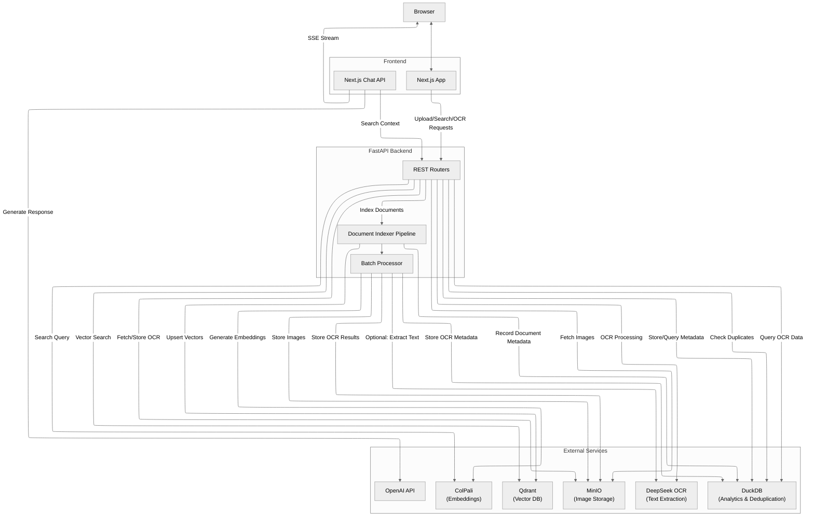

# Snappy Architecture 🏗️

This document outlines how the major components in Snappy work together to deliver vision-grounded document search.

---

## Components

- **FastAPI application** (`backend/api/app.py`) wires the routers for health, retrieval, indexing, maintenance, configuration, OCR, and DuckDB endpoints.
- **Qdrant integration** (`backend/services/qdrant/`) manages vector collections and search. The database writer in `indexing/qdrant_indexer.py` builds on the shared pipeline package.
- **Pipeline package** (`backend/services/pipeline/`) hosts the database-agnostic `DocumentIndexer`, batch processor, progress tracking, and storage helpers used during ingestion.
- **MinIO service** (`backend/services/minio.py`) stores page images with concurrent uploads and retry handling.
- **ColPali client** (`backend/services/colpali.py`) communicates with the embedding service for both queries and images.
- **DeepSeek OCR service** (`backend/services/ocr/`) handles OCR requests with UUID-based result naming, integrates with MinIO, and surfaces batch/background helpers for the OCR router.
- **DuckDB service** (`backend/services/duckdb.py`) provides document deduplication, OCR metadata storage, and SQL-based analytics with query sanitization.
- **Configuration layer** (`backend/config.py`, `backend/config_schema/`) keeps runtime settings consistent across the API and UI with schema-driven validation.
- **Support modules**
  - `backend/api/utils.py` – PDF-to-image conversion
  - `backend/api/progress.py` – Job state tracking for SSE
  - `backend/api/dependencies.py` – Cached service instances and cache invalidation

---

## Indexing Flow

1. `POST /index` receives one or more PDFs and starts validation.
2. **Deduplication Check**: When DuckDB is enabled, the system checks the `documents` table using content-based fingerprinting (filename, file_size_bytes, total_pages). Duplicate documents are skipped with user feedback, and only new documents proceed to indexing.
3. `convert_pdf_paths_to_images` rasterises each page.
4. `DocumentIndexer` (`services/pipeline/document_indexer.py`) handles batching, embedding, image uploads, optional OCR callbacks, and delegates upserts via `services/qdrant/indexing/qdrant_indexer.py`.
5. When DeepSeek OCR is enabled, the batch processor invokes `services/ocr` helpers in parallel with adjustable worker settings, storing UUID-named JSON outputs alongside page images in MinIO.
6. **Metadata Storage**: When DuckDB is enabled, document metadata (filename, size, page count, timestamps) is stored in the `documents` table, and OCR results are stored in the `pages` and `regions` tables for analytics.
7. When `ENABLE_AUTO_CONFIG_MODE=True`, dual executors overlap embedding, storage, OCR, and upserts based on `get_pipeline_max_concurrency()`.
8. `/progress/stream/{job_id}` streams progress updates so the UI can reflect status in real time.

---

## Search Flow

1. `GET /search` embeds the incoming query via ColPali.
2. `SearchManager` (`services/qdrant/search.py`) performs two-stage retrieval:
   - Prefetch via pooled vectors when mean pooling is enabled.
   - Final rerank on the original multivectors.
3. Results include metadata and public image URLs; the frontend decides how to display them.

## OCR Flow (Optional)

1. `/ocr/process-page` and `/ocr/process-batch` use `services/ocr` to fetch page images from MinIO and submit them to the DeepSeek OCR microservice with adjustable worker pool settings.
2. OCR responses (markdown, text, regions, extracted crops) are persisted in MinIO with UUID-based naming via `services/ocr/storage.py` for reliable retrieval and caching.
3. When DuckDB is enabled, OCR metadata (text, regions with bounding boxes, page dimensions) is stored in the `pages` and `regions` tables for SQL-based analytics and full-text search.
4. `/ocr/process-document` launches a background job that iterates every page discovered via Qdrant metadata and reports progress through `api/progress`.
5. `/ocr/progress/{job_id}` and `/ocr/progress/stream/{job_id}` expose job status for polling or SSE streaming, mirroring the indexing progress APIs.
6. `/ocr/cancel/{job_id}` stops long-running jobs, while `/ocr/health` verifies that the OCR client can reach the external service.

---

## DuckDB Analytics (Optional)

The DuckDB service provides columnar storage for document metadata and OCR results, enabling:

1. **Document Deduplication**: Before indexing, the system checks the `documents` table using `(filename, file_size_bytes, total_pages)` as a unique constraint. Duplicate uploads are detected and skipped with user feedback.

2. **Schema Structure**:
   - `documents` table: Core metadata (document_id, filename, size, page count, first/last indexed timestamps)
   - `pages` table: Page-level data (dimensions, text, markdown, MinIO URLs, extraction timestamps)
   - `regions` table: Text regions with bounding boxes (label, coordinates, content) for layout analysis

3. **SQL Query Interface**: `/duckdb/query` endpoint accepts sanitized SQL queries (block comment stripping, length limits) for custom analytics across all indexed documents and OCR results.

4. **Full-Text Search**: Full-text indexes on `pages.text` and `regions.content` enable fast text search across all OCR data.

5. **DuckDB-Wasm UI**: Interactive web UI at http://localhost:4213 for exploring data, running queries, and visualizing results.

6. **Graceful Shutdown**: Automatic checkpointing on close ensures all data is flushed to disk before shutdown.

---

## Frontend Integration

- Pages live under `frontend/app/*` (`/upload`, `/search`, `/chat`, `/configuration`, `/maintenance`, etc.).
- `frontend/lib/api/client.ts` wraps the generated OpenAPI client using `NEXT_PUBLIC_API_BASE_URL`.
- `frontend/app/api/chat/route.ts` runs in the Edge runtime, calls `GET /search`, invokes the OpenAI Responses API, and streams events (`text-delta`, `kb.images`) back to the browser.

---

## ColPali Service

Located in `colpali/`, this FastAPI app powers embeddings.

| Method | Path | Description |
|--------|------|-------------|
| `GET` | `/health`, `/info` | Health and model metadata |
| `POST` | `/patches` | Patch grid estimation |
| `POST` | `/embed/queries` | Text → embeddings |
| `POST` | `/embed/images` | Images → embeddings + token boundaries |

Docker Compose profiles are provided for CPU and GPU deployments, each sharing a Hugging Face cache volume.

---

## Configuration Lifecycle

1. **Schema** – `config_schema.py` defines defaults, metadata, and critical keys.
2. **Runtime store** – Values load from `.env` into `runtime_config`.
3. **Access** – `config.py` exposes typed getters and computed defaults.
4. **API/UI** – `/config/*` endpoints feed the configuration UI; updates trigger cache invalidation for dependent services.

See `backend/docs/configuration.md` and `backend/CONFIGURATION_GUIDE.md` for details.
