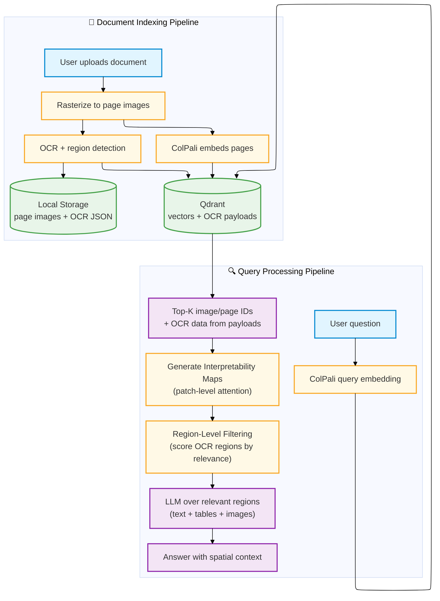

# Snappy Architecture

> **Research Paper**: [Spatially-Grounded Document Retrieval via Patch-to-Region Relevance Propagation](https://arxiv.org/abs/2512.02660)

Snappy implements **region-level document retrieval** through patch-to-region relevance propagation; a hybrid architecture that unifies vision-language models with OCR at inference time without additional training. The system uses ColPali's patch-level similarity scores as spatial relevance filters over OCR-extracted regions, achieving precise retrieval granularity while preserving the semantic understanding of vision-language models.

PDFs are rasterized to images, embedded with ColPali multivectors using late interaction, and searched by layout and text. Coordinate mapping between vision transformer patch grids (32×32) and OCR bounding boxes enables relevance propagation via interpretability maps, filtering OCR regions to return only spatially-relevant content.

## Core Retrieval Paradigm

Snappy's retrieval architecture is built on four foundational pillars:

### 1. Coordinate Mapping: Patches to Bounding Boxes
Formalizes the mathematical correspondence between vision transformer patch grids and OCR bounding boxes. ColPali encodes each page as a 32×32 grid of patch embeddings over 448×448 input resolution, where each patch corresponds to a 14×14 pixel region. OCR bounding boxes are scaled to the model's coordinate space, enabling spatial alignment between heterogeneous representations.

**Mathematical Foundation**: For patch index k, the bounding box is computed via raster scan order (row = ⌊k/32⌋, col = k mod 32), with OCR coordinates scaled by the ratio of model resolution to original document dimensions.

### 2. Relevance Propagation via Interpretability Maps
Repurposes ColPali's late interaction mechanism to generate per-query-token similarity heatmaps, then propagates these scores to OCR regions through IoU-weighted patch-region intersection. Instead of discarding patch-level attention when returning page-level results, Snappy extracts spatial relevance distributions and maps them to structured OCR regions.

**Aggregation Strategy**: Region relevance score = Σ IoU(region_bbox, patch_bbox) × patch_score, weighted by spatial overlap to ensure patches fully contained within regions contribute more than peripheral patches.

**See**: [Spatial Grounding Documentation](spatial_grounding.md)

### 3. Two-Stage Retrieval Architecture
Balances efficiency and precision through mean-pooling compression for candidate retrieval followed by full-resolution reranking.

- **Stage 1**: Mean-pool patch embeddings to obtain single page-level vectors, enabling efficient ANN search via Qdrant to retrieve top-K candidates
- **Stage 2**: Compute full patch-level similarity for candidates and propagate scores to OCR regions as described above

This approach provides substantial speedup (1000× search space reduction with K=100, N=100K pages) while preserving region-level granularity where it matters.

**See**: [Late Interaction Documentation](late_interaction.md)

### 4. Inference-Time Operation
Unlike RegionRAG (which requires hybrid training with bounding box annotations) or LayoutLM (which operates at pre-training time), Snappy achieves region-level retrieval purely at inference time using ColPali's emergent patch attention. This provides flexibility: the same approach works with any OCR system providing bounding boxes and any ColPali-family model (including the 10× smaller ColModernVBERT).

**See**: [Analysis: Vision vs Text RAG](analysis.md)

---

## Components at a glance
- **FastAPI backend**: routers for indexing, search, OCR, interpretability, configuration, maintenance, and health.
- **Streaming pipeline**: parallel stages for rasterize, embed, store images, optional OCR, and Qdrant upserts.
- **ColPali service**: query and image embeddings (multivectors with pooled variants), interpretability map generation.
- **DeepSeek OCR service (optional)**: text, markdown, and region extraction with bounding boxes.
- **Qdrant**: vector store for image/page embeddings (multi-vector with pooling); payload carries metadata, OCR data (text, markdown, regions), and image URLs.
- **Local Storage**: page images and OCR JSON storage with hierarchical paths; OCR JSON serves as backup.
- **Next.js frontend**: upload, search, chat, and interpretability visualization; streams responses via SSE.
- **OpenAI**: generates chat answers using retrieved images, text, and tables.

## Layered Architecture
The backend is organized into three distinct layers to ensure maintainability and testability:

1.  **API Layer (`backend/api`)**:
    - Handles HTTP requests, validation, and responses.
    - Thin wrappers that delegate work to the Domain layer.
    - No business logic allowed.

2.  **Domain Layer (`backend/domain`)**:
    - Contains all business logic, orchestration, and domain rules.
    - Orchestrates data flow between Clients and processing logic.
    - Independent of the HTTP framework (FastAPI).

3.  **Infrastructure/Clients Layer (`backend/clients`)**:
    - Handles communication with external services (Local Storage, Qdrant, ColPali, OCR).
    - Implements specific protocols and error handling for each service.
    - Decoupled from domain types where possible.

## Indexing path (streaming)
1. Upload PDFs to `POST /index`.
2. Rasterizer produces page batches and fans out to embedding, storage, and optional OCR stages in parallel.
3. Upsert stage waits for embeddings, generates URLs dynamically, writes vectors to Qdrant, and tracks progress.
4. Images and OCR JSON live in local storage; full OCR data (text, markdown, regions) is stored in Qdrant payloads.
5. `/progress/stream/{job_id}` streams live status for the UI; failures stop the pipeline to keep data consistent.

## Search and chat path
1. `GET /search` embeds the query with ColPali and retrieves top-k page IDs from Qdrant using late interaction (two-stage retrieval with prefetch + rerank when mean pooling is enabled).
2. OCR data (text, markdown, regions) is retrieved directly from Qdrant payloads alongside the search results.
3. If region-level retrieval is enabled (`ENABLE_REGION_LEVEL_RETRIEVAL=true`), OCR regions are filtered using interpretability maps to return only query-relevant regions.
4. Chat (`/api/chat` on the frontend) streams an OpenAI response with citations, sending images and/or filtered text regions depending on OCR and region filtering settings.

## Interpretability
- `POST /api/interpretability` generates token-level similarity maps showing which document patches contribute to query matches.
- Used for debugging retrieval behavior and understanding late interaction in action.
- Powers region-level filtering by computing relevance scores for OCR bounding boxes.

## Configuration and modes
- Toggle OCR with `DEEPSEEK_OCR_ENABLED`; requires GPU.
- Quantization and pooling options live in `.env` and `backend/config/schema`.
- See `backend/docs/configuration.md` for full settings and defaults.

## Cancellation
- `/index/cancel/{job_id}` and `/ocr/cancel/{job_id}` stop running jobs. Cleanup of vectors/objects/rows is not automatic; remove data manually if needed.
- Progress/status is still reported over the SSE progress stream.

## Where to dig deeper
- [Late Interaction](late_interaction.md) - multi-vector retrieval, MaxSim scoring, and two-stage search.
- [Spatial Grounding](spatial_grounding.md) - how spatial information flows from pixels to regions.
- [OCR Storage](ocr_storage.md) - OCR data storage in Qdrant payloads.
- [STREAMING_PIPELINE.md](../../STREAMING_PIPELINE.md) - how the streaming indexer overlaps stages.
- [Analysis: Vision vs Text RAG](analysis.md) - when to use vision-only vs hybrid text modes.
- [Configuration Reference](configuration.md) - complete configuration reference.
- [Frontend README](../../frontend/README.md) and [Backend README](../README.md) - development guides.
