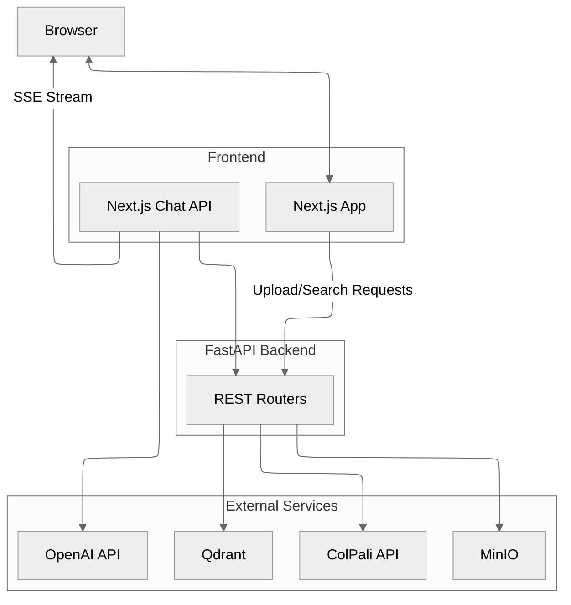

# Snappy Architecture - How It All Fits Together! 🏗️

Welcome to the architectural tour of Snappy! Let's see how all the pieces work together to deliver vision-first document retrieval magic. ✨

## The Component Cast 🎭

**Core Services**:
- **FastAPI App** (`backend/api/app.py`) – The conductor! Wires up all routers: `meta`, `retrieval`, `indexing`, `maintenance`, and `config`
- **Qdrant Service** (`backend/services/qdrant/`) – Vector storage maestro handling collections, indexing, search, and optional MUVERA magic
- **MinIO Service** (`backend/services/minio.py`) – Image upload champion with smart batching, auto-sized workers, and retry logic
- **ColPali Client** (`backend/services/colpali.py`) – The vision brain connector, handling embeddings, patches, and timeouts
- **Configuration** (`backend/config.py`) – Dynamic settings manager that reads from `config_schema.py` and invalidates services when needed

**Supporting Cast**:
- `backend/api/utils.py` – PDF-to-image conversion wizardry
- `backend/api/progress.py` – Real-time job tracking for SSE streams
- `backend/api/dependencies.py` – Smart service caching with error recovery

## The Indexing Journey 📚➡️🔍

**Step-by-Step Magic**:

1. **Upload** → `POST /index` receives PDFs and schedules a background task
2. **Rasterize** → `convert_pdf_paths_to_images` transforms PDFs into page images via `pdf2image`
3. **Process** → `DocumentIndexer` (`services/qdrant/indexing.py`) does the heavy lifting:
   - 📦 Chunks pages into batches (`BATCH_SIZE`)
   - 🧠 Embeds via ColPali API (original + mean-pooled variants)
   - 🗄️ Stores images in MinIO
   - 📊 Upserts multivector data into Qdrant
4. **Pipeline Power** → When `ENABLE_PIPELINE_INDEXING=True`, dual thread pools overlap embedding, storage, and upserts for maximum throughput (auto-sized based on CPU cores!)
5. **Live Updates** → Progress streams through `/progress/stream/{job_id}` as Server-Sent Events. Watch it happen in real-time! 🎬

## The Search Flow 🔍✨

**Finding the Perfect Match**:

1. **Query In** → `GET /search` embeds your text query via ColPali
2. **Smart Search** → `SearchManager` (`services/qdrant/search.py`) does multi-stage retrieval:
   - 🚀 Optional MUVERA first-stage (when enabled) for speed
   - 📊 Prefetch from mean-pooled vectors (when `QDRANT_MEAN_POOLING_ENABLED=True`)
   - 🎯 Final reranking with full-precision original vectors
3. **Results** → Returns metadata + `image_url` (images loaded lazily by the frontend for snappy performance!)

## Frontend Integration 🎨

**The User Experience Layer**:

- **Pages** → Live under `frontend/app/*`: `/upload`, `/search`, `/chat`, `/configuration`, `/maintenance`, and more
- **API Client** → `frontend/lib/api/client.ts` wires up the auto-generated OpenAPI client (points to `NEXT_PUBLIC_API_BASE_URL`, defaults to `http://localhost:8000`)
- **Chat Magic** → Implemented in `frontend/app/api/chat/route.ts`:
  - 🔍 Searches docs via `/search` or exposes `document_search` tool to the AI
  - 🖼️ Converts images to data URLs when needed
  - 🌊 Streams OpenAI responses + custom `kb.images` events for visual citations

## ColPali Service - The Vision Brain 🧠

**Standalone Embedding Service** (`colpali/`):

**Endpoints**:
- `GET /health`, `GET /info` – Health checks and model info
- `POST /patches` – Patch grid calculations
- `POST /embed/queries` – Text → embeddings
- `POST /embed/images` – Images → embeddings

**Deployment Options**: CPU and GPU variants via `colpali/docker-compose.yml`

## Configuration Lifecycle ⚙️

**From Schema to Runtime**:

1. **Blueprint** → Defaults and metadata defined in `config_schema.py`
2. **Load** → Values flow from `.env`/environment into `runtime_config`
3. **Expose** → Configuration API (`/config/schema`, `/config/values`, `/config/update`, `/config/reset`, `/config/optimize`) makes everything accessible and mutable
4. **Refresh** → Critical updates auto-invalidate service caches for instant effect! ⚡

📚 **Learn More**:
- Settings reference: `backend/docs/configuration.md`
- Implementation deep-dive: `backend/CONFIGURATION_GUIDE.md`
