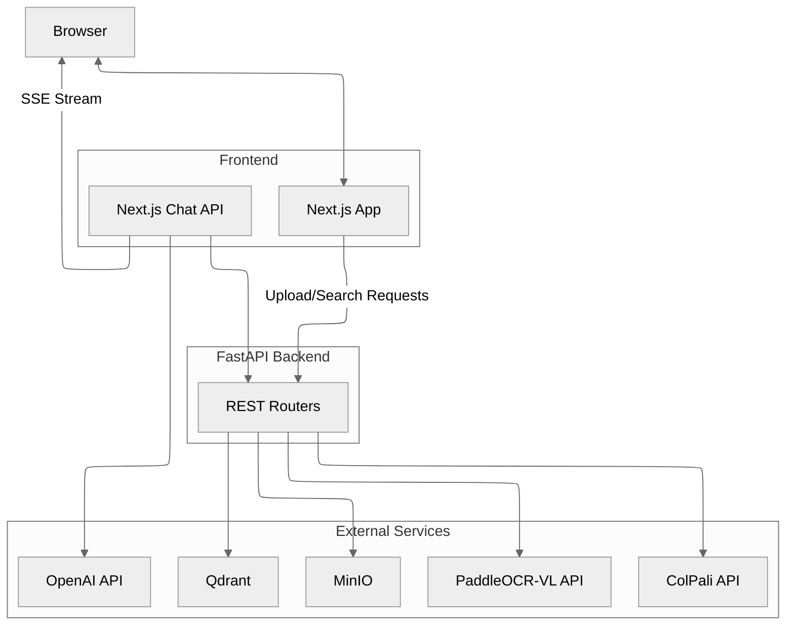

# Snappy Architecture 🏗️

This document outlines how the major components in Snappy work together to deliver vision-grounded document search.

---

## Components

- **FastAPI application** (`backend/api/app.py`) wires the routers for health, retrieval, indexing, OCR, maintenance, and configuration.
- **Qdrant service** (`backend/services/qdrant/`) manages vector collections, indexing, search, and optional MUVERA post-processing.
- **MinIO service** (`backend/services/minio.py`) stores page images with concurrent uploads and retry handling.
- **ColPali client** (`backend/services/colpali.py`) communicates with the embedding service for both queries and images.
- **PaddleOCR client** (`backend/services/paddleocr.py`) proxies document parsing requests to the PaddleOCR-VL FastAPI microservice.
- **Configuration layer** (`backend/config.py`, `backend/config_schema.py`) keeps runtime settings consistent across the API and UI.
- **Support modules**
  - `backend/api/utils.py` – PDF-to-image conversion
  - `backend/api/progress.py` – Job state tracking for SSE
  - `backend/api/dependencies.py` – Cached service instances and cache invalidation

---

## Indexing Flow

1. `POST /index` receives one or more PDFs and starts a background task.
2. `convert_pdf_paths_to_images` rasterises each page.
3. `DocumentIndexer` (`services/qdrant/indexing.py`) handles batching, embedding, image uploads, and Qdrant upserts.
4. When `ENABLE_PIPELINE_INDEXING=True`, dual executors overlap embedding, storage, and upserts based on `get_pipeline_max_concurrency()`.
5. `/progress/stream/{job_id}` streams progress updates so the UI can reflect status in real time.

---

## Search Flow

1. `GET /search` embeds the incoming query via ColPali.
2. `SearchManager` (`services/qdrant/search.py`) performs two-stage retrieval:
   - Optional MUVERA first-stage vector for quick prefiltering.
   - Prefetch via pooled vectors when mean pooling is enabled.
   - Final rerank on the original multivectors.
3. Results include metadata and public image URLs; the frontend decides how to display them.

---

## Frontend Integration

- Pages live under `frontend/app/*` (`/upload`, `/search`, `/chat`, `/configuration`, `/maintenance`, etc.).
- `frontend/lib/api/client.ts` wraps the generated OpenAPI client using `NEXT_PUBLIC_API_BASE_URL`.
- `frontend/app/api/chat/route.ts` runs in the Edge runtime, calls `GET /search`, invokes the OpenAI Responses API, and streams events (`text-delta`, `kb.images`) back to the browser.

---

## ColPali Service

Located in `colpali/`, this FastAPI app powers embeddings.

| Method | Path | Description |
|--------|------|-------------|
| `GET` | `/health`, `/info` | Health and model metadata |
| `POST` | `/patches` | Patch grid estimation |
| `POST` | `/embed/queries` | Text → embeddings |
| `POST` | `/embed/images` | Images → embeddings + token boundaries |

Docker Compose profiles are provided for CPU and GPU deployments, each sharing a Hugging Face cache volume.

---

## Configuration Lifecycle

1. **Schema** – `config_schema.py` defines defaults, metadata, and critical keys.
2. **Runtime store** – Values load from `.env` into `runtime_config`.
3. **Access** – `config.py` exposes typed getters and computed defaults.
4. **API/UI** – `/config/*` endpoints feed the configuration UI; updates trigger cache invalidation for dependent services.

See `backend/docs/configuration.md` and `backend/CONFIGURATION_GUIDE.md` for details.
