# Architecture

A concise view of the Vision RAG template and its main data flows.

```mermaid
---
config:
  theme: neutral
  layout: elk
  look: neo
---
flowchart TB
 subgraph Services["🛠 Services"]
        QS[["🗂 QdrantService - clients/qdrant.py"]]
        MINIO[["📦 MinioService - clients/minio.py"]]
        COL[["🧠 ColPali Client - clients/colpali.py"]]
        OAI[["🤖 OpenAI Client - clients/openai.py"]]
  end
 subgraph External["🌐 External"]
        QD[("💾 Qdrant")]
        MN[("🗄 MinIO")]
        CQ(["☁️ ColPali API"])
        OA(["☁️ OpenAI"])
  end
    U["🖥 User Browser"] <--> UI["🎨 Gradio UI - ui.py"]
    UI --> APP["⚙️ App - api/app.py"]
    UI -- 📤 Upload PDFs --> APP
    APP -- 📝 PDF ➡ page images --> QS
    QS -- 📥 store images --> MINIO
    MINIO --> MN
    QS -- 🧩 embed images --> COL
    COL --> CQ
    QS -- 📊 upsert vectors --> QD
    UI -- 💬 Ask --> APP
    APP --> QS & UI
    QS -- 🔍 embed query --> COL
    QS <-- 🔎 multivector search --> QD
    QS -- 📥 fetch images --> MINIO
    QS -- 🖼 page images + metadata --> APP
    APP -- 📝 text + images --> OAI
    OAI --> OA
    OAI -- 📡 stream reply --> APP
```

Notes

- __Server entrypoint__: `main.py` boots `api.app.create_app()` and serves the modular routers.
- __Indexing__: The API `/index` route (`api/routers/indexing.py`) converts PDFs to page images (see `api/utils.py::convert_pdf_paths_to_images()`), then `QdrantService` stores images in MinIO, gets embeddings from the ColPali API (including patch metadata), mean-pools rows/cols, and upserts multivectors to Qdrant. The local UI performs equivalent conversion via `local.py::convert_files()`.
- __Retrieval__: `QdrantService` embeds the query via ColPali, runs multivector search on Qdrant, fetches page images from MinIO, and returns them to the API. The chat router (`api/routers/chat.py`) calls OpenAI with the user text + images and streams the answer. The `/search` route (`api/routers/retrieval.py`) returns structured results.
- The diagram intentionally omits lower-level details (e.g., prefetch limits, comparator settings) to stay readable.
