# Snappy Architecture

Snappy implements **spatially-grounded hybrid document retrieval**, unifying vision-language late interaction with structured OCR for region-level retrieval-augmented generation. PDFs are rasterized to images, embedded with ColPali multivectors using late interaction, and searched by layout and text. Optional DeepSeek OCR and DuckDB add text grounding, region-level filtering, analytics, and deduplication.

```mermaid
---
config:
  layout: elk
  look: classic
  theme: base
---
flowchart TB
    subgraph Indexing["📄 Document Indexing Pipeline"]
        U["User uploads document"] --> R["Rasterize to page images"]
        R --> E["ColPali embeds pages"] & O["OCR + region detection"]
        E --> Qdrant[("Qdrant<br/>image/page vectors")]
        O --> Duck[("DuckDB<br/>regions with text/tables/images")]
    end

    subgraph Query["🔍 Query Processing Pipeline"]
        Q["User question"] --> QE["ColPali query embedding"]
        QE --> Qdrant
        Qdrant --> K["Top-K image/page IDs"]
        K --> Duck
        Duck --> IM["Generate Interpretability Maps<br/>(patch-level attention)"]
        IM --> RF["Region-Level Filtering<br/>(score OCR regions by relevance)"]
        RF --> LLM["LLM over relevant regions<br/>(text + tables + images)"]
        LLM --> A["Answer with spatial context"]
    end

    classDef userNode fill:#e1f5ff,stroke:#0288d1,stroke-width:2px
    classDef processNode fill:#fff9e6,stroke:#f9a825,stroke-width:2px
    classDef storageNode fill:#e8f5e9,stroke:#43a047,stroke-width:2px
    classDef resultNode fill:#f3e5f5,stroke:#8e24aa,stroke-width:2px

    class U,Q userNode
    class R,E,O,QE,IM,RF processNode
    class Qdrant,Duck storageNode
    class K,LLM,A resultNode
```

## Core Retrieval Paradigm

Snappy's retrieval architecture is built on three foundational pillars:

### 1. Vision-Language Late Interaction
ColPali embeddings preserve spatial structure through **multi-vector representations** (one vector per image patch). Each query token finds its best match among all document patches via MaxSim scoring, enabling fine-grained layout-aware retrieval without losing context. Two-stage retrieval (prefetch with pooled vectors + rerank with original multivectors) balances speed and accuracy.

**See**: [Late Interaction Documentation](late_interaction.md)

### 2. Spatial Grounding
Spatial information flows through the entire pipeline: pixel coordinates → patch grid → embeddings → interpretability maps → region filtering. This preserves **where** content appears on the page, not just **what** it says. Region-level retrieval uses interpretability maps to filter OCR regions by query relevance, returning only spatially-relevant content.

**See**: [Spatial Grounding Documentation](spatial_grounding.md)

### 3. Hybrid Vision + Text Retrieval
Snappy combines vision-first retrieval (ColPali image embeddings) with structured OCR (DeepSeek text/bounding boxes). Vision handles layout, handwriting, and diagrams; OCR provides searchable text and region metadata. Region-level filtering uses vision-based attention maps to score OCR regions, creating a true hybrid approach.

**See**: [Analysis: Vision vs Text RAG](analysis.md)

---

## Components at a glance
- **FastAPI backend**: routers for indexing, search, OCR, interpretability, configuration, maintenance, and health.
- **Streaming pipeline**: parallel stages for rasterize, embed, store images, optional OCR, and Qdrant upserts.
- **ColPali service**: query and image embeddings (multivectors with pooled variants), interpretability map generation.
- **DeepSeek OCR service (optional)**: text, markdown, and region extraction with bounding boxes.
- **Qdrant**: vector store for image/page embeddings (multi-vector with pooling); payload carries metadata and optional OCR URLs.
- **MinIO**: page images and OCR JSON storage with hierarchical paths.
- **DuckDB (optional)**: document metadata, OCR regions, and analytics; powers deduplication and inline OCR responses.
- **Next.js frontend**: upload, search, chat, and interpretability visualization; streams responses via SSE.
- **OpenAI**: generates chat answers using retrieved images, text, and tables.

## Layered Architecture
The backend is organized into three distinct layers to ensure maintainability and testability:

1.  **API Layer (`backend/api`)**:
    - Handles HTTP requests, validation, and responses.
    - Thin wrappers that delegate work to the Domain layer.
    - No business logic allowed.

2.  **Domain Layer (`backend/domain`)**:
    - Contains all business logic, orchestration, and domain rules.
    - Orchestrates data flow between Clients and processing logic.
    - Independent of the HTTP framework (FastAPI).

3.  **Infrastructure/Clients Layer (`backend/clients`)**:
    - Handles communication with external services (MinIO, Qdrant, DuckDB, ColPali, OCR).
    - Implements specific protocols and error handling for each service.
    - Decoupled from domain types where possible.

## Indexing path (streaming)
1. Upload PDFs to `POST /index`; optional dedup check when DuckDB is enabled.
2. Rasterizer produces page batches and fans out to embedding, storage, and optional OCR stages in parallel.
3. Upsert stage waits for embeddings, generates URLs dynamically, writes vectors to Qdrant, and tracks progress.
4. Images live in MinIO; OCR output goes to MinIO or DuckDB depending on configuration.
5. `/progress/stream/{job_id}` streams live status for the UI; failures stop the pipeline to keep data consistent.

## Search and chat path
1. `GET /search` embeds the query with ColPali and retrieves top-k page IDs from Qdrant using late interaction (two-stage retrieval with prefetch + rerank when mean pooling is enabled).
2. When DuckDB is enabled, regions/text for those pages come directly from DuckDB; otherwise the payload contains OCR URLs for the frontend to fetch from MinIO.
3. If region-level retrieval is enabled (`ENABLE_REGION_LEVEL_RETRIEVAL=true`), OCR regions are filtered using interpretability maps to return only query-relevant regions.
4. Chat (`/api/chat` on the frontend) streams an OpenAI response with citations, sending images and/or filtered text regions depending on OCR and region filtering settings.

## Interpretability
- `POST /api/interpretability` generates token-level similarity maps showing which document patches contribute to query matches.
- Used for debugging retrieval behavior and understanding late interaction in action.
- Powers region-level filtering by computing relevance scores for OCR bounding boxes.

## Configuration and modes
- Toggle OCR with `DEEPSEEK_OCR_ENABLED`; requires the ML profile (GPU).
- Toggle DuckDB with `DUCKDB_ENABLED` for analytics, deduplication, and inline OCR.
- Quantization and pooling options live in `.env` and `backend/config/schema`.
- See `backend/docs/configuration.md` for full settings and defaults.

## Cancellation
- `/index/cancel/{job_id}` and `/ocr/cancel/{job_id}` stop running jobs. Cleanup of vectors/objects/rows is not automatic; remove data manually if needed.
- Progress/status is still reported over the SSE progress stream.

## Where to dig deeper
- [Late Interaction](late_interaction.md) - multi-vector retrieval, MaxSim scoring, and two-stage search.
- [Spatial Grounding](spatial_grounding.md) - how spatial information flows from pixels to regions.
- [STREAMING_PIPELINE.md](../../STREAMING_PIPELINE.md) - how the streaming indexer overlaps stages.
- [Analysis: Vision vs Text RAG](analysis.md) - when to use vision-only vs hybrid text modes.
- [Configuration Reference](configuration.md) - complete configuration reference.
- [Frontend README](../../frontend/README.md) and [Backend README](../README.md) - development guides.
