# Architecture

A concise view of the Vision RAG template and its main data flows.

```mermaid
---
config:
  theme: neutral
  layout: elk
  look: neo
---
flowchart TB
 subgraph Services["🛠 Services"]
        QS[["🗂 QdrantService - clients/qdrant.py"]]
        MINIO[["📦 MinioService - clients/minio.py"]]
        COL[["🧠 ColPali Client - clients/colpali.py"]]
        NXCHAT[["💬 Next Chat API - frontend/app/api/chat/route.ts"]]
  end
 subgraph External["🌐 External"]
        QD[("💾 Qdrant")]
        MN[("🗄 MinIO")]
        CQ(["☁️ ColPali API"])
        OA(["☁️ OpenAI"])
  end
    U["🖥 User Browser"] <--> NEXT["🎨 Next.js Frontend - frontend/app/*"]
    NEXT --> APP["⚙️ App - api/app.py"]
    NEXT -- 📤 Upload PDFs --> APP
    APP -- 📝 PDF ➡ page images --> QS
    QS -- 📥 store images --> MINIO
    MINIO --> MN
    QS -- 🧩 embed images --> COL
    COL --> CQ
    QS -- 📊 upsert vectors --> QD
    NEXT -- 🔎 Search (/search) --> APP
    APP --> QS & NEXT
    QS -- 🔍 embed query --> COL
    QS <-- 🔎 multivector search --> QD
    QS -- 📥 fetch images --> MINIO
    QS -- 🖼 page images + metadata --> APP
    NEXT -- 💬 Ask --> NXCHAT
    NXCHAT -- 📝 text + images --> OA
    NXCHAT -- 📡 stream reply --> U
```

Notes

- __Server entrypoint__: `main.py` (or `backend.py`) boots `api.app.create_app()` and serves the modular routers.
- __Frontends__: Next.js app under `frontend/app/*` is the primary and only UI.
- __Indexing__: The API `/index` route (`api/routers/indexing.py`) converts PDFs to page images (see `api/utils.py::convert_pdf_paths_to_images()`), then `QdrantService` stores images in MinIO, gets embeddings from the ColPali API (including patch metadata), mean-pools rows/cols, and upserts multivectors to Qdrant.
- __Retrieval__: `QdrantService` embeds the query via ColPali, runs multivector search on Qdrant, fetches page images from MinIO, and returns them to the API. The frontend Chat API route (`frontend/app/api/chat/route.ts`) calls OpenAI with the user text + images and streams the answer to the browser. The `/search` route (`api/routers/retrieval.py`) returns structured results.
- The diagram intentionally omits lower-level details (e.g., prefetch limits, comparator settings) to stay readable.

## Next.js frontend integration

- __App location__: `frontend/app/*` with pages:
  - `frontend/app/chat/page.tsx` → retrieves images via backend `/search` and streams chat from `frontend/app/api/chat/route.ts`.
  - `frontend/app/search/page.tsx` → calls `/search` via `RetrievalService` and renders image results with labels/scores.
  - `frontend/app/upload/page.tsx` → calls `/index` via `IndexingService` to upload PDFs.
  - `frontend/app/page.tsx` → landing page.
- __API client base URL__: `frontend/lib/api/client.ts` sets `OpenAPI.BASE` from `NEXT_PUBLIC_API_BASE_URL` (defaults to `http://localhost:8000`).
- __Images__: `frontend/next.config.ts` allows remote images from MinIO at `http://localhost:9000/**` for Next/Image compatibility.

## Backend API surface used by the frontend

- `/` → root listing (see `api/routers/meta.py`).
- `/health` → service health (ColPali, MinIO, Qdrant).
- `/index` (POST multipart) → index PDFs (see `api/routers/indexing.py`).
- `/search` (GET q, k) → semantic search results (see `api/routers/retrieval.py`).
- `/clear/qdrant`, `/clear/minio`, `/clear/all` → maintenance endpoints.

Chat streaming is not proxied by the backend. It is implemented in the Next.js API route at `frontend/app/api/chat/route.ts`, which calls OpenAI's Responses API and streams Server-Sent Events (SSE) to the browser.

## OpenAPI and client generation

- __Spec location__: `frontend/docs/openapi.json` (current file in repo).
- __Codegen scripts__: see `frontend/package.json` `gen:sdk` and `gen:zod`.
  - They currently point to `../openapi.json`. Either:
    - Move/copy the spec to repository root as `openapi.json`, or
    - Update the scripts to use `./docs/openapi.json` when running from `frontend/`.
- __Generated clients__: emitted to `frontend/lib/api/generated` and `frontend/lib/api/zod` and consumed by pages via `ChatService`, `RetrievalService`, `IndexingService`.

## CORS and connectivity

- `api/app.py` enables permissive CORS for development: `allow_origins=["*"]` and `allow_methods/headers=["*"]`.
- Configure the frontend to reach the backend by setting `NEXT_PUBLIC_API_BASE_URL` (e.g., `http://localhost:8000`).

## ColPali service (`colpali/`) and why it is separate

- **What it is**: A standalone FastAPI service that serves ColQwen2.5 embeddings and patch utilities. Code lives in `colpali/`.
- **Endpoints** (see `colpali/app.py`):
  - `GET /health`, `GET /info`
  - `POST /patches` → returns patch grid counts for given image dimensions
  - `POST /embed/queries` → query embeddings
  - `POST /embed/images` → image embeddings with image-token boundaries
- **How backend uses it**:
  - `backend/clients/colpali.py` calls the above endpoints.
  - Base URL configured in `backend/config.py` via `COLPALI_API_BASE_URL` or `COLPALI_MODE` (`cpu|gpu`) selecting `COLPALI_CPU_URL` (default `http://localhost:7001`) or `COLPALI_GPU_URL` (default `http://localhost:7002`).
  - Timeout via `COLPALI_API_TIMEOUT`.
- **Deployment (ports and Docker)**:
  - `colpali/docker-compose.yml` exposes two services:
    - CPU: external `7001` → container `7000` (`api-cpu`, `Dockerfile.cpu`)
    - GPU: external `7002` → container `7000` (`api-gpu`, `Dockerfile.gpu`, `gpus: all`)
  - Both mount a shared Hugging Face cache volume (`hf-cache`) for faster cold starts.
- **Why it is separate from the backend**:
  - Resource isolation: GPU scheduling and heavy ML deps are kept out of the web API container.
  - Scalability: scale the embedding service independently from the API, pick CPU or GPU per environment.
  - Operational flexibility: roll/upgrade models without redeploying the backend; can be hosted remotely.
  - Security and stability: stricter attack surface for the backend; isolating large frameworks reduces blast radius.
- **How to wire it up**:
  - Run either the CPU or GPU service from `colpali/` (see `docker-compose.yml`).
  - Point the backend to it via `COLPALI_API_BASE_URL` or set `COLPALI_MODE=cpu|gpu` and ensure `COLPALI_CPU_URL`/`COLPALI_GPU_URL` match your deployed ports.

