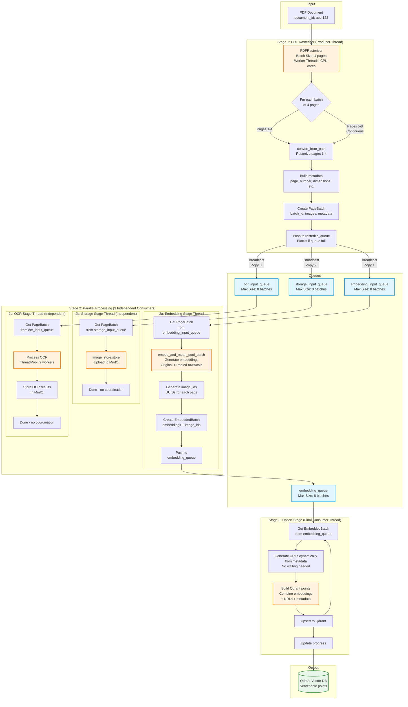

# Pipeline Processing Package

This package provides **vector-database-agnostic** pipeline components for document indexing.

---

## Overview

The pipeline package handles the core processing flow for document indexing using a **streaming architecture**:
- Parallel stage processing (rasterization, embedding, storage, OCR)
- Dynamic URL generation (no cache coordination needed)
- Independent stage execution
- Backpressure control via bounded queues
- Progress tracking with immediate feedback

---

## Architecture

### Key Principles

1. **Streaming Processing**: Pages flow through independent parallel stages as soon as they're ready
2. **No Blocking**: Stages don't wait for each other - URLs are generated dynamically
3. **Separation of Concerns**: Each stage has a single responsibility
4. **Dependency Injection**: All dependencies are injected, not created internally

### Streaming Pipeline

#### `StreamingPipeline`
Main orchestrator that coordinates parallel processing stages:
- Manages stage threads and queues
- Provides backpressure control
- Coordinates data flow between stages

```python
from domain.pipeline import ImageProcessor, ImageStorageHandler
from domain.pipeline.streaming_pipeline import StreamingPipeline

# Create dependencies
image_processor = ImageProcessor(default_format="JPEG", default_quality=85)
image_store = ImageStorageHandler(minio_service=minio, image_processor=image_processor)

# Create streaming pipeline with all dependencies injected
pipeline = StreamingPipeline(
    embedding_processor=embedding_service,
    image_store=image_store,
    image_processor=image_processor,
    ocr_service=ocr_service,
    point_factory=point_factory,
    qdrant_service=qdrant,
    collection_name="documents",
    minio_base_url="http://localhost:9000",
    minio_bucket="documents",
    batch_size=4,
    max_queue_size=8,
)

# Start stage threads
pipeline.start(progress_callback=my_progress_handler)

# Process documents
pipeline.process_pdf(
    pdf_path="/path/to/doc.pdf",
    filename="doc.pdf",
    cancellation_check=lambda: check_if_cancelled()
)

# Wait for completion
pipeline.wait_for_completion()
pipeline.stop()
```

### Pipeline Stages

All stages are in `domain/pipeline/stages/`:

#### `PDFRasterizer`
Converts PDF pages to images and broadcasts to all stages:
- Streams pages as they're rasterized (no waiting for full document)
- Generates unique page IDs shared across all stages
- Broadcasts to embedding, storage, and OCR queues

#### `EmbeddingStage`
Generates vector embeddings:
- Consumes page batches from rasterizer
- Produces embeddings (original + pooled variants)
- Outputs to upsert queue

#### `StorageStage`
Stores page images in MinIO:
- Runs in parallel with embedding
- Uses hierarchical structure: `{doc_id}/{page_num}/image/{page_id}.{ext}`
- Failures are critical - stops pipeline to prevent broken image URLs

#### `OCRStage`
Extracts text from page images:
- Runs in parallel with embedding and storage
- Stores OCR JSON in MinIO: `{doc_id}/{page_num}/ocr.json`
- Only runs if OCR is enabled
- Failures are critical when enabled - stops pipeline

#### `UpsertStage`
Creates final Qdrant points and upserts:
- **Only waits for embeddings**: Receives embeddings from queue, generates URLs dynamically
- Generates image and OCR URLs from metadata (document_id, page_number, page_id)
- Combines embeddings with generated URLs
- References OCR data via URL (not embedded in point)
- Updates progress after successful upsert

### Key Architectural Decision: Dynamic URL Generation + Independent Stages

**All stages run independently** with no synchronization. URLs are generated on-the-fly from metadata:

```python
# Storage and OCR stages run independently - no coordination
class StorageStage:
    def process_batch(self, batch):
        # Upload images to MinIO
        image_store.store(...)
        # That's it - no completion tracking needed

class OCRStage:
    def process_batch(self, batch):
        # Process OCR and store results
        ocr_service.process_and_store(...)
        # That's it - no completion tracking needed

class UpsertStage:
    def process_batch(self, embedded_batch):
        # Generate URLs dynamically from metadata
        urls = [self._generate_image_url(doc_id, page_num, page_id)
                for page_id, page_num in pages]

        ocr_urls = [self._generate_ocr_url(doc_id, page_num)
                    for page_num in page_numbers]

        # Upsert immediately with generated URLs
        qdrant.upsert(points)

        # Update progress (embeddings processed)
        self.progress_callback(pages_upserted)
```

**Benefits**:
- **No blocking**: All stages run at full speed independently
- **No data caching**: Minimal memory footprint
- **Dynamic URLs**: Pattern matches MinIO structure exactly
- **Immediate progress**: Progress updates as soon as embeddings are processed
- **Fire-and-forget storage**: Storage and OCR don't block the critical path

### Shared Components

#### `ImageStorageHandler`
Manages image persistence in MinIO:
- Format conversion and quality optimization
- Hierarchical storage: `{doc_id}/{page_num}/image/{page_id}.{ext}`

#### `ImageProcessor`
Handles image format conversion:
- JPEG/PNG/WebP support
- Quality optimization
- Size calculation

## Usage with Vector Databases

### Qdrant Example

```python
from domain.pipeline import DocumentIndexer, ProcessedBatch, ImageProcessor, ImageStorageHandler
from clients.qdrant.indexing import PointFactory

# Create dependencies with proper injection
image_processor = ImageProcessor(default_format="JPEG", default_quality=85)
image_store = ImageStorageHandler(minio_service=minio, image_processor=image_processor)

# Create generic indexer with injected dependencies
indexer = DocumentIndexer(
    embedding_processor=embedding_service,
    image_store=image_store,
)

# Create Qdrant-specific point factory
point_factory = PointFactory()

def store_in_qdrant(batch: ProcessedBatch):
    """Qdrant-specific storage logic."""
    points = point_factory.build(
        batch_start=batch.batch_start,
        original_batch=batch.original_embeddings,
        # ... other batch data
    )
    qdrant_client.upsert(points=points)

# Run indexing with Qdrant storage
indexer.index_documents(
    images=images,
    store_batch_cb=store_in_qdrant,
)
```

### Other Vector DBs

The same pipeline can work with any vector database by providing an appropriate `store_batch_cb`:

```python
def store_in_pinecone(batch: ProcessedBatch):
    """Pinecone-specific storage logic."""
    vectors = [
        (id, embedding, metadata)
        for id, embedding, metadata in zip(
            batch.image_ids,
            batch.original_embeddings,
            batch.meta_batch,
        )
    ]
    pinecone_index.upsert(vectors=vectors)

indexer.index_documents(
    images=images,
    store_batch_cb=store_in_pinecone,
)
```

---

## Benefits

1. **Reduced Coupling**: Vector DB changes don't affect core pipeline logic
2. **Testability**: Pipeline components can be tested independently
3. **Flexibility**: Easy to add new vector databases
4. **Maintainability**: Clear separation between generic and DB-specific code

---

## Migration Notes

This package was created by extracting generic components from `clients/qdrant/indexing/`:

- `progress.py` → `domain/pipeline/progress.py`
- `storage.py` → `domain/pipeline/storage.py`
- `utils.py` → `domain/pipeline/utils.py`
- `processor.py` → `domain/pipeline/batch_processor.py`
- `document_indexer.py` → `domain/pipeline/document_indexer.py`

Qdrant-specific code remains in `clients/qdrant/indexing/`:
- `points.py` - Qdrant PointStruct construction
- `qdrant_indexer.py` - Qdrant-specific wrapper

---

## Streaming Pipeline Architecture

The streaming pipeline (`streaming_pipeline.py`) provides a high-performance alternative to the batch-oriented pipeline with **3-6x faster processing** and **progressive results availability**.

### Visual Architecture



### Key Components

#### Data Structures

- **`PageBatch`**: Rasterized pages with metadata ready for processing
- **`EmbeddedBatch`**: Pages with embeddings generated (original + pooled variants)

#### Pipeline Stages

1. **PDFRasterizer (Producer)**
   - Streams PDF pages in batches (default: 4 pages)
   - Uses all CPU cores for parallel rasterization
   - **Broadcasts** each batch to 3 separate queues (creates independent copies for thread safety)
   - Blocks when any queue is full (backpressure)

2. **Parallel Consumer Stages** (3 independent threads, each with dedicated queue)
   - **EmbeddingStage**: Reads from `embedding_input_queue`, generates embeddings → `embedding_queue` (failures stop pipeline)
   - **StorageStage**: Reads from `storage_input_queue`, uploads to MinIO (failures stop pipeline)
   - **OCRStage**: Reads from `ocr_input_queue`, processes OCR, stores results in MinIO (only runs if enabled, failures stop pipeline)

3. **UpsertStage (Final Consumer)**
   - Gets `EmbeddedBatch` from `embedding_queue` (only waits for embeddings)
   - Generates image and OCR URLs dynamically from metadata
   - Builds complete Qdrant points with embeddings and URLs
   - Upserts to Qdrant immediately
   - Updates progress after successful upsert

### Performance Characteristics

**Batch Pipeline (100-page PDF)**:
- First results: 72 seconds
- Total time: 360 seconds (6 minutes)
- Throughput: 0.33 pages/second
- Resource utilization: ~50% (sequential bottlenecks)

**Streaming Pipeline (100-page PDF)**:
- First results: 10 seconds (7x faster!)
- Total time: 60 seconds (6x faster!)
- Throughput: 2 pages/second
- Resource utilization: ~95% (GPU, CPU, I/O all busy)

### Usage Example

```python
from domain.pipeline.streaming_pipeline import StreamingPipeline
from domain.pipeline import ImageProcessor, ImageStorageHandler

# Create dependencies with proper injection (following SOLID principles)
image_processor = ImageProcessor(default_format="JPEG", default_quality=85)
image_store = ImageStorageHandler(minio_service=minio, image_processor=image_processor)

# Create streaming pipeline with all dependencies injected
pipeline = StreamingPipeline(
    embedding_processor=embedding_service,
    image_store=image_store,
    image_processor=image_processor,
    ocr_service=ocr_service,
    point_factory=point_factory,
    qdrant_service=qdrant_service,
    collection_name="documents",
    batch_size=4,
    max_queue_size=8,  # Backpressure control
)

# Start consumer threads
pipeline.start()

# Process PDF (rasterizer feeds the pipeline)
total_pages = pipeline.process_pdf(
    pdf_path="/tmp/document.pdf",
    filename="document.pdf",
    progress_callback=lambda current, total: print(f"{current}/{total}"),
    cancellation_check=lambda: check_if_cancelled(),
)

# Wait for pipeline to finish
pipeline.wait_for_completion()

# Clean up
pipeline.stop()
```

### Key Benefits

1. **Progressive Results**: First pages searchable in ~10 seconds vs 60+ seconds
2. **Better Resource Utilization**: All stages run in parallel (CPU rasterizing while GPU embedding)
3. **Backpressure Control**: Bounded queues prevent memory overflow
4. **Fail-Fast Design**: Any stage failure stops the pipeline to maintain data consistency
5. **Cancellation Support**: Can stop mid-processing; cleanup is manual if needed

### Coordination Mechanism

All stages run **independently in parallel** with dedicated queues:
- **Embedding Stage**: Produces `EmbeddedBatch` → `embedding_queue`
- **Storage Stage**: Uploads images to MinIO in parallel
- **OCR Stage**: Processes and stores OCR results in MinIO in parallel (only if enabled)
- **Upsert Stage**: Receives embeddings, generates URLs dynamically, upserts immediately

This architecture allows each stage to proceed at full speed. All stages run concurrently, and failures in any stage stop the pipeline to ensure data consistency.

For detailed performance analysis, tuning parameters, and migration guide, see [STREAMING_PIPELINE.md](../../STREAMING_PIPELINE.md).
