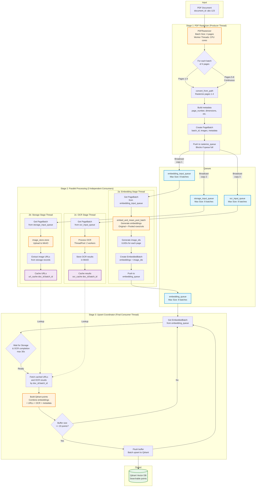

# Pipeline Processing Package

This package provides **vector-database-agnostic** pipeline components for document indexing.

---

## Overview

The pipeline package handles the core processing flow for document indexing:
- Batch processing coordination
- Image storage management
- Embedding generation coordination
- OCR processing (optional)
- Progress tracking and cancellation

---

## Architecture

### Key Principles

1. **Separation of Concerns**: Pipeline logic is independent of vector database implementation
2. **Reusability**: Components can be used with Qdrant, Pinecone, Weaviate, or any other vector DB
3. **Callback Pattern**: Database-specific operations (like point construction) are delegated via callbacks

### Components

#### `DocumentIndexer`
Main orchestrator that coordinates the entire indexing pipeline:
- Handles sequential vs pipelined processing modes
- Manages batch iteration
- Coordinates progress tracking
- Delegates storage via callback pattern

```python
from domain.pipeline import ImageProcessor, ImageStorageHandler

# Create dependencies
image_processor = ImageProcessor(default_format="JPEG", default_quality=85)
image_store = ImageStorageHandler(minio_service=minio, image_processor=image_processor)

# Create indexer with injected dependencies
indexer = DocumentIndexer(
    embedding_processor=embedding_service,
    image_store=image_store,
    ocr_service=ocr,
)

indexer.index_documents(
    images=image_list,
    progress_cb=my_progress_handler,
    store_batch_cb=my_storage_handler,  # DB-specific
)
```

#### `BatchProcessor`
Processes individual batches:
- Generates embeddings
- Stores images in MinIO
- Runs OCR (if enabled)
- Returns `ProcessedBatch` with all metadata

#### `ImageStorageHandler`
Manages image persistence in MinIO:
- Format conversion
- Quality optimization
- Hierarchical storage structure

#### `ProgressNotifier`
Lightweight progress callback orchestration:
- Stage tracking
- Cancellation support
- Error handling

#### `ProcessedBatch`
Data class containing all processed batch data:
- Embeddings (original + pooled variants)
- Image metadata
- Storage URLs
- OCR results

---

## Usage with Vector Databases

### Qdrant Example

```python
from domain.pipeline import DocumentIndexer, ProcessedBatch, ImageProcessor, ImageStorageHandler
from clients.qdrant.indexing import PointFactory

# Create dependencies with proper injection
image_processor = ImageProcessor(default_format="JPEG", default_quality=85)
image_store = ImageStorageHandler(minio_service=minio, image_processor=image_processor)

# Create generic indexer with injected dependencies
indexer = DocumentIndexer(
    embedding_processor=embedding_service,
    image_store=image_store,
)

# Create Qdrant-specific point factory
point_factory = PointFactory()

def store_in_qdrant(batch: ProcessedBatch):
    """Qdrant-specific storage logic."""
    points = point_factory.build(
        batch_start=batch.batch_start,
        original_batch=batch.original_embeddings,
        # ... other batch data
    )
    qdrant_client.upsert(points=points)

# Run indexing with Qdrant storage
indexer.index_documents(
    images=images,
    store_batch_cb=store_in_qdrant,
)
```

### Other Vector DBs

The same pipeline can work with any vector database by providing an appropriate `store_batch_cb`:

```python
def store_in_pinecone(batch: ProcessedBatch):
    """Pinecone-specific storage logic."""
    vectors = [
        (id, embedding, metadata)
        for id, embedding, metadata in zip(
            batch.image_ids,
            batch.original_embeddings,
            batch.meta_batch,
        )
    ]
    pinecone_index.upsert(vectors=vectors)

indexer.index_documents(
    images=images,
    store_batch_cb=store_in_pinecone,
)
```

---

## Benefits

1. **Reduced Coupling**: Vector DB changes don't affect core pipeline logic
2. **Testability**: Pipeline components can be tested independently
3. **Flexibility**: Easy to add new vector databases
4. **Maintainability**: Clear separation between generic and DB-specific code

---

## Migration Notes

This package was created by extracting generic components from `clients/qdrant/indexing/`:

- `progress.py` → `domain/pipeline/progress.py`
- `storage.py` → `domain/pipeline/storage.py`
- `utils.py` → `domain/pipeline/utils.py`
- `processor.py` → `domain/pipeline/batch_processor.py`
- `document_indexer.py` → `domain/pipeline/document_indexer.py`

New additions to the pipeline package:
- `cancellation.py` - Job cancellation and cleanup coordination

Qdrant-specific code remains in `clients/qdrant/indexing/`:
- `points.py` - Qdrant PointStruct construction
- `qdrant_indexer.py` - Qdrant-specific wrapper

---

## Streaming Pipeline Architecture

The streaming pipeline (`streaming_pipeline.py`) provides a high-performance alternative to the batch-oriented pipeline with **3-6x faster processing** and **progressive results availability**.

### Visual Architecture



### Key Components

#### Data Structures

- **`PageBatch`**: Rasterized pages with metadata ready for processing
- **`EmbeddedBatch`**: Pages with embeddings generated (original + pooled variants)
- **`ProcessedBatch`**: Fully processed batch ready for Qdrant upsert

#### Pipeline Stages

1. **PDFRasterizer (Producer)**
   - Streams PDF pages in batches (default: 4 pages)
   - Uses all CPU cores for parallel rasterization
   - **Broadcasts** each batch to 3 separate queues (creates independent copies for thread safety)
   - Blocks when any queue is full (backpressure)

2. **Parallel Consumer Stages** (3 independent threads, each with dedicated queue)
   - **EmbeddingStage**: Reads from `embedding_input_queue`, generates embeddings → `embedding_queue`
   - **StorageStage**: Reads from `storage_input_queue`, uploads to MinIO, caches URLs by `doc_id:batch_id`
   - **OCRStage**: Reads from `ocr_input_queue`, processes OCR, caches results by `doc_id:batch_id`

3. **UpsertStage (Final Consumer)**
   - Gets `EmbeddedBatch` from `embedding_queue`
   - Waits for storage/OCR completion (max 30s timeout)
   - Fetches cached URLs and OCR results using `doc_id:batch_id` key
   - Builds complete Qdrant points with all data
   - Buffers and batch upserts (every 20 points)

### Performance Characteristics

**Batch Pipeline (100-page PDF)**:
- First results: 72 seconds
- Total time: 360 seconds (6 minutes)
- Throughput: 0.33 pages/second
- Resource utilization: ~50% (sequential bottlenecks)

**Streaming Pipeline (100-page PDF)**:
- First results: 10 seconds (7x faster!)
- Total time: 60 seconds (6x faster!)
- Throughput: 2 pages/second
- Resource utilization: ~95% (GPU, CPU, I/O all busy)

### Usage Example

```python
from domain.pipeline.streaming_pipeline import StreamingPipeline
from domain.pipeline import ImageProcessor, ImageStorageHandler

# Create dependencies with proper injection (following SOLID principles)
image_processor = ImageProcessor(default_format="JPEG", default_quality=85)
image_store = ImageStorageHandler(minio_service=minio, image_processor=image_processor)

# Create streaming pipeline with all dependencies injected
pipeline = StreamingPipeline(
    embedding_processor=embedding_service,
    image_store=image_store,
    image_processor=image_processor,
    ocr_service=ocr_service,
    point_factory=point_factory,
    qdrant_service=qdrant_service,
    collection_name="documents",
    batch_size=4,
    max_queue_size=8,  # Backpressure control
)

# Start consumer threads
pipeline.start()

# Process PDF (rasterizer feeds the pipeline)
total_pages = pipeline.process_pdf(
    pdf_path="/tmp/document.pdf",
    filename="document.pdf",
    progress_callback=lambda current, total: print(f"{current}/{total}"),
    cancellation_check=lambda: check_if_cancelled(),
)

# Wait for pipeline to finish
pipeline.wait_for_completion()

# Clean up
pipeline.stop()
```

### Key Benefits

1. **Progressive Results**: First pages searchable in ~10 seconds vs 60+ seconds
2. **Better Resource Utilization**: All stages run in parallel (CPU rasterizing while GPU embedding)
3. **Backpressure Control**: Bounded queues prevent memory overflow
4. **Graceful Degradation**: Storage/OCR failures don't crash the pipeline
5. **Cancellation Support**: Can stop mid-processing with graceful cleanup

### Coordination Mechanism

All stages coordinate via `document_id:batch_id` keys but run **independently**:
- **Embedding Stage**: Produces `EmbeddedBatch` → `embedding_queue`
- **Storage Stage**: Caches URLs in `url_cache[doc_id:batch_id]`
- **OCR Stage**: Caches results in `ocr_cache[doc_id:batch_id]`
- **Upsert Stage**: Fetches from both caches using the same key

This decoupling allows each stage to proceed at its own pace while the upsert stage synchronizes final results.

For detailed performance analysis, tuning parameters, and migration guide, see [STREAMING_PIPELINE.md](../../STREAMING_PIPELINE.md).
