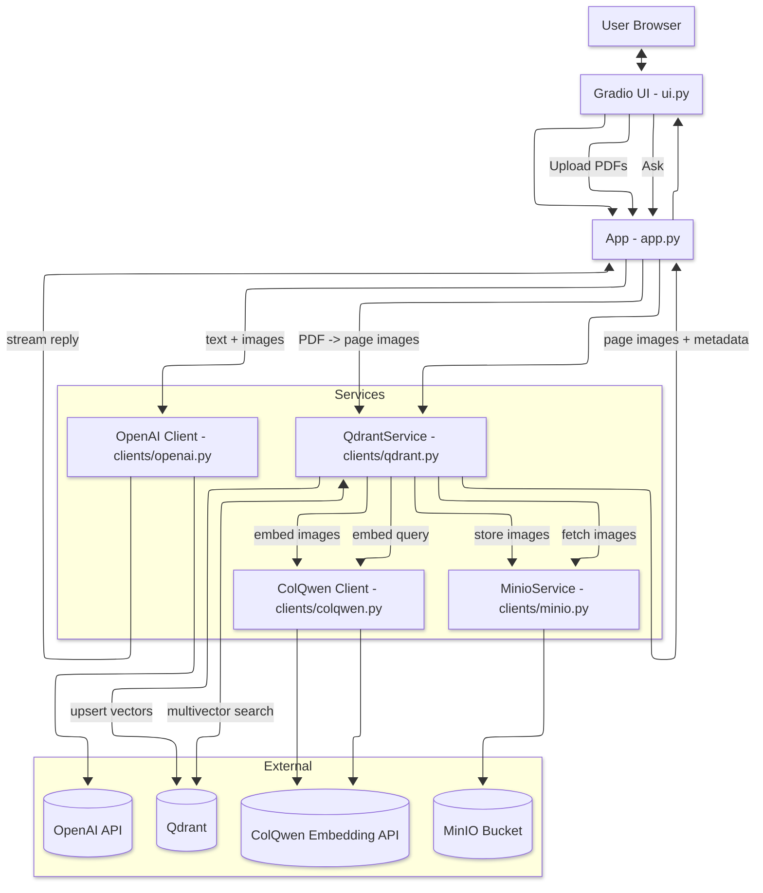

# Architecture

A concise view of the Vision RAG template and its main data flows.

Notes

- __Indexing__: `app.py` converts PDFs to page images. `QdrantService` stores images in MinIO, gets embeddings from the ColQwen API (including patch metadata), mean-pools rows/cols, and upserts multivectors to Qdrant.
- __Retrieval__: `QdrantService` embeds the query via ColQwen, runs multivector search on Qdrant, fetches page images from MinIO, and returns them to `app.py`. `app.py` optionally calls OpenAI with the user text + images and streams the answer back to the UI.
- The diagram intentionally omits lower-level details (e.g., prefetch limits, comparator settings) to stay readable.
